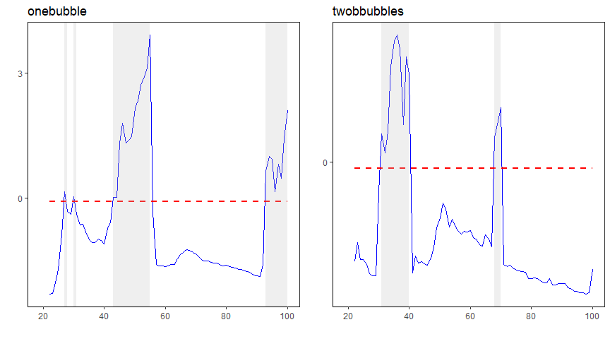

---
output:
  github_document:
    html_preview: true
---

<!-- README.md is generated from README.Rmd. Please edit that file -->

```{r, echo = FALSE}
knitr::opts_chunk$set(
  collapse = TRUE,
  comment = "#>",
  fig.path = "README-"
)
```


# exuber : Econometric Analysis of Explosive Time Series

[](https://travis-ci.org/kvasilopoulos/exuber)
[](https://ci.appveyor.com/project/kvasilopoulos/exuber)
[](https://cran.r-project.org/package=exuber)
 [](https://www.tidyverse.org/lifecycle/#maturing)
[](https://codecov.io/gh/kvasilopoulos/exuber)

## Description 

Testing for and dating periods of explosive dynamics (exuberance) in time series 
using recursive unit root tests as proposed by [Phillips, P. C., Shi, S. and Yu, J. (2015a)](https://doi.org/10.1111/iere.12132). Simulate a variety of periodically-collapsing 
bubble models. The estimation and simulation utilize the matrix inversion lemma 
from the recursive least squares algorithm, which results in a significant speed improvement.

## Overview

### Estimation
* `radf()` : Recursive Augmented Dickey-Fuller test

### Simulate custom critical values
* `mc_cv()` : Monte Carlo critical values
* `wb_cv()` : Wild Bootstrap critical values
* `sb_cv()` : Sieve Bootstrap (panel) critical values

### Simulation
* `sim_dgp1()` : Simulation of a single-bubble process
* `sim_dgp2()` : Simulation of a two-bubble process
* `sim_blan()` : Simulation of a Blanchard (1979) bubble process
* `sim_evans()` : Simulation of a Evans (1991) bubble process
* `sim_div()` : Simulation of dividends

## Installation

You can install the released version of exuber from [CRAN](https://CRAN.R-project.org) with:

``` r
install.packages("exuber")
```

And the development version from [GitHub](https://github.com/) with:

```{r installation, eval = FALSE}
if(!require(devtools)) install.packages("devtools")
devtools::install_github("kvasilopoulos/exuber")
```
Note that development version requires compilation, so to install you will need the appropriate development tools.

* Window Users should install [Rtools](https://cran.r-project.org/bin/windows/Rtools/)
* Mac User should install [Clang or GNU Fortran](https://cran.r-project.org/bin/macosx/tools/). 

**Note:** R 3.5.0 El Capitan binaries are using Clang 6.0.0 and GNU Fortran 6.1 to provide OpenMP parallelization support and C++17 standard features. 

If you encounter a clear bug, please file a reproducible example on [GitHub](https://github.com/kvasilopoulos/exuber/issues).

## Usage

This is a basic example which shows you how to use exuber:

```{r example, echo = TRUE, eval = TRUE, results = "hide"}
library(exuber)
# Simulate data witn n = 100 observations
set.seed(112)
sim1 <- sim_dgp1(n = 100) # one bubble
sim2 <- sim_dgp2(n = 100) # two bubbles

dta <- data.frame("onebubble" = sim1, 
                  "twobbubbles" = sim2)

ts <- radf(dta, lag = 1)
```

Report t-stats with the assiged critical values

```{r Summary, eval = TRUE}
summary(ts)
```

Date stamp periods of explosive behaviour
```{r Datestamp, eval = TRUE}
datestamp(ts)
```

### Plotting

The output of autoplot is a list of ggplots


```{r plotting, echo=TRUE, eval = FALSE, fig.width=9}
ts %>% 
  autoplot() %>% 
  ggarrange()
```

```{r include=FALSE, eval=FALSE}
ts %>% 
  autoplot() %>% 
  ggarrange() %>% 
  ggplot2::ggsave(file = "inst/figures/readme.png", 
                  width = 9, height = 4.81)
```



#### License

This package is free and open source software, licensed under [GPL-3](https://github.com/kvasilopoulos/exuber/blob/master/LICENSE).

#### Code of Conduct

Please note that this project is released with a [Contributor Code of Conduct](https://github.com/kvasilopoulos/exuber/blob/master/CONDUCT.md). 
By participating in this project you agree to abide by its terms.
