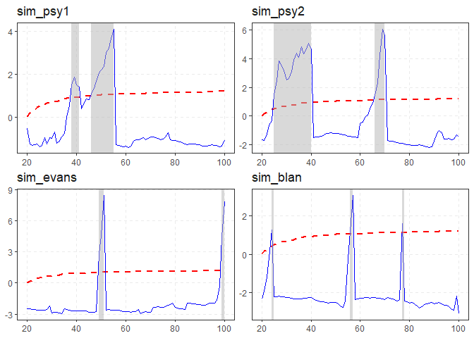

<!-- README.md is generated from README.Rmd. Please edit that file -->

# exuber <a href='https://kvasilopoulos.github.io/exuber'></a>

<!-- badges: start -->

[](https://cran.r-project.org/package=exuber)
[](https://www.repostatus.org/#active)
[](https://www.tidyverse.org/lifecycle/#maturing)
[](https://github.com/kvasilopoulos/exuber/actions)
[](https://codecov.io/gh/kvasilopoulos/exuber?branch=master)
<!-- badges: end -->

Testing for and dating periods of explosive dynamics (exuberance) in
time series using the univariate and panel recursive unit root tests
proposed by [Phillips et al. (2015)](https://doi.org/10.1111/iere.12132)
and [Pavlidis et al. (2016)](https://doi.org/10.1007/s11146-015-9531-2).
The recursive least-squares algorithm utilizes the matrix inversion
lemma to avoid matrix inversion which results in significant speed
improvements. Simulation of a variety of periodically-collapsing bubble
processes.

### Overview

Testing for explosive dynamics is comprised of two distinct parts :

  - Estimation
  - Critical Values

**Some Context:** Conventional testing techniques compute critical
values,and p-values from a standard distribution, where the user does
not need to specify critical values explicitly. However, the recent
literature in explosive dynamics require the use of non-standard
distributions, which require the use of techniques that sample empirical
distributions in order to calculate the critical values.

#### Estimation

The cornerstone function of the package is:

  - `radf()`: Recursive Augmented Dickey-Fuller Test.

This function offers a vectorized estimation (i.e. single and/or
multiple time-series) for individual and panel estimation. The
estimation can parse data from multiple classes and handle dates as
index.

#### Critical Values

There are several options for generating critical values:

  - `radf_mc_cv()`: Monte Carlo
  - `radf_wb_cv()`: Wild Bootstrap
  - `radf_sb_cv()`: Sieve Bootstrap (Panel)

On default `exuber` will use Monte Carlo simulated critical values if no
other option is provided. The package offers these critical values in
the form of `data` (up to 600 observations), that are obtained with the
`mc_cv()` function.

### Analysis

For the analysis you should include both the output from estimation
(`object`) and critical values (`cv`). The below methods break the
process into small simple steps:

  - `summary()` summarizes the model.
  - `diagnostics()` shows which series reject the null hypothesis .
  - `datestamp()` computes the origination, termination and duration of
    episodes (if any).

These combined provide a comprehensive analysis on the exuberant
behavior of the model.

### Installation

``` r
# Install release version from CRAN
install.packages("exuber")
```

You can install the development version of exuber from GitHub.

``` r
# install.packages("devtools")
devtools::install_github("kvasilopoulos/exuber")
```

If you encounter a clear bug, please file a reproducible example on
[GitHub](https://github.com/kvasilopoulos/exuber/issues).

### Usage

``` r

library(exuber)

rsim_data <- radf(sim_data)

summary(rsim_data)
#> Using 'radf_crit' for 'cv'.
#> 
#> -- Summary (minw = 19, lag = 0) ---------------------------------------------- Monte Carlo (nrep = 2000) --
#> 
#> psy1 :
#> # A tibble: 3 x 5
#>   name  tstat   `90`    `95`  `99`
#>   <fct> <dbl>  <dbl>   <dbl> <dbl>
#> 1 adf   -2.46 -0.413 -0.0812 0.652
#> 2 sadf   1.95  0.988  1.29   1.92 
#> 3 gsadf  5.19  1.71   1.97   2.57 
#> 
#> psy2 :
#> # A tibble: 3 x 5
#>   name  tstat   `90`    `95`  `99`
#>   <fct> <dbl>  <dbl>   <dbl> <dbl>
#> 1 adf   -2.86 -0.413 -0.0812 0.652
#> 2 sadf   7.88  0.988  1.29   1.92 
#> 3 gsadf  7.88  1.71   1.97   2.57 
#> 
#> evans :
#> # A tibble: 3 x 5
#>   name  tstat   `90`    `95`  `99`
#>   <fct> <dbl>  <dbl>   <dbl> <dbl>
#> 1 adf   -5.83 -0.413 -0.0812 0.652
#> 2 sadf   5.28  0.988  1.29   1.92 
#> 3 gsadf  5.99  1.71   1.97   2.57 
#> 
#> div :
#> # A tibble: 3 x 5
#>   name  tstat   `90`    `95`  `99`
#>   <fct> <dbl>  <dbl>   <dbl> <dbl>
#> 1 adf   -1.95 -0.413 -0.0812 0.652
#> 2 sadf   1.11  0.988  1.29   1.92 
#> 3 gsadf  1.34  1.71   1.97   2.57 
#> 
#> blan :
#> # A tibble: 3 x 5
#>   name  tstat   `90`    `95`  `99`
#>   <fct> <dbl>  <dbl>   <dbl> <dbl>
#> 1 adf   -5.15 -0.413 -0.0812 0.652
#> 2 sadf   3.93  0.988  1.29   1.92 
#> 3 gsadf 11.0   1.71   1.97   2.57

diagnostics(rsim_data)
#> Using 'radf_crit' for 'cv'.
#> 
#> -- Diagnostics (option = gsadf) ------------------------------------------------------------ Monte Carlo --
#> 
#> psy1:     Rejects H0 at the 1% significance level
#> psy2:     Rejects H0 at the 1% significance level
#> evans:    Rejects H0 at the 1% significance level
#> div:      Cannot reject H0 
#> blan:     Rejects H0 at the 1% significance level

datestamp(rsim_data)
#> Using 'radf_crit' for 'cv'.
#> 
#> -- Datestamp (min_duration = 0) ------------------------------------------------------------ Monte Carlo --
#> 
#> psy1 :
#>   Start End Duration
#> 1    44  56       12
#> 
#> psy2 :
#>   Start End Duration
#> 1    22  41       19
#> 2    62  71        9
#> 
#> evans :
#>   Start End Duration
#> 1    20  21        1
#> 2    44  45        1
#> 3    66  68        2
#> 
#> blan :
#>   Start End Duration
#> 1    34  37        3
#> 2    84  87        3

autoplot(rsim_data)
#> Using 'radf_crit' for 'cv'.
```

<!-- -->

-----

Please note that the ‘exuber’ project is released with a [Contributor
Code of
Conduct](https://kvasilopoulos.github.io/exuber/CODE_OF_CONDUCT). By
contributing to this project, you agree to abide by its terms.
