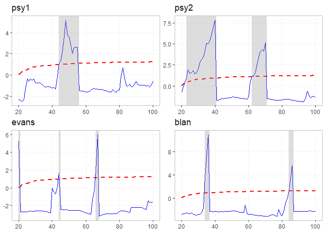

<!-- README.md is generated from README.Rmd. Please edit that file -->

# exuber <a href='https://kvasilopoulos.github.io/exuber/'></a>

<!-- badges: start -->

[](https://CRAN.R-project.org/package=exuber)
[](https://www.repostatus.org/#active)
[](https://lifecycle.r-lib.org/articles/stages.html#stable)
[](https://github.com/kvasilopoulos/exuber/actions/workflows/R-CMD-check.yaml)
[](https://app.codecov.io/gh/kvasilopoulos/exuber)
[](https://doi.org/10.18637/jss.v103.i10)
<!-- badges: end -->

Testing for and dating periods of explosive dynamics (exuberance) in
time series using the univariate and panel recursive unit root tests
proposed by [Phillips et al. (2015)](https://doi.org/10.1111/iere.12132)
and [Pavlidis et al. (2016)](https://doi.org/10.1007/s11146-015-9531-2).
The recursive least-squares algorithm utilizes the matrix inversion
lemma to avoid matrix inversion which results in significant speed
improvements. Simulation of a variety of periodically-collapsing bubble
processes.

### Overview

Testing for explosive dynamics is comprised of two distinct parts :

- Estimation
- Critical Values

**Some Context:** Conventional testing techniques compute critical
values,and p-values from a standard distribution, where the user does
not need to specify critical values explicitly. However, the recent
literature in explosive dynamics require the use of non-standard
distributions, which require the use of techniques that sample empirical
distributions in order to calculate the critical values.

#### Estimation

The cornerstone function of the package is:

- `radf()`: Recursive Augmented Dickey-Fuller Test.

This function offers a vectorized estimation (i.e. single and/or
multiple time-series) for individual and panel estimation. The
estimation can parse data from multiple classes and handle dates as
index.

#### Critical Values

There are several options for generating critical values:

- `radf_mc_cv()`: Monte Carlo
- `radf_wb_cv()`, `radf_wb_ps_cv()`: Wild Bootstrap (Harvey et al. 2016;
  Phillips & Shi 2020)
- `radf_sb_cv()`: Sieve Bootstrap (Panel)

When `cv` is omitted, `exuber` uses precomputed Monte Carlo critical
values: a shared store covering `lag = 0` to `4` and every sample size
up to 4000, fetched once per `(n, lag)` and cached on disk.
`radf_mc_cv()` and the bootstrap functions are the offline route, and
the only route for other lags or larger samples.

### Analysis

For the analysis you should include both the output from estimation
(`object`) and critical values (`cv`). The below methods break the
process into small simple steps:

- `summary()` summarizes the model.
- `diagnostics()` shows which series reject the null hypothesis .
- `datestamp()` computes the origination, termination and duration of
  episodes (if any).
- `rootstamp()` estimates how fast a detected episode is growing (the
  explosive root and its doubling time), run over every `datestamp()`
  episode at once.

These combined provide a comprehensive analysis on the exuberant
behavior of the model. See `vignette("exuber")` for this workflow end to
end and `vignette("plotting")` for the `autoplot()` methods that go with
it.

### Beyond `radf()`

The recursive ADF test is the core, but not the whole package. Each
family below has its own vignette and its own section of the reference
index:

- **Volatility-robust tests** (`radf_tt()`, `radf_sign()`, `radf_kp()`,
  `radf_sbz()`): the same question as `radf()` under time-varying
  innovation variance – `vignette("radf-tt")`,
  `vignette("volatility-robust-radf")`.
- **Dating procedures** (`dating_hls()`, `dating_knp()`, `dating_pdc()`,
  `dating_hlw()`, `radf_recovery()`): regime-model estimates of when a
  bubble you already believe in starts and ends, no critical value
  needed – `vignette("dating-methods")`.
- **Real-time monitoring** (`monitor()`, `monitor_cusum()`,
  `monitor_lbi()`, `monitor_quantile()`): calibrate on a training
  window, then raise an alarm as new observations arrive –
  `vignette("monitoring")`.
- **Root inference** (`rootstamp()`): how fast a detected episode is
  growing – `vignette("root-inference")`.
- **Multivariate** (`radf_common()`, `cobubble_test()`,
  `contagion_reg()`): shared and transmitted bubbles across series –
  `vignette("co-explosivity")`.
- **Simulation** (`sim_*()`): the bubble processes and innovation
  generators every test above is validated on –
  `vignette("simulation")`.

`vignette("naming-and-analysis")` explains the naming scheme (`radf_`,
`_test`, `dating_`, `monitor_`) and which results plug into
`summary()`/`datestamp()`/`tidy()`/`autoplot()`.

### Installation

``` r
# Install release version from CRAN
install.packages("exuber")
```

You can install the development version of exuber from GitHub.

``` r
# install.packages("devtools")
devtools::install_github("kvasilopoulos/exuber")
```

If you encounter a clear bug, please file a reproducible example on
[GitHub](https://github.com/kvasilopoulos/exuber/issues).

### Usage

``` r

library(exuber)

rsim_data <- radf(sim_data)

summary(rsim_data)
#> Using precomputed critical values for `cv`.
#> 
#> ── Summary (minw = 19, lag = 0) ────────────────── Monte Carlo (nboot = 2000) ──
#> 
#> psy1 :
#> # A tibble: 3 × 5
#>   stat  tstat   `90`    `95`  `99`
#>   <fct> <dbl>  <dbl>   <dbl> <dbl>
#> 1 adf   -2.46 -0.412 -0.0178 0.644
#> 2 sadf   1.95  0.965  1.25   1.77 
#> 3 gsadf  5.19  1.65   1.93   2.60 
#> 
#> psy2 :
#> # A tibble: 3 × 5
#>   stat  tstat   `90`    `95`  `99`
#>   <fct> <dbl>  <dbl>   <dbl> <dbl>
#> 1 adf   -2.86 -0.412 -0.0178 0.644
#> 2 sadf   7.88  0.965  1.25   1.77 
#> 3 gsadf  7.88  1.65   1.93   2.60 
#> 
#> evans :
#> # A tibble: 3 × 5
#>   stat  tstat   `90`    `95`  `99`
#>   <fct> <dbl>  <dbl>   <dbl> <dbl>
#> 1 adf   -5.83 -0.412 -0.0178 0.644
#> 2 sadf   5.28  0.965  1.25   1.77 
#> 3 gsadf  5.99  1.65   1.93   2.60 
#> 
#> div :
#> # A tibble: 3 × 5
#>   stat  tstat   `90`    `95`  `99`
#>   <fct> <dbl>  <dbl>   <dbl> <dbl>
#> 1 adf   -1.95 -0.412 -0.0178 0.644
#> 2 sadf   1.11  0.965  1.25   1.77 
#> 3 gsadf  1.34  1.65   1.93   2.60 
#> 
#> blan :
#> # A tibble: 3 × 5
#>   stat  tstat   `90`    `95`  `99`
#>   <fct> <dbl>  <dbl>   <dbl> <dbl>
#> 1 adf   -5.15 -0.412 -0.0178 0.644
#> 2 sadf   3.93  0.965  1.25   1.77 
#> 3 gsadf 11.0   1.65   1.93   2.60

diagnostics(rsim_data)
#> Using precomputed critical values for `cv`.
#> 
#> ── Diagnostics (option = gsadf) ───────────────────────────────── Monte Carlo ──
#> 
#> psy1:     Rejects H0 at the 1% significance level
#> psy2:     Rejects H0 at the 1% significance level
#> evans:    Rejects H0 at the 1% significance level
#> div:      Cannot reject H0 
#> blan:     Rejects H0 at the 1% significance level

datestamp(rsim_data)
#> Using precomputed critical values for `cv`.
#> 
#> ── Datestamp (min_duration = 0) ───────────────────────────────── Monte Carlo ──
#> 
#> psy1 :
#>   Start Peak End Duration   Signal Ongoing
#> 1    44   48  56       12 positive   FALSE
#> 
#> psy2 :
#>   Start Peak End Duration   Signal Ongoing
#> 1    23   40  41       18 positive   FALSE
#> 2    62   70  71        9 positive   FALSE
#> 
#> evans :
#>   Start Peak End Duration   Signal Ongoing
#> 1    20   20  21        1 positive   FALSE
#> 2    44   44  45        1 positive   FALSE
#> 3    66   67  68        2 positive   FALSE
#> 
#> blan :
#>   Start Peak End Duration   Signal Ongoing
#> 1    34   36  37        3 positive   FALSE
#> 2    84   86  87        3 positive   FALSE

autoplot(rsim_data)
#> Using precomputed critical values for `cv`.
#> Warning: Using `size` aesthetic for lines was deprecated in ggplot2 3.4.0.
#> ℹ Please use `linewidth` instead.
#> ℹ The deprecated feature was likely used in the exuber package.
#>   Please report the issue at <https://github.com/kvasilopoulos/exuber/issues>.
#> This warning is displayed once per session.
#> Call `lifecycle::last_lifecycle_warnings()` to see where this warning was
#> generated.
```

<!-- -->

### Citation

`exuber` is the product of ongoing research – if it’s useful in your own
work, please support it by citing the accompanying paper in the *Journal
of Statistical Software*:

> Vasilopoulos, K., Pavlidis, E., & Martínez-García, E. (2022). exuber:
> Recursive Right-Tailed Unit Root Testing with R. *Journal of
> Statistical Software*, 103(10), 1-26.
> [doi:10.18637/jss.v103.i10](https://doi.org/10.18637/jss.v103.i10)

``` r
citation("exuber")
#> To cite exuber in publications use:
#> 
#>   Vasilopoulos K, Pavlidis E, Martínez-García E (2022). "exuber:
#>   Recursive Right-Tailed Unit Root Testing with R." _Journal of
#>   Statistical Software_, *103*(10), 1-26. doi:10.18637/jss.v103.i10
#>   <https://doi.org/10.18637/jss.v103.i10>.
#> 
#> A BibTeX entry for LaTeX users is
#> 
#>   @Article{,
#>     title = {{exuber}: Recursive Right-Tailed Unit Root Testing with {R}},
#>     author = {Kostas Vasilopoulos and Efthymios Pavlidis and Enrique Mart{\'i}nez-Garc{\'i}a},
#>     journal = {Journal of Statistical Software},
#>     year = {2022},
#>     volume = {103},
#>     number = {10},
#>     pages = {1--26},
#>     doi = {10.18637/jss.v103.i10},
#>   }
```

------------------------------------------------------------------------

Please note that the ‘exuber’ project is released with a [Contributor
Code of
Conduct](https://kvasilopoulos.github.io/exuber/CODE_OF_CONDUCT). By
contributing to this project, you agree to abide by its terms.
