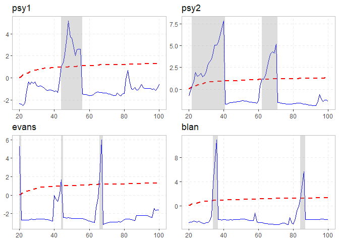

<!-- README.md is generated from README.Rmd. Please edit that file -->

# exuber <a href='https://kvasilopoulos.github.io/exuber'></a>

[](https://cran.r-project.org/package=exuber)
[](https://www.repostatus.org/#active)
[](https://www.tidyverse.org/lifecycle/#maturing)
[](https://travis-ci.org/kvasilopoulos/exuber)
[](https://ci.appveyor.com/project/kvasilopoulos/exuber)
[](https://codecov.io/gh/kvasilopoulos/exuber)

Testing for and dating periods of explosive dynamics (exuberance) in
time series using the univariate and panel recursive unit root tests
proposed by [Phillips et al. (2015)](https://doi.org/10.1111/iere.12132)
and [Pavlidis et al. (2016)](https://doi.org/10.1007/s11146-015-9531-2).
The recursive least-squares algorithm utilizes the matrix inversion
lemma to avoid matrix inversion which results in significant speed
improvements. Simulation of a variety of periodically-collapsing bubble
processes.

### Overview

Testing for explosive dynamics is comprised of two distinct parts :

  - Estimation
  - critical values

**Some Context:** Conventional testing techniques compute critical
values,and p-values from a standard distribution, where the user does
not need to specify critical values explicitly. However, the recent
literature in explosive dynamics require the use of non-standard
distributions, which require the use of techniques that sample empirical
distributions in order to calculate the critical values.

#### Estimation

The workhorse function of the package is:

  - `radf()`: Recursive Augmented Dickey-Fuller Test.

This function offers a vectorized estimation (i.e. single and/or
multiple time-series) for individual and panel estimation. The
estimation can parse data from multiple classes and handle dates as
index.

#### Critical Values

There are several options for generating critical values:

  - `mc_cv()`: Monte Carlo
  - `wb_cv()`: Wild Bootstrap
  - `sb_cv()`: Sieve Bootsrap (Panel)

On default `exuber` will use Monte Carlo simulated critical values if no
other option is provided. The package offers these critical values in
the form of `data` (up to 600 observations), that are obtain with the
`mc_cv()` function.

### Analysis

For the analysis you should include both the `object` and `cv`. The
below methods break the process into small simple steps:

  - `summary()` summarizes the model.
  - `diagnostics()` shows which series reject the null hupothesis .
  - `datestamp()` computes the origination, termination and duration of
    episodes (if any).

These combined provide a comprehensive analysis on the exuberant
behavior of the model.

### Installation

``` r
# Install release version from CRAN
install.packages("exuber")
```

#### Development version

You can install the development version of exuber from GitHub.

``` r
# install.packages("devtools")
devtools::install_github("kvasilopoulos/exuber")
```

If you encounter a clear bug, please file a reproducible example on
[GitHub](https://github.com/kvasilopoulos/exuber/issues).

### Usage

``` r

library(exuber)

rsim_data <- radf(sim_data)

summary(rsim_data)
#> 
#> -- Summary (minw = 19, lag = 0) -------------------------- Monte Carlo (nrep = 2000) --
#> 
#>  sim_psy1 
#>         tstat      90%       95%     99%
#> ADF    -1.897  -0.4275  -0.07364  0.5121
#> SADF    3.584   0.9024   1.20175  1.7137
#> GSADF   4.099   1.6033   1.89674  2.5226
#> 
#>  sim_psy2 
#>         tstat      90%       95%     99%
#> ADF    -2.703  -0.4275  -0.07364  0.5121
#> SADF    4.751   0.9024   1.20175  1.7137
#> GSADF   6.096   1.6033   1.89674  2.5226
#> 
#>  sim_evans 
#>         tstat      90%       95%     99%
#> ADF    -3.308  -0.4275  -0.07364  0.5121
#> SADF   -2.423   0.9024   1.20175  1.7137
#> GSADF   8.456   1.6033   1.89674  2.5226
#> 
#>  sim_div 
#>           tstat      90%       95%     99%
#> ADF    -2.32848  -0.4275  -0.07364  0.5121
#> SADF   -0.09609   0.9024   1.20175  1.7137
#> GSADF   0.48195   1.6033   1.89674  2.5226
#> 
#>  sim_blan 
#>         tstat      90%       95%     99%
#> ADF    -5.083  -0.4275  -0.07364  0.5121
#> SADF    1.287   0.9024   1.20175  1.7137
#> GSADF   3.076   1.6033   1.89674  2.5226

diagnostics(rsim_data)
#> 
#> -- Diagnostics (option = gsadf) ---------------------------------------- Monte Carlo --
#> 
#> sim_psy1:  Rejects H0 for significance level of 1% 
#> sim_psy2:  Rejects H0 for significance level of 1% 
#> sim_evans: Rejects H0 for significance level of 1% 
#> sim_div:   Cannot reject H0! 
#> sim_blan:  Rejects H0 for significance level of 1%

datestamp(rsim_data)
#> 
#> -- Datestamp (min_duration = 0) ---------------------------------------- Monte Carlo --
#> 
#> sim_psy1 :
#>   Start End Duration
#> 1    38  41        4
#> 2    46  55       10
#> 
#> sim_psy2 :
#>   Start End Duration
#> 1    25  40       16
#> 2    66  70        5
#> 
#> sim_evans :
#>   Start End Duration
#> 1    49  51        3
#> 2    99 100        2
#> 
#> sim_blan :
#>   Start End Duration
#> 1    24  25        2
#> 2    56  57        2
#> 3    77  78        2

autoplot(rsim_data)
```

<!-- -->

-----

Please note that the ‘exuber’ project is released with a [Contributor
Code of
Conduct](https://kvasilopoulos.github.io/exuber/CODE_OF_CONDUCT). By
contributing to this project, you agree to abide by its terms.
