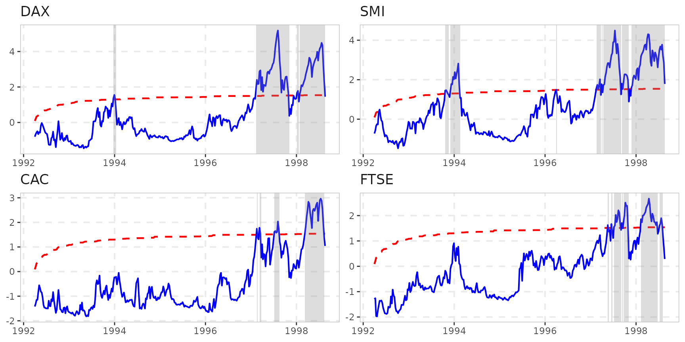
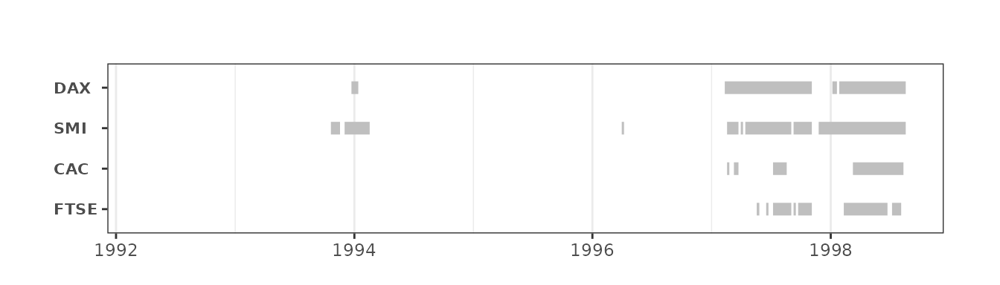

# Intro to exuber

For our analysis we are going to use the
[`datasets::EuStockMarkets`](https://rdrr.io/r/datasets/EuStockMarkets.html)
dataset, which contains the daily closing prices of four major European
stock indices: Germany DAX, Switzerland SMI, France CAC, and UK FTSE
(see
[`?EuStockMarkets`](https://rdrr.io/r/datasets/EuStockMarkets.html)).
The data are sampled in business time, i.e., weekends and holidays are
omitted. In this particular exercise we want to focus on weekly
observations. To do so we aggregate to a weekly frequency and reduce the
number of observations from 1860 to 372.

``` r

stocks <- aggregate(EuStockMarkets, nfrequency = 52, mean)
```

## Estimation

We estimate the above series using the recursive Augmented Dickey-Fuller
test with 1 lag.

``` r

est_stocks <- radf(stocks, lag = 1)
```

## Analysis

The summary will print the test statistic and the critical values for
10%, 5% and 1% significance level. For a plain recursive ADF (`lag = 0`)
and up to 600 observations, the package ships pre-simulated critical
values that
[`summary()`](https://rdrr.io/r/base/summary.html)/[`diagnostics()`](https://kvasilopoulos.github.io/exuber/reference/diagnostics.md)/[`datestamp()`](https://kvasilopoulos.github.io/exuber/reference/datestamp.md)/[`autoplot()`](https://ggplot2.tidyverse.org/reference/autoplot.html)
use automatically when `cv` is omitted. With `lag = 1` (as estimated
above), critical values instead need to be simulated for this specific
`(n, lag)` combination –
[`radf_mc_cv()`](https://kvasilopoulos.github.io/exuber/reference/radf_mc_cv.md)
does that locally, and we pass the result via `cv` to every downstream
call.

``` r

cv_stocks <- radf_mc_cv(NROW(stocks), lag = 1)
```

``` r

summary(est_stocks, cv = cv_stocks)
#> 
#> ── Summary (minw = 38, lag = 1) ─────────────────── Monte Carlo (nrep = 1000) ──
#> 
#> DAX :
#> # A tibble: 3 × 5
#>   stat  tstat   `90`    `95`  `99`
#>   <fct> <dbl>  <dbl>   <dbl> <dbl>
#> 1 adf    1.45 -0.440 -0.0429 0.537
#> 2 sadf   4.95  1.23   1.54   2.06 
#> 3 gsadf  5.18  2.13   2.38   3.00 
#> 
#> SMI :
#> # A tibble: 3 × 5
#>   stat  tstat   `90`    `95`  `99`
#>   <fct> <dbl>  <dbl>   <dbl> <dbl>
#> 1 adf    1.77 -0.440 -0.0429 0.537
#> 2 sadf   4.28  1.23   1.54   2.06 
#> 3 gsadf  4.49  2.13   2.38   3.00 
#> 
#> CAC :
#> # A tibble: 3 × 5
#>   stat  tstat   `90`    `95`  `99`
#>   <fct> <dbl>  <dbl>   <dbl> <dbl>
#> 1 adf   0.987 -0.440 -0.0429 0.537
#> 2 sadf  2.91   1.23   1.54   2.06 
#> 3 gsadf 2.97   2.13   2.38   3.00 
#> 
#> FTSE :
#> # A tibble: 3 × 5
#>   stat  tstat   `90`    `95`  `99`
#>   <fct> <dbl>  <dbl>   <dbl> <dbl>
#> 1 adf   0.194 -0.440 -0.0429 0.537
#> 2 sadf  2.56   1.23   1.54   2.06 
#> 3 gsadf 2.67   2.13   2.38   3.00
```

It seems that all stocks exhibit exuberant behaviour but we can also
verify it using
[`diagnostics()`](https://kvasilopoulos.github.io/exuber/reference/diagnostics.md).
This function is particularly useful when we deal a large number of
series.

``` r

diagnostics(est_stocks, cv = cv_stocks)
#> 
#> ── Diagnostics (option = gsadf) ───────────────────────────────── Monte Carlo ──
#> 
#> DAX:      Rejects H0 at the 1% significance level
#> SMI:      Rejects H0 at the 1% significance level
#> CAC:      Rejects H0 at the 5% significance level
#> FTSE:     Rejects H0 at the 5% significance level
```

If we need to know the exact period of exuberance we can do so with the
function
[`datestamp()`](https://kvasilopoulos.github.io/exuber/reference/datestamp.md).
[`datestamp()`](https://kvasilopoulos.github.io/exuber/reference/datestamp.md)
works in a similar manner with
[`summary()`](https://rdrr.io/r/base/summary.html) and
[`diagnostics()`](https://kvasilopoulos.github.io/exuber/reference/diagnostics.md).

``` r

# Minimum duration of an explosive period
rot = psy_ds(stocks) # log(n) ~ rule of thumb

dstamp_stocks <- datestamp(est_stocks, cv = cv_stocks, min_duration = rot)
dstamp_stocks
#> 
#> ── Datestamp (min_duration = 6) ───────────────────────────────── Monte Carlo ──
#> 
#> DAX :
#>        Start       Peak        End Duration   Signal Ongoing
#> 1 1997-02-10 1997-08-05 1997-11-04       38 positive   FALSE
#> 2 1998-01-27 1998-07-22 1998-08-19       29 positive   FALSE
#> 
#> SMI :
#>        Start       Peak        End Duration   Signal Ongoing
#> 1 1993-12-02 1994-02-03 1994-02-17       11 positive   FALSE
#> 2 1997-04-14 1997-07-15 1997-09-02       20 positive   FALSE
#> 3 1997-09-09 1997-10-07 1997-11-04        8 positive   FALSE
#> 4 1997-11-25 1998-04-07 1998-08-19       39 positive    TRUE
#> 
#> CAC :
#>        Start       Peak        End Duration   Signal Ongoing
#> 1 1997-07-08 1997-08-05 1997-08-19        6 positive   FALSE
#> 2 1998-03-10 1998-07-15 1998-08-12       22 positive   FALSE
#> 
#> FTSE :
#>        Start       Peak        End Duration   Signal Ongoing
#> 1 1997-07-08 1997-08-12 1997-09-02        8 positive   FALSE
#> 2 1997-09-23 1997-10-07 1997-11-04        6 positive   FALSE
#> 3 1998-02-10 1998-04-14 1998-06-24       19 positive   FALSE
```

We can extract the datestamp as a dummy variable 1 = Exuberance, 0 = No
exuberance.

``` r

dummy <- attr(dstamp_stocks, "dummy")
tail(dummy)
#>     DAX SMI CAC FTSE
#> 367   1   1   1    1
#> 368   1   1   1    1
#> 369   1   1   1    1
#> 370   1   1   1    0
#> 371   1   1   0    0
#> 372   0   1   0    0
```

## Plotting

The `autoplot` function returns a faceted ggplot2 object for all the
series that reject the null hypothesis at 5% significance level.

``` r

autoplot(est_stocks, cv = cv_stocks)
#> Warning: Using `size` aesthetic for lines was deprecated in ggplot2 3.4.0.
#> ℹ Please use `linewidth` instead.
#> ℹ The deprecated feature was likely used in the exuber package.
#>   Please report the issue at <https://github.com/kvasilopoulos/exuber/issues>.
#> This warning is displayed once per session.
#> Call `lifecycle::last_lifecycle_warnings()` to see where this warning was
#> generated.
```



Finally, we can plot just the periods the periods of exuberance.
Plotting datestamp object is particularly useful when we have a lot of
series, and we are interested to identify explosive patterns in all of
them.

``` r

datestamp(est_stocks, cv = cv_stocks) %>%
  autoplot()
```


