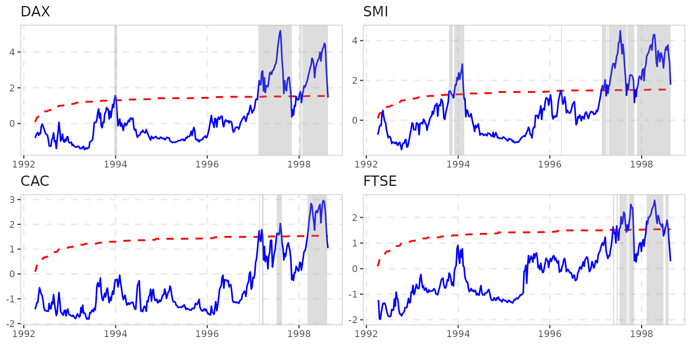
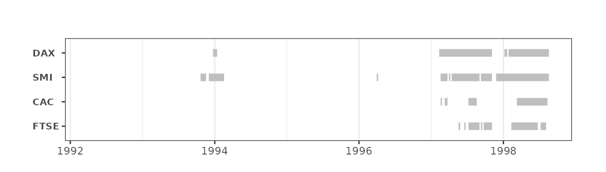

# Intro to exuber

This vignette uses the
[`datasets::EuStockMarkets`](https://rdrr.io/r/datasets/EuStockMarkets.html)
data, which contain the daily closing prices of four major European
stock indices: the German DAX, the Swiss SMI, the French CAC and the UK
FTSE (see
[`?EuStockMarkets`](https://rdrr.io/r/datasets/EuStockMarkets.html)).
The data are sampled in business time, so weekends and holidays are
omitted. We want weekly observations, so we aggregate to a weekly
frequency, which reduces the sample from 1860 to 372 observations.

``` r

stocks <- aggregate(EuStockMarkets, nfrequency = 52, mean)
```

## Estimation

We estimate the recursive augmented Dickey-Fuller test on these series
with one lag.

``` r

est_stocks <- radf(stocks, lag = 1)
```

## Analysis

[`summary()`](https://rdrr.io/r/base/summary.html) prints the test
statistics together with the critical values at the 10%, 5% and 1%
significance levels. A critical value is the threshold a statistic must
exceed before we reject the null hypothesis of a unit root in favor of
explosive behavior. When `cv` is omitted,
[`summary()`](https://rdrr.io/r/base/summary.html),
[`diagnostics()`](https://kvasilopoulos.github.io/exuber/reference/diagnostics.md),
[`datestamp()`](https://kvasilopoulos.github.io/exuber/reference/datestamp.md)
and
[`autoplot()`](https://ggplot2.tidyverse.org/reference/autoplot.html)
fetch precomputed Monte Carlo critical values for the relevant
`(n, lag)` from a shared store. The store covers lags 0 to 4 and samples
of up to 4000 observations. The first fetch needs network access, and
later calls read from the disk cache. Here we simulate the critical
values locally with
[`radf_mc_cv()`](https://kvasilopoulos.github.io/exuber/reference/radf_mc_cv.md)
and pass the result through `cv` to every downstream call. This offline
route is also the one to use for other lags or larger samples.

``` r

cv_stocks <- radf_mc_cv(NROW(stocks), lag = 1)
```

``` r

summary(est_stocks, cv = cv_stocks)
#> 
#> ── Summary (minw = 38, lag = 1) ────────────────── Monte Carlo (nboot = 1000) ──
#> 
#> DAX :
#> # A tibble: 3 × 5
#>   stat  tstat   `90`    `95`  `99`
#>   <fct> <dbl>  <dbl>   <dbl> <dbl>
#> 1 adf    1.45 -0.440 -0.0429 0.537
#> 2 sadf   4.95  1.23   1.54   2.06 
#> 3 gsadf  5.18  2.13   2.38   3.00 
#> 
#> SMI :
#> # A tibble: 3 × 5
#>   stat  tstat   `90`    `95`  `99`
#>   <fct> <dbl>  <dbl>   <dbl> <dbl>
#> 1 adf    1.77 -0.440 -0.0429 0.537
#> 2 sadf   4.28  1.23   1.54   2.06 
#> 3 gsadf  4.49  2.13   2.38   3.00 
#> 
#> CAC :
#> # A tibble: 3 × 5
#>   stat  tstat   `90`    `95`  `99`
#>   <fct> <dbl>  <dbl>   <dbl> <dbl>
#> 1 adf   0.987 -0.440 -0.0429 0.537
#> 2 sadf  2.91   1.23   1.54   2.06 
#> 3 gsadf 2.97   2.13   2.38   3.00 
#> 
#> FTSE :
#> # A tibble: 3 × 5
#>   stat  tstat   `90`    `95`  `99`
#>   <fct> <dbl>  <dbl>   <dbl> <dbl>
#> 1 adf   0.194 -0.440 -0.0429 0.537
#> 2 sadf  2.56   1.23   1.54   2.06 
#> 3 gsadf 2.67   2.13   2.38   3.00
```

All four stocks appear to show exuberant behavior, and
[`diagnostics()`](https://kvasilopoulos.github.io/exuber/reference/diagnostics.md)
confirms this by reporting which series reject the null. It is most
useful when there are many series.

``` r

diagnostics(est_stocks, cv = cv_stocks)
#> 
#> ── Diagnostics (option = gsadf) ───────────────────────────────── Monte Carlo ──
#> 
#> DAX:      Rejects H0 at the 1% significance level
#> SMI:      Rejects H0 at the 1% significance level
#> CAC:      Rejects H0 at the 5% significance level
#> FTSE:     Rejects H0 at the 5% significance level
```

To find out when the exuberance occurred, we use
[`datestamp()`](https://kvasilopoulos.github.io/exuber/reference/datestamp.md),
which takes the same arguments as
[`summary()`](https://rdrr.io/r/base/summary.html) and
[`diagnostics()`](https://kvasilopoulos.github.io/exuber/reference/diagnostics.md).

``` r

# Minimum duration of an explosive period
rot = psy_ds(stocks) # log(n) ~ rule of thumb

dstamp_stocks <- datestamp(est_stocks, cv = cv_stocks, min_duration = rot)
dstamp_stocks
#> 
#> ── Datestamp (min_duration = 6) ───────────────────────────────── Monte Carlo ──
#> 
#> DAX :
#>        Start       Peak        End Duration   Signal Ongoing
#> 1 1997-02-10 1997-08-05 1997-11-04       38 positive   FALSE
#> 2 1998-01-27 1998-07-22 1998-08-19       29 positive   FALSE
#> 
#> SMI :
#>        Start       Peak        End Duration   Signal Ongoing
#> 1 1993-12-02 1994-02-03 1994-02-17       11 positive   FALSE
#> 2 1997-04-14 1997-07-15 1997-09-02       20 positive   FALSE
#> 3 1997-09-09 1997-10-07 1997-11-04        8 positive   FALSE
#> 4 1997-11-25 1998-04-07 1998-08-19       39 positive    TRUE
#> 
#> CAC :
#>        Start       Peak        End Duration   Signal Ongoing
#> 1 1997-07-08 1997-08-05 1997-08-19        6 positive   FALSE
#> 2 1998-03-10 1998-07-15 1998-08-12       22 positive   FALSE
#> 
#> FTSE :
#>        Start       Peak        End Duration   Signal Ongoing
#> 1 1997-07-08 1997-08-12 1997-09-02        8 positive   FALSE
#> 2 1997-09-23 1997-10-07 1997-11-04        6 positive   FALSE
#> 3 1998-02-10 1998-04-14 1998-06-24       19 positive   FALSE
```

We can also extract the datestamp as a dummy variable, where 1 marks
exuberance and 0 marks its absence.

``` r

dummy <- attr(dstamp_stocks, "dummy")
tail(dummy)
#>     DAX SMI CAC FTSE
#> 367   1   1   1    1
#> 368   1   1   1    1
#> 369   1   1   1    1
#> 370   1   1   1    0
#> 371   1   1   0    0
#> 372   0   1   0    0
```

[`datestamp()`](https://kvasilopoulos.github.io/exuber/reference/datestamp.md)
is not the only way to obtain dates, but the other two approaches answer
different questions rather than the same one. The `dating_*()` family
([`vignette("dating-methods")`](https://kvasilopoulos.github.io/exuber/articles/dating-methods.md))
fits an explicit regime model to date a bubble that you already believe
is there, and it does not test whether one exists. The
[`monitor()`](https://kvasilopoulos.github.io/exuber/reference/monitor.md)
and `monitor_*()` family
([`vignette("monitoring")`](https://kvasilopoulos.github.io/exuber/articles/monitoring.md))
detects bubbles in real time by watching new observations one at a time,
instead of dating a finished sample.
[`vignette("naming-and-analysis")`](https://kvasilopoulos.github.io/exuber/articles/naming-and-analysis.md)
shows how every function in the package relates to
[`datestamp()`](https://kvasilopoulos.github.io/exuber/reference/datestamp.md).

## Plotting

[`autoplot()`](https://ggplot2.tidyverse.org/reference/autoplot.html)
returns a faceted ggplot2 object for all the series that reject the null
hypothesis at the 5% significance level.

``` r

autoplot(est_stocks, cv = cv_stocks)
```



Finally, we can plot only the periods of exuberance. Plotting the
datestamp object is useful when there are many series and we want to see
the explosive episodes in all of them.

``` r

datestamp(est_stocks, cv = cv_stocks) %>%
  autoplot()
```


