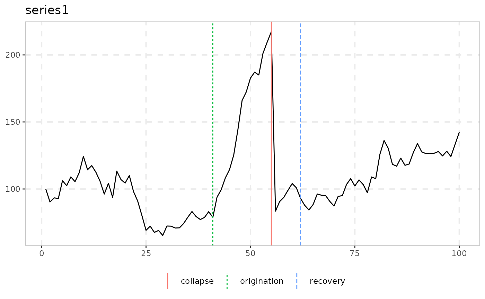

# Naming Conventions and the Analysis/Tidying/Plotting Pipeline

``` r

library(exuber)
```

## Why this exists

`exuber` started as one test
([`radf()`](https://kvasilopoulos.github.io/exuber/reference/radf.md),
the recursive ADF/SADF/GSADF/BSADF statistic of Phillips, Shi & Yu 2015)
and grew, through a long research programme, into roughly 25 functions
covering a dozen papers’ worth of related-but-distinct methodology:
alternative tests, dating procedures, monitoring schemes, root
inference. Every one of them used to be named `radf_<something>()`,
which was accurate for some and misleading for others – a `radf_` prefix
reads as “this is a recursive-ADF statistic,” but several of these
functions are not that at all. This vignette documents the naming scheme
that replaced it, and – more usefully – which functions can actually be
plugged into the shared
[`summary()`](https://rdrr.io/r/base/summary.html)/[`datestamp()`](https://kvasilopoulos.github.io/exuber/reference/datestamp.md)/[`tidy()`](https://generics.r-lib.org/reference/tidy.html)/[`autoplot()`](https://ggplot2.tidyverse.org/reference/autoplot.html)
pipeline built for
[`radf()`](https://kvasilopoulos.github.io/exuber/reference/radf.md),
and which have their own, differently-shaped output instead.

## The naming scheme

| Pattern | Means | Examples |
|----|----|----|
| `radf_` prefix | Genuinely built on the recursive-ADF core: calls [`radf()`](https://kvasilopoulos.github.io/exuber/reference/radf.md) directly, or reuses its `badf`/`bsadf` recursion | [`radf()`](https://kvasilopoulos.github.io/exuber/reference/radf.md), [`radf_tt()`](https://kvasilopoulos.github.io/exuber/reference/radf_tt.md), [`radf_sign()`](https://kvasilopoulos.github.io/exuber/reference/radf_sign.md), [`radf_common()`](https://kvasilopoulos.github.io/exuber/reference/radf_common.md), [`radf_kp()`](https://kvasilopoulos.github.io/exuber/reference/radf_kp.md), [`radf_recovery()`](https://kvasilopoulos.github.io/exuber/reference/radf_recovery.md), and the `_cv`/`_mc`/`_sb`/`_wb` critical-value engines |
| `_test` suffix | A standalone hypothesis test with its own null distribution, not built on the recursive-ADF core | [`lbi_test()`](https://kvasilopoulos.github.io/exuber/reference/lbi_test.md), [`ssu_test()`](https://kvasilopoulos.github.io/exuber/reference/ssu_test.md), [`quantile_test()`](https://kvasilopoulos.github.io/exuber/reference/quantile_test.md), [`cobubble_test()`](https://kvasilopoulos.github.io/exuber/reference/cobubble_test.md) |
| `dating_` prefix | Point-estimation / model-selection dating, no formal hypothesis test at all | [`dating_hls()`](https://kvasilopoulos.github.io/exuber/reference/dating_hls.md), [`dating_hlw()`](https://kvasilopoulos.github.io/exuber/reference/dating_hlw.md), [`dating_knp()`](https://kvasilopoulos.github.io/exuber/reference/dating_knp.md), [`dating_pdc()`](https://kvasilopoulos.github.io/exuber/reference/dating_pdc.md) |
| `monitor`/`monitor_` prefix | Real-time/sequential detection – grouped by *what it does*, not by internal mechanism. [`monitor()`](https://kvasilopoulos.github.io/exuber/reference/monitor.md) is this family’s flagship, the same role [`radf()`](https://kvasilopoulos.github.io/exuber/reference/radf.md) plays for the `radf_` family: it reuses `badf`/`bsadf` directly (genuinely ADF-family internals) but carries no `radf`/`sadf` token at all, specifically so it reads as “the real-time monitor,” not as a `radf_` variant – see below | [`monitor()`](https://kvasilopoulos.github.io/exuber/reference/monitor.md), [`monitor_cusum()`](https://kvasilopoulos.github.io/exuber/reference/monitor_cusum.md), [`monitor_lbi()`](https://kvasilopoulos.github.io/exuber/reference/monitor_lbi.md), [`monitor_quantile()`](https://kvasilopoulos.github.io/exuber/reference/monitor_quantile.md) |
| `root` family | Confidence-interval inference on the *magnitude* of the explosive root, not a test for its presence (`exuber_functions(family = "root")`; no shared prefix) | [`rootstamp()`](https://kvasilopoulos.github.io/exuber/reference/rootstamp.md) (two S3 methods: default for a single sub-sample, `radf_obj` to run every [`datestamp()`](https://kvasilopoulos.github.io/exuber/reference/datestamp.md) episode at once) |
| stands alone | A point-estimation tool, not a test | [`contagion_reg()`](https://kvasilopoulos.github.io/exuber/reference/contagion_reg.md) |

Naming prefixes are a convention, not a contract – they’re easy to
misremember and, as
[`monitor()`](https://kvasilopoulos.github.io/exuber/reference/monitor.md)
shows, sometimes trade off against each other (grouped with its fellow
monitors under a name that deliberately doesn’t advertise its ADF-family
internals, so it can’t be mistaken for a `radf_*()` variant). For
anything programmatic, don’t parse function names: call
[`exuber_functions()`](https://kvasilopoulos.github.io/exuber/reference/exuber_functions.md),
which returns the same categorization as actual, queryable data.

``` r

exuber_functions(family = "monitor")
#> # A tibble: 4 × 3
#>   name             family      description                                      
#>   <chr>            <chr>       <chr>                                            
#> 1 monitor          adf,monitor Real-time monitoring (Family A); reuses radf()'s…
#> 2 monitor_cusum    monitor     CUSUM/CUSUMV real-time monitoring, closed-form b…
#> 3 monitor_lbi      monitor     Sequential extension of lbi_test(), constant-bou…
#> 4 monitor_quantile monitor     QPWY recursive quantile-regression monitoring, e…
```

Two names that look related but aren’t: the `dating_*()` family above
are standalone SSR/BIC procedures called directly on raw data – they
take no critical value at all.
[`datestamp()`](https://kvasilopoulos.github.io/exuber/reference/datestamp.md)
(see below) is a different thing entirely: the generic that applies
PSY’s own threshold-crossing rule to any `radf_obj` + `radf_cv` pair.

One exception to
“[`datestamp()`](https://kvasilopoulos.github.io/exuber/reference/datestamp.md)
always needs a `radf_cv`”: `datestamp(object, option = "svadf")` runs
Sarkar & Wells (2026)’s asymmetric-threshold dating directly off
`object$badf`, no critical value at all – see
[`vignette("experimental-methods")`](https://kvasilopoulos.github.io/exuber/articles/experimental-methods.md).

## What actually plugs into `summary()`/`datestamp()`/`tidy()`/`autoplot()`

These four generics are built around one shape: a `radf_obj` (from
[`radf()`](https://kvasilopoulos.github.io/exuber/reference/radf.md))
paired with a `radf_cv` that carries a **time-varying** boundary
(`badf_cv`/`bsadf_cv`, one critical value per recursion point) as well
as the three scalar sup-statistic critical values
(`adf_cv`/`sadf_cv`/`gsadf_cv`). Only functions whose result actually
carries the `radf_obj` class – and whose paired `_cv()` actually
computes that time-varying boundary – get the full pipeline. Three
tiers, in practice:

### Full support: `radf_common()`, `radf_kp()`, `radf_tt()`, `radf_sign()`, `radf_sign_dm()`, `radf_sbz()`

[`radf_kp()`](https://kvasilopoulos.github.io/exuber/reference/radf_kp.md)/[`radf_common()`](https://kvasilopoulos.github.io/exuber/reference/radf_common.md)
literally return
[`radf()`](https://kvasilopoulos.github.io/exuber/reference/radf.md)’s
own output (purged of volatility, or computed on a PCA factor,
respectively, then
[`radf()`](https://kvasilopoulos.github.io/exuber/reference/radf.md)
unmodified), so every generic works exactly as it does for plain
[`radf()`](https://kvasilopoulos.github.io/exuber/reference/radf.md).
The running series for this whole section is the one these tests are
built for –
[`sim_psy1()`](https://kvasilopoulos.github.io/exuber/reference/sim_psy1.md)’s
bubble with a permanent volatility break
([`sim_vol_break()`](https://kvasilopoulos.github.io/exuber/reference/sim_vol_break.md),
innovation standard deviation tripling half-way through), see
[`vignette("volatility-robust-radf")`](https://kvasilopoulos.github.io/exuber/articles/volatility-robust-radf.md):

``` r

y <- sim_psy1(n = 200, seed = 1, e = sim_vol_break(199))
```

``` r

res <- radf_kp(y, minw = 20)
cv <- radf_mc_cv(n = attr(res, "n"), minw = 20)

summary(res, cv = cv)
#> 
#> ── Summary (minw = 20, lag = 0) ────────────────── Monte Carlo (nboot = 1000) ──
#> 
#> series1 :
#> # A tibble: 3 × 5
#>   stat  tstat   `90`    `95`  `99`
#>   <fct> <dbl>  <dbl>   <dbl> <dbl>
#> 1 adf   -1.72 -0.328 0.00172 0.572
#> 2 sadf   1.50  1.19  1.48    1.97 
#> 3 gsadf  2.63  1.99  2.27    2.87
datestamp(res, cv = cv)
#> 
#> ── Datestamp (min_duration = 0) ───────────────────────────────── Monte Carlo ──
#> 
#> series1 :
#>   Start Peak End Duration   Signal Ongoing
#> 1    90   95 105       15 positive   FALSE
#> 2   106  106 109        3 positive   FALSE
#> 3   141  141 142        1 positive   FALSE
#> 4   145  146 147        2 negative   FALSE
tidy(res, cv = cv)
#> # A tibble: 1 × 4
#>   id        adf  sadf gsadf
#>   <fct>   <dbl> <dbl> <dbl>
#> 1 series1 -1.72  1.50  2.63
autoplot(res, cv = cv)
```


The other three are different: they carry the `radf_obj` class but build
their statistic on `gls_dfstat_grid()` (a no-intercept, GLS-demeaned
recursive-DF grid, fed the raw series for
[`radf_tt()`](https://kvasilopoulos.github.io/exuber/reference/radf_tt.md),
its cumulated sign for
[`radf_sign()`](https://kvasilopoulos.github.io/exuber/reference/radf_sign.md),
a recursively demeaned cumulated sign for
[`radf_sign_dm()`](https://kvasilopoulos.github.io/exuber/reference/radf_sign_dm.md))
rather than calling
[`radf()`](https://kvasilopoulos.github.io/exuber/reference/radf.md)
directly. Until 2026-08-18 all three had a real gap: their `_cv()`
functions only ever computed the three scalar critical values
[`summary()`](https://rdrr.io/r/base/summary.html)/[`tidy()`](https://generics.r-lib.org/reference/tidy.html)
need, discarding the `badf`/`bsadf` path `gls_dfstat_grid()` already
computes per replicate, so
[`datestamp()`](https://kvasilopoulos.github.io/exuber/reference/datestamp.md)/[`autoplot()`](https://ggplot2.tidyverse.org/reference/autoplot.html)
(which need a *time-varying* boundary) always errored. Fixed for all
three the same way, once the pattern was confirmed in
[`radf_tt_cv()`](https://kvasilopoulos.github.io/exuber/reference/radf_tt_cv.md)
first and then checked to hold for the other two as well: unlike
[`radf_mc_cv()`](https://kvasilopoulos.github.io/exuber/reference/radf_mc_cv.md)’s
own `bsadf_cv` (a
[`cummax()`](https://rdrr.io/r/base/cumsum.html)-across-replicates
shortcut around the base C++ engine’s output shape),
`gls_dfstat_grid()`’s `bsadf` is already the genuine
sup-over-all-window-starts statistic at each point, so no shortcut
derivation was needed – just the per-time-point quantile across
replicates, the construction
[`radf_mc_cv()`](https://kvasilopoulos.github.io/exuber/reference/radf_mc_cv.md)
uses for its own `bsadf_cv`. Validated per function: `badf_cv`’s last
row is bit-identical to `adf_cv` (`adf` is literally `badf`’s last
point, per replicate – a hard identity, not an approximate check, and
true regardless of which series feeds `gls_dfstat_grid()`); empirical
false-alarm rate under `H0` is at or below nominal (`radf_tt` 3.3%,
`radf_sign` 5.5%, `radf_sign_dm` 3.5%, all at nominal 5%, n=100,
minw=20); and detection power on an identical synthetic bubble is in the
same range as the established
[`radf()`](https://kvasilopoulos.github.io/exuber/reference/radf.md)/[`radf_mc_cv()`](https://kvasilopoulos.github.io/exuber/reference/radf_mc_cv.md)
baseline (16%) rather than suspiciously higher or lower (`radf_tt` 18%,
`radf_sign` 20%, `radf_sign_dm` 8% – the sign-based tests trading power
for their heteroskedasticity invariance is itself the paper’s own
documented finding, not a validation red flag).

``` r

res <- radf_tt(y, minw = 20)
cv <- radf_tt_cv(n = 200, minw = 20)

summary(res, cv = cv)
#> 
#> ── Summary (minw = 20, lag = 0) ────────── Time-Transformed MC (nboot = 2000) ──
#> 
#> series1 :
#> # A tibble: 3 × 5
#>   stat   tstat  `90`  `95`  `99`
#>   <fct>  <dbl> <dbl> <dbl> <dbl>
#> 1 adf   -0.997 0.832  1.26  2.04
#> 2 sadf   3.27  2.32   2.66  3.32
#> 3 gsadf  4.23  3.26   3.65  4.38
datestamp(res, cv = cv)
#> 
#> ── Datestamp (min_duration = 0) ───────────────────────── Time-Transformed MC ──
#> 
#> series1 :
#>   Start Peak End Duration   Signal Ongoing
#> 1    21   38  89       68 negative   FALSE
#> 2   148  148 150        2 positive   FALSE
tidy(res, cv = cv)
#> # A tibble: 1 × 4
#>   id         adf  sadf gsadf
#>   <fct>    <dbl> <dbl> <dbl>
#> 1 series1 -0.997  3.27  4.23
autoplot(res, cv = cv)
```


``` r

res <- radf_sign(y, minw = 20)
cv <- radf_sign_cv(n = 200, minw = 20)

summary(res, cv = cv)
#> 
#> ── Summary (minw = 20, lag = 0) ──────────────── Sign-Based MC (nboot = 2000) ──
#> 
#> series1 :
#> # A tibble: 3 × 5
#>   stat   tstat  `90`  `95`  `99`
#>   <fct>  <dbl> <dbl> <dbl> <dbl>
#> 1 adf   -0.293 0.932  1.35  2.14
#> 2 sadf   4.47  2.43   2.78  3.26
#> 3 gsadf  8.88  3.46   3.88  4.98
datestamp(res, cv = cv)
#> 
#> ── Datestamp (min_duration = 0) ─────────────────────────────── Sign-Based MC ──
#> 
#> series1 :
#>   Start Peak End Duration   Signal Ongoing
#> 1    84   84  85        1 positive   FALSE
#> 2    87  103 122       35 positive   FALSE
#> 3   123  123 124        1 positive   FALSE
tidy(res, cv = cv)
#> # A tibble: 1 × 4
#>   id         adf  sadf gsadf
#>   <fct>    <dbl> <dbl> <dbl>
#> 1 series1 -0.293  4.47  8.88
autoplot(res, cv = cv)
```


[`radf_sbz()`](https://kvasilopoulos.github.io/exuber/reference/radf_sbz.md)
is a fourth, separate case: it builds its statistic (`supBZ`) on
`wls_dfstat_grid()`, a WLS/kernel-volatility-weighted no-intercept
recursive-DF grid, not `gls_dfstat_grid()` – but the same fix applies
for the same reason, since `wls_dfstat_grid()` already returns the full
`badf`/`bsadf` path per replicate.
[`radf_sbz_cv()`](https://kvasilopoulos.github.io/exuber/reference/radf_sbz_cv.md)’s
wild bootstrap is therefore built the same way as
[`radf_tt_cv()`](https://kvasilopoulos.github.io/exuber/reference/radf_tt_cv.md)/[`radf_sign_cv()`](https://kvasilopoulos.github.io/exuber/reference/radf_sign_cv.md)’s
Monte Carlo simulation: per-time-point quantile across replicates, no
[`cummax()`](https://rdrr.io/r/base/cumsum.html) shortcut needed.
Validated the same way: `badf_cv`’s last row is bit-identical to
`adf_cv`; empirical false-alarm rate under `H0` is 5.0% at nominal 5%
(n=100, minw=20, 200 replications); and it does reject on a sufficiently
strong deterministic explosive path, though its kernel-volatility
weighting trades away enough power on
[`sim_psy1()`](https://kvasilopoulos.github.io/exuber/reference/sim_psy1.md)’s
default, milder bubble that it doesn’t reject on the series above at
nboot=100-200 – the same power/robustness trade-off already documented
for
[`radf_sbz_union()`](https://kvasilopoulos.github.io/exuber/reference/radf_sbz_union.md)’s
`supBZ` leg below, not a new finding specific to the split.

``` r

res <- radf_sbz(y, minw = 20)
cv <- radf_sbz_cv(y, minw = 20, nboot = 200, seed = 1)

summary(res, cv = cv)
#> 
#> ── Summary (minw = 20, lag = 0) ────────── Wild Bootstrap (SBZ) (nboot = 200) ──
#> 
#> series1 :
#> # A tibble: 3 × 5
#>   stat  tstat  `90`  `95`  `99`
#>   <fct> <dbl> <dbl> <dbl> <dbl>
#> 1 adf   -1.39 0.825  1.13  1.61
#> 2 sadf   1.67 1.58   2.11  3.36
#> 3 gsadf  1.91 3.37   5.06  6.21
tidy(res, cv = cv)
#> # A tibble: 1 × 4
#>   id        adf  sadf gsadf
#>   <fct>   <dbl> <dbl> <dbl>
#> 1 series1 -1.39  1.67  1.91
```

[`datestamp()`](https://kvasilopoulos.github.io/exuber/reference/datestamp.md)/[`autoplot()`](https://ggplot2.tidyverse.org/reference/autoplot.html)
need at least one rejection to have anything to show (they error
otherwise, same as for any other `radf_obj`/`radf_cv` pair) – the series
above doesn’t clear `supBZ`’s bar, so here’s the same volatility break
under a stronger, uncollapsed explosive regime (`rho = 1.03` from
`t = 120` to the sample end), which does:

``` r

y_strong <- sim_psy1(n = 200, te = 120, tf = 200, c = 0.03, alpha = 0, seed = 1,
                     e = sim_vol_break(199))

res2 <- radf_sbz(y_strong, minw = 20)
cv2 <- radf_sbz_cv(y_strong, minw = 20, nboot = 100, seed = 1)
datestamp(res2, cv = cv2)
#> 
#> ── Datestamp (min_duration = 0) ──────────────────────── Wild Bootstrap (SBZ) ──
#> 
#> series1 :
#>   Start Peak End Duration   Signal Ongoing
#> 1   128  129 130        2 positive   FALSE
#> 2   132  134 135        3 positive   FALSE
#> 3   172  200 200       29 positive    TRUE
autoplot(res2, cv = cv2)
```


### Own `print()` and `autoplot()`: everything else

The remaining ~15 functions
([`lbi_test()`](https://kvasilopoulos.github.io/exuber/reference/lbi_test.md),
[`ssu_test()`](https://kvasilopoulos.github.io/exuber/reference/ssu_test.md),
[`quantile_test()`](https://kvasilopoulos.github.io/exuber/reference/quantile_test.md),
[`cobubble_test()`](https://kvasilopoulos.github.io/exuber/reference/cobubble_test.md),
the `dating_*()` family, the
[`monitor()`](https://kvasilopoulos.github.io/exuber/reference/monitor.md)/`monitor_*()`
family (including
[`monitor()`](https://kvasilopoulos.github.io/exuber/reference/monitor.md)
itself, ADF-family internals notwithstanding – see above),
[`contagion_reg()`](https://kvasilopoulos.github.io/exuber/reference/contagion_reg.md),
[`radf_recovery()`](https://kvasilopoulos.github.io/exuber/reference/radf_recovery.md),
[`rootstamp()`](https://kvasilopoulos.github.io/exuber/reference/rootstamp.md),
[`radf_sbz_union()`](https://kvasilopoulos.github.io/exuber/reference/radf_sbz_union.md))
each return their own class with their own
[`print()`](https://rdrr.io/r/base/print.html) and
[`autoplot()`](https://ggplot2.tidyverse.org/reference/autoplot.html)
methods, because their output genuinely doesn’t fit the `radf_obj` shape
– a dating table isn’t a per-series sup-statistic, a monitoring alarm
isn’t a critical value grid. Trying to force them through
[`summary()`](https://rdrr.io/r/base/summary.html)/[`datestamp()`](https://kvasilopoulos.github.io/exuber/reference/datestamp.md)/[`tidy()`](https://generics.r-lib.org/reference/tidy.html)
isn’t a documentation gap to close; the right call is their own
presentation, shown directly:

[`rootstamp()`](https://kvasilopoulos.github.io/exuber/reference/rootstamp.md)
is the one exception worth flagging: it’s grouped under **Analysis** in
the [reference
index](https://kvasilopoulos.github.io/exuber/reference/index.md) and
the README’s workflow list, right after
[`datestamp()`](https://kvasilopoulos.github.io/exuber/reference/datestamp.md),
since that’s genuinely where it belongs in the *sequence of steps*
(detect → date → measure growth rate) – but that’s a workflow position,
not an S3-support tier. It’s still its own class with its own
[`print()`](https://rdrr.io/r/base/print.html) and
[`autoplot()`](https://ggplot2.tidyverse.org/reference/autoplot.html)
methods, same as everything else in this section; see
[`vignette("root-inference")`](https://kvasilopoulos.github.io/exuber/articles/root-inference.md).

``` r

dating_hls(sim_data$psy1, trim = 0.05)
#> 
#> ── dating_hls (n = 100, trim = 0.05) ───────────────────────────────────────────
#> 
#>    series  model  origination  collapse  recovery
#>   series1      4           41        55        62

ssu_test(sim_data$psy1, sig_lvl = 95)
#> 
#> ── ssu_test (n = 100, minw = 19, sig_lvl = 95%, crit = 3.3) ────────────────────
#> 
#>    series   sadf  detected
#>   series1  4.251      TRUE
autoplot(dating_hls(sim_data$psy1, trim = 0.05))
```



## Summary

| Tier | Functions | [`summary()`](https://rdrr.io/r/base/summary.html) | [`datestamp()`](https://kvasilopoulos.github.io/exuber/reference/datestamp.md) | [`tidy()`](https://generics.r-lib.org/reference/tidy.html) | [`autoplot()`](https://ggplot2.tidyverse.org/reference/autoplot.html) |
|----|----|----|----|----|----|
| Full | [`radf()`](https://kvasilopoulos.github.io/exuber/reference/radf.md), [`radf_common()`](https://kvasilopoulos.github.io/exuber/reference/radf_common.md), [`radf_kp()`](https://kvasilopoulos.github.io/exuber/reference/radf_kp.md), [`radf_tt()`](https://kvasilopoulos.github.io/exuber/reference/radf_tt.md), [`radf_sign()`](https://kvasilopoulos.github.io/exuber/reference/radf_sign.md), [`radf_sign_dm()`](https://kvasilopoulos.github.io/exuber/reference/radf_sign_dm.md), [`radf_sbz()`](https://kvasilopoulos.github.io/exuber/reference/radf_sbz.md) | yes | yes | yes | yes |
| Standalone | everything else | own [`print()`](https://rdrr.io/r/base/print.html) | – | – | own method |
