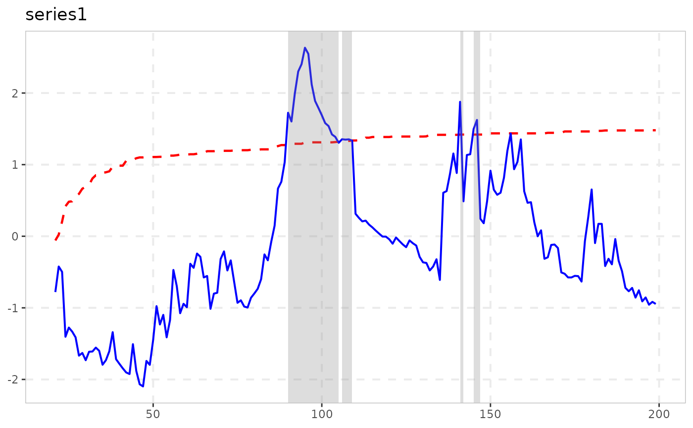
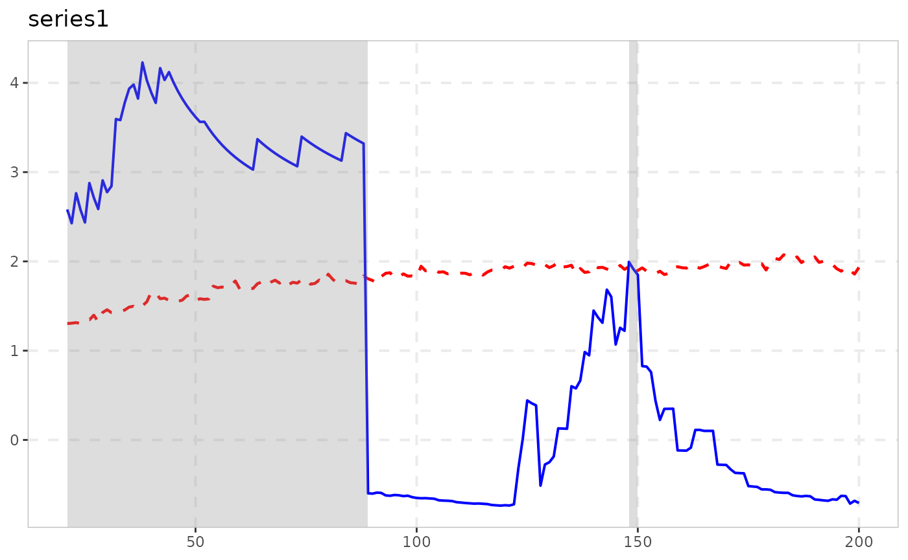
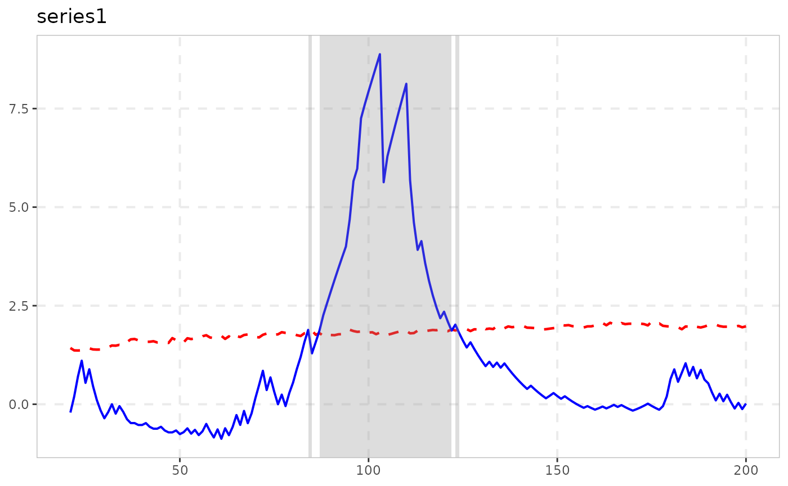
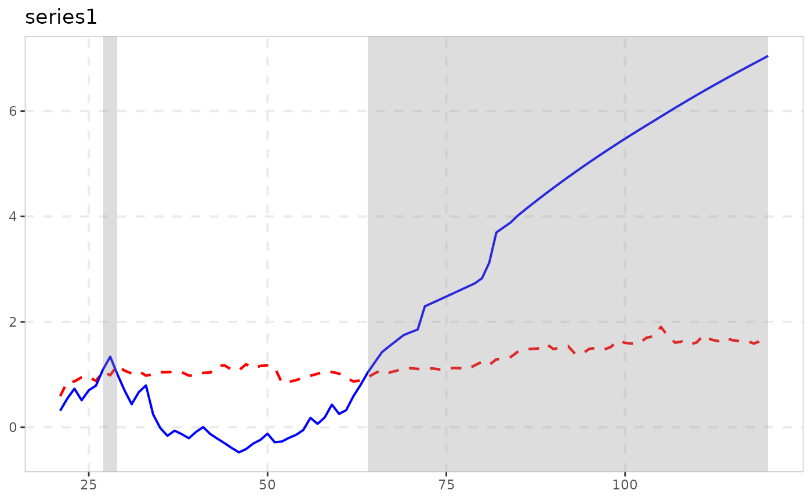

# Naming Conventions and the Analysis/Tidying/Plotting Pipeline

``` r

library(exuber)
```

## Why this exists

`exuber` started as one test
([`radf()`](https://kvasilopoulos.github.io/exuber/reference/radf.md),
the recursive ADF/SADF/GSADF/BSADF statistic of Phillips, Shi & Yu 2015)
and grew, through a long research programme, into roughly 25 functions
covering a dozen papers’ worth of related-but-distinct methodology:
alternative tests, dating procedures, monitoring schemes, root
inference. Every one of them used to be named `radf_<something>()`,
which was accurate for some and misleading for others – a `radf_` prefix
reads as “this is a recursive-ADF statistic,” but several of these
functions are not that at all. This vignette documents the naming scheme
that replaced it, and – more usefully – which functions can actually be
plugged into the shared
[`summary()`](https://rdrr.io/r/base/summary.html)/[`datestamp()`](https://kvasilopoulos.github.io/exuber/reference/datestamp.md)/[`tidy()`](https://generics.r-lib.org/reference/tidy.html)/[`autoplot()`](https://ggplot2.tidyverse.org/reference/autoplot.html)
pipeline built for
[`radf()`](https://kvasilopoulos.github.io/exuber/reference/radf.md),
and which have their own, differently-shaped output instead.

## The naming scheme

| Pattern | Means | Examples |
|----|----|----|
| `radf_` prefix | Genuinely built on the recursive-ADF core: calls [`radf()`](https://kvasilopoulos.github.io/exuber/reference/radf.md) directly, or reuses its `badf`/`bsadf` recursion | [`radf()`](https://kvasilopoulos.github.io/exuber/reference/radf.md), [`radf_tt()`](https://kvasilopoulos.github.io/exuber/reference/radf_tt.md), [`radf_sign()`](https://kvasilopoulos.github.io/exuber/reference/radf_sign.md), [`radf_common()`](https://kvasilopoulos.github.io/exuber/reference/radf_common.md), [`radf_kp()`](https://kvasilopoulos.github.io/exuber/reference/radf_kp.md), [`radf_recovery()`](https://kvasilopoulos.github.io/exuber/reference/radf_recovery.md), and the `_cv`/`_mc`/`_sb`/`_wb` critical-value engines |
| `_test` suffix | A standalone hypothesis test with its own null distribution, not built on the recursive-ADF core | [`lbi_test()`](https://kvasilopoulos.github.io/exuber/reference/lbi_test.md), [`ssu_test()`](https://kvasilopoulos.github.io/exuber/reference/ssu_test.md), [`quantile_test()`](https://kvasilopoulos.github.io/exuber/reference/quantile_test.md), [`cobubble_test()`](https://kvasilopoulos.github.io/exuber/reference/cobubble_test.md) |
| `dating_` prefix | Point-estimation / model-selection dating, no formal hypothesis test at all | [`dating_hls()`](https://kvasilopoulos.github.io/exuber/reference/dating_hls.md), [`dating_hlw()`](https://kvasilopoulos.github.io/exuber/reference/dating_hlw.md), [`dating_knp()`](https://kvasilopoulos.github.io/exuber/reference/dating_knp.md), [`dating_pdc()`](https://kvasilopoulos.github.io/exuber/reference/dating_pdc.md) |
| `monitor`/`monitor_` prefix | Real-time/sequential detection – grouped by *what it does*, not by internal mechanism. [`monitor()`](https://kvasilopoulos.github.io/exuber/reference/monitor.md) is this family’s flagship, the same role [`radf()`](https://kvasilopoulos.github.io/exuber/reference/radf.md) plays for the `radf_` family: it reuses `badf`/`bsadf` directly (genuinely ADF-family internals) but carries no `radf`/`sadf` token at all, specifically so it reads as “the real-time monitor,” not as a `radf_` variant – see below | [`monitor()`](https://kvasilopoulos.github.io/exuber/reference/monitor.md), [`monitor_cusum()`](https://kvasilopoulos.github.io/exuber/reference/monitor_cusum.md), [`monitor_lbi()`](https://kvasilopoulos.github.io/exuber/reference/monitor_lbi.md), [`monitor_quantile()`](https://kvasilopoulos.github.io/exuber/reference/monitor_quantile.md) |
| `root_` prefix | Confidence-interval inference on the *magnitude* of the explosive root, not a test for its presence | [`rootstamp()`](https://kvasilopoulos.github.io/exuber/reference/rootstamp.md) (two S3 methods: default for a single sub-sample, `radf_obj` to run every [`datestamp()`](https://kvasilopoulos.github.io/exuber/reference/datestamp.md) episode at once) |
| stands alone | A point-estimation tool, not a test | [`contagion_reg()`](https://kvasilopoulos.github.io/exuber/reference/contagion_reg.md) |

Naming prefixes are a convention, not a contract – they’re easy to
misremember and, as
[`monitor()`](https://kvasilopoulos.github.io/exuber/reference/monitor.md)
shows, sometimes trade off against each other (grouped with its fellow
monitors under a name that deliberately doesn’t advertise its ADF-family
internals, so it can’t be mistaken for a `radf_*()` variant). For
anything programmatic, don’t parse function names: call
[`exuber_functions()`](https://kvasilopoulos.github.io/exuber/reference/exuber_functions.md),
which returns the same categorization as actual, queryable data.

``` r

exuber_functions(family = "monitor")
#> # A tibble: 4 × 3
#>   name             family      description                                      
#>   <chr>            <chr>       <chr>                                            
#> 1 monitor          adf,monitor Real-time monitoring (Family A); reuses radf()'s…
#> 2 monitor_cusum    monitor     CUSUM/CUSUMV real-time monitoring, closed-form b…
#> 3 monitor_lbi      monitor     Sequential extension of lbi_test(), constant-bou…
#> 4 monitor_quantile monitor     QPWY recursive quantile-regression monitoring, e…
```

Two names that look related but aren’t: the `dating_*()` family above
are standalone SSR/BIC procedures called directly on raw data – they
take no critical value at all.
[`datestamp()`](https://kvasilopoulos.github.io/exuber/reference/datestamp.md)
(see below) is a different thing entirely: the generic that applies
PSY’s own threshold-crossing rule to any `radf_obj` + `radf_cv` pair.

One exception to
“[`datestamp()`](https://kvasilopoulos.github.io/exuber/reference/datestamp.md)
always needs a `radf_cv`”: `datestamp(object, option = "svadf")` runs
Sarkar & Wells (2026)’s asymmetric-threshold dating directly off
`object$badf`, no critical value at all – see
[`vignette("experimental-methods")`](https://kvasilopoulos.github.io/exuber/articles/experimental-methods.md).

## What actually plugs into `summary()`/`datestamp()`/`tidy()`/`autoplot()`

These four generics are built around one shape: a `radf_obj` (from
[`radf()`](https://kvasilopoulos.github.io/exuber/reference/radf.md))
paired with a `radf_cv` that carries a **time-varying** boundary
(`badf_cv`/`bsadf_cv`, one critical value per recursion point) as well
as the three scalar sup-statistic critical values
(`adf_cv`/`sadf_cv`/`gsadf_cv`). Only functions whose result actually
carries the `radf_obj` class – and whose paired `_cv()` actually
computes that time-varying boundary – get the full pipeline. Three
tiers, in practice:

### Full support: `radf_common()`, `radf_kp()`, `radf_tt()`, `radf_sign()`, `radf_sign_dm()`, `radf_sbz()`

[`radf_kp()`](https://kvasilopoulos.github.io/exuber/reference/radf_kp.md)/[`radf_common()`](https://kvasilopoulos.github.io/exuber/reference/radf_common.md)
literally return
[`radf()`](https://kvasilopoulos.github.io/exuber/reference/radf.md)’s
own output (purged of volatility, or computed on a PCA factor,
respectively, then
[`radf()`](https://kvasilopoulos.github.io/exuber/reference/radf.md)
unmodified), so every generic works exactly as it does for plain
[`radf()`](https://kvasilopoulos.github.io/exuber/reference/radf.md):

``` r

res <- radf_kp(sim_data, minw = 20)
cv <- radf_mc_cv(n = attr(res, "n"), minw = 20)

summary(res, cv = cv)
#> 
#> ── Summary (minw = 20, lag = 0) ────────────────── Monte Carlo (nboot = 1000) ──
#> 
#> psy1 :
#> # A tibble: 3 × 5
#>   stat   tstat   `90`   `95`  `99`
#>   <fct>  <dbl>  <dbl>  <dbl> <dbl>
#> 1 adf   -0.439 -0.423 -0.152 0.677
#> 2 sadf   0.175  1.07   1.40  1.78 
#> 3 gsadf  1.67   1.58   1.90  2.51 
#> 
#> psy2 :
#> # A tibble: 3 × 5
#>   stat   tstat   `90`   `95`  `99`
#>   <fct>  <dbl>  <dbl>  <dbl> <dbl>
#> 1 adf   -2.40  -0.423 -0.152 0.677
#> 2 sadf   0.918  1.07   1.40  1.78 
#> 3 gsadf  2.03   1.58   1.90  2.51 
#> 
#> evans :
#> # A tibble: 3 × 5
#>   stat   tstat   `90`   `95`  `99`
#>   <fct>  <dbl>  <dbl>  <dbl> <dbl>
#> 1 adf   -1.93  -0.423 -0.152 0.677
#> 2 sadf  -0.714  1.07   1.40  1.78 
#> 3 gsadf  0.489  1.58   1.90  2.51 
#> 
#> div :
#> # A tibble: 3 × 5
#>   stat   tstat   `90`   `95`  `99`
#>   <fct>  <dbl>  <dbl>  <dbl> <dbl>
#> 1 adf   -2.32  -0.423 -0.152 0.677
#> 2 sadf   0.584  1.07   1.40  1.78 
#> 3 gsadf  0.900  1.58   1.90  2.51 
#> 
#> blan :
#> # A tibble: 3 × 5
#>   stat   tstat   `90`   `95`  `99`
#>   <fct>  <dbl>  <dbl>  <dbl> <dbl>
#> 1 adf   -2.47  -0.423 -0.152 0.677
#> 2 sadf  -1.46   1.07   1.40  1.78 
#> 3 gsadf  0.452  1.58   1.90  2.51
datestamp(res, cv = cv)
#> 
#> ── Datestamp (min_duration = 0) ───────────────────────────────── Monte Carlo ──
#> 
#> psy2 :
#>   Start Peak End Duration   Signal Ongoing
#> 1    22   30  36       14 positive   FALSE
#> 2    60   65  70       10 positive   FALSE
tidy(res, cv = cv)
#> # A tibble: 5 × 4
#>   id       adf   sadf gsadf
#>   <fct>  <dbl>  <dbl> <dbl>
#> 1 psy1  -0.439  0.175 1.67 
#> 2 psy2  -2.40   0.918 2.03 
#> 3 evans -1.93  -0.714 0.489
#> 4 div   -2.32   0.584 0.900
#> 5 blan  -2.47  -1.46  0.452
autoplot(res, cv = cv)
```



The other three are different: they carry the `radf_obj` class but build
their statistic on `gls_dfstat_grid()` (a no-intercept, GLS-demeaned
recursive-DF grid, fed the raw series for
[`radf_tt()`](https://kvasilopoulos.github.io/exuber/reference/radf_tt.md),
its cumulated sign for
[`radf_sign()`](https://kvasilopoulos.github.io/exuber/reference/radf_sign.md),
a recursively demeaned cumulated sign for
[`radf_sign_dm()`](https://kvasilopoulos.github.io/exuber/reference/radf_sign_dm.md))
rather than calling
[`radf()`](https://kvasilopoulos.github.io/exuber/reference/radf.md)
directly. Until 2026-08-18 all three had a real gap: their `_cv()`
functions only ever computed the three scalar critical values
[`summary()`](https://rdrr.io/r/base/summary.html)/[`tidy()`](https://generics.r-lib.org/reference/tidy.html)
need, discarding the `badf`/`bsadf` path `gls_dfstat_grid()` already
computes per replicate, so
[`datestamp()`](https://kvasilopoulos.github.io/exuber/reference/datestamp.md)/[`autoplot()`](https://ggplot2.tidyverse.org/reference/autoplot.html)
(which need a *time-varying* boundary) always errored. Fixed for all
three the same way, once the pattern was confirmed in
[`radf_tt_cv()`](https://kvasilopoulos.github.io/exuber/reference/radf_tt_cv.md)
first and then checked to hold for the other two as well: unlike
[`radf_mc_cv()`](https://kvasilopoulos.github.io/exuber/reference/radf_mc_cv.md)’s
own `bsadf_cv` (a
[`cummax()`](https://rdrr.io/r/base/cumsum.html)-across-replicates
shortcut around the base C++ engine’s output shape),
`gls_dfstat_grid()`’s `bsadf` is already the genuine
sup-over-all-window-starts statistic at each point, so no shortcut
derivation was needed – just the per-time-point quantile across
replicates, the construction
[`radf_mc_cv()`](https://kvasilopoulos.github.io/exuber/reference/radf_mc_cv.md)
uses for its own `bsadf_cv`. Validated per function: `badf_cv`’s last
row is bit-identical to `adf_cv` (`adf` is literally `badf`’s last
point, per replicate – a hard identity, not an approximate check, and
true regardless of which series feeds `gls_dfstat_grid()`); empirical
false-alarm rate under `H0` is at or below nominal (`radf_tt` 3.3%,
`radf_sign` 5.5%, `radf_sign_dm` 3.5%, all at nominal 5%, n=100,
minw=20); and detection power on an identical synthetic bubble is in the
same range as the established
[`radf()`](https://kvasilopoulos.github.io/exuber/reference/radf.md)/[`radf_mc_cv()`](https://kvasilopoulos.github.io/exuber/reference/radf_mc_cv.md)
baseline (16%) rather than suspiciously higher or lower (`radf_tt` 18%,
`radf_sign` 20%, `radf_sign_dm` 8% – the sign-based tests trading power
for their heteroskedasticity invariance is itself the paper’s own
documented finding, not a validation red flag).

``` r

res <- radf_tt(sim_data, minw = 20)
cv <- radf_tt_cv(n = 100, minw = 20)

summary(res, cv = cv)
#> 
#> ── Summary (minw = 20, lag = 0) ────────── Time-Transformed MC (nboot = 2000) ──
#> 
#> psy1 :
#> # A tibble: 3 × 5
#>   stat  tstat  `90`  `95`  `99`
#>   <fct> <dbl> <dbl> <dbl> <dbl>
#> 1 adf   -1.04 0.947  1.34  2.05
#> 2 sadf   1.27 2.18   2.51  3.40
#> 3 gsadf  2.20 2.81   3.15  4.04
#> 
#> psy2 :
#> # A tibble: 3 × 5
#>   stat   tstat  `90`  `95`  `99`
#>   <fct>  <dbl> <dbl> <dbl> <dbl>
#> 1 adf   -0.860 0.947  1.34  2.05
#> 2 sadf   2.60  2.18   2.51  3.40
#> 3 gsadf  3.50  2.81   3.15  4.04
#> 
#> evans :
#> # A tibble: 3 × 5
#>   stat  tstat  `90`  `95`  `99`
#>   <fct> <dbl> <dbl> <dbl> <dbl>
#> 1 adf   -1.33 0.947  1.34  2.05
#> 2 sadf   1.66 2.18   2.51  3.40
#> 3 gsadf  1.88 2.81   3.15  4.04
#> 
#> div :
#> # A tibble: 3 × 5
#>   stat  tstat  `90`  `95`  `99`
#>   <fct> <dbl> <dbl> <dbl> <dbl>
#> 1 adf   0.722 0.947  1.34  2.05
#> 2 sadf  2.34  2.18   2.51  3.40
#> 3 gsadf 2.34  2.81   3.15  4.04
#> 
#> blan :
#> # A tibble: 3 × 5
#>   stat   tstat  `90`  `95`  `99`
#>   <fct>  <dbl> <dbl> <dbl> <dbl>
#> 1 adf   -1.34  0.947  1.34  2.05
#> 2 sadf   0.500 2.18   2.51  3.40
#> 3 gsadf  1.54  2.81   3.15  4.04
datestamp(res, cv = cv)
#> 
#> ── Datestamp (min_duration = 0) ───────────────────────── Time-Transformed MC ──
#> 
#> psy2 :
#>   Start Peak End Duration   Signal Ongoing
#> 1    21   27  35       14 positive   FALSE
#> 2    55   55  73       18 positive   FALSE
tidy(res, cv = cv)
#> # A tibble: 5 × 4
#>   id       adf  sadf gsadf
#>   <fct>  <dbl> <dbl> <dbl>
#> 1 psy1  -1.04  1.27   2.20
#> 2 psy2  -0.860 2.60   3.50
#> 3 evans -1.33  1.66   1.88
#> 4 div    0.722 2.34   2.34
#> 5 blan  -1.34  0.500  1.54
autoplot(res, cv = cv)
```



``` r

res <- radf_sign(sim_data, minw = 20)
cv <- radf_sign_cv(n = 100, minw = 20)

summary(res, cv = cv)
#> 
#> ── Summary (minw = 20, lag = 0) ──────────────── Sign-Based MC (nboot = 2000) ──
#> 
#> psy1 :
#> # A tibble: 3 × 5
#>   stat   tstat  `90`  `95`  `99`
#>   <fct>  <dbl> <dbl> <dbl> <dbl>
#> 1 adf   -0.152 0.920  1.28  1.99
#> 2 sadf   0.937 2.26   2.62  3.39
#> 3 gsadf  2.02  2.89   3.31  4.45
#> 
#> psy2 :
#> # A tibble: 3 × 5
#>   stat  tstat  `90`  `95`  `99`
#>   <fct> <dbl> <dbl> <dbl> <dbl>
#> 1 adf    2.56 0.920  1.28  1.99
#> 2 sadf   6.42 2.26   2.62  3.39
#> 3 gsadf 14.0  2.89   3.31  4.45
#> 
#> evans :
#> # A tibble: 3 × 5
#>   stat  tstat  `90`  `95`  `99`
#>   <fct> <dbl> <dbl> <dbl> <dbl>
#> 1 adf    4.85 0.920  1.28  1.99
#> 2 sadf   5.76 2.26   2.62  3.39
#> 3 gsadf  6.85 2.89   3.31  4.45
#> 
#> div :
#> # A tibble: 3 × 5
#>   stat  tstat  `90`  `95`  `99`
#>   <fct> <dbl> <dbl> <dbl> <dbl>
#> 1 adf    1.13 0.920  1.28  1.99
#> 2 sadf   2.79 2.26   2.62  3.39
#> 3 gsadf  2.95 2.89   3.31  4.45
#> 
#> blan :
#> # A tibble: 3 × 5
#>   stat  tstat  `90`  `95`  `99`
#>   <fct> <dbl> <dbl> <dbl> <dbl>
#> 1 adf    3.38 0.920  1.28  1.99
#> 2 sadf   3.38 2.26   2.62  3.39
#> 3 gsadf  3.68 2.89   3.31  4.45
datestamp(res, cv = cv)
#> 
#> ── Datestamp (min_duration = 0) ─────────────────────────────── Sign-Based MC ──
#> 
#> psy2 :
#>   Start Peak End Duration   Signal Ongoing
#> 1    21   40 100       80 positive    TRUE
#> 
#> evans :
#>   Start Peak End Duration   Signal Ongoing
#> 1    21   84 100       80 positive    TRUE
#> 
#> blan :
#>   Start Peak End Duration   Signal Ongoing
#> 1    31   43  73       42 negative   FALSE
#> 2    77   78  79        2 positive   FALSE
#> 3    80  100 100       21 positive    TRUE
tidy(res, cv = cv)
#> # A tibble: 5 × 4
#>   id       adf  sadf gsadf
#>   <fct>  <dbl> <dbl> <dbl>
#> 1 psy1  -0.152 0.937  2.02
#> 2 psy2   2.56  6.42  14.0 
#> 3 evans  4.85  5.76   6.85
#> 4 div    1.13  2.79   2.95
#> 5 blan   3.38  3.38   3.68
autoplot(res, cv = cv)
```



[`radf_sbz()`](https://kvasilopoulos.github.io/exuber/reference/radf_sbz.md)
is a fourth, separate case: it builds its statistic (`supBZ`) on
`wls_dfstat_grid()`, a WLS/kernel-volatility-weighted no-intercept
recursive-DF grid, not `gls_dfstat_grid()` – but the same fix applies
for the same reason, since `wls_dfstat_grid()` already returns the full
`badf`/`bsadf` path per replicate.
[`radf_sbz_cv()`](https://kvasilopoulos.github.io/exuber/reference/radf_sbz_cv.md)’s
wild bootstrap is therefore built the same way as
[`radf_tt_cv()`](https://kvasilopoulos.github.io/exuber/reference/radf_tt_cv.md)/[`radf_sign_cv()`](https://kvasilopoulos.github.io/exuber/reference/radf_sign_cv.md)’s
Monte Carlo simulation: per-time-point quantile across replicates, no
[`cummax()`](https://rdrr.io/r/base/cumsum.html) shortcut needed.
Validated the same way: `badf_cv`’s last row is bit-identical to
`adf_cv`; empirical false-alarm rate under `H0` is 5.0% at nominal 5%
(n=100, minw=20, 200 replications); and it does reject on a sufficiently
strong deterministic explosive path, though its kernel-volatility
weighting trades away enough power on `sim_data`’s milder bubbles that
none of the five reject at nboot=100-200 – the same power/robustness
trade-off already documented for
[`radf_sbz_union()`](https://kvasilopoulos.github.io/exuber/reference/radf_sbz_union.md)’s
`supBZ` leg below, not a new finding specific to the split.

``` r

res <- radf_sbz(sim_data, minw = 20)
cv <- radf_sbz_cv(sim_data, minw = 20, nboot = 200, seed = 1)

summary(res, cv = cv)
#> 
#> ── Summary (minw = 20, lag = 0) ────────── Wild Bootstrap (SBZ) (nboot = 200) ──
#> 
#> psy1 :
#> # A tibble: 3 × 5
#>   stat   tstat  `90`  `95`  `99`
#>   <fct>  <dbl> <dbl> <dbl> <dbl>
#> 1 adf   -1.22  0.544 0.801  1.22
#> 2 sadf   0.280 1.45  1.63   2.04
#> 3 gsadf  1.05  2.03  2.76   3.27
#> 
#> psy2 :
#> # A tibble: 3 × 5
#>   stat  tstat  `90`  `95`  `99`
#>   <fct> <dbl> <dbl> <dbl> <dbl>
#> 1 adf   -1.07 0.481 0.583 0.745
#> 2 sadf   1.53 1.76  2.72  3.49 
#> 3 gsadf  1.56 2.35  3.43  4.43 
#> 
#> evans :
#> # A tibble: 3 × 5
#>   stat  tstat  `90`  `95`  `99`
#>   <fct> <dbl> <dbl> <dbl> <dbl>
#> 1 adf   -2.95 0.599 0.846  1.26
#> 2 sadf  -1.00 4.35  6.07   8.57
#> 3 gsadf  1.70 4.54  6.22   8.57
#> 
#> div :
#> # A tibble: 3 × 5
#>   stat  tstat  `90`  `95`  `99`
#>   <fct> <dbl> <dbl> <dbl> <dbl>
#> 1 adf   0.660  1.10  1.48  1.97
#> 2 sadf  2.26   2.25  2.59  2.98
#> 3 gsadf 2.26   2.60  2.82  3.53
#> 
#> blan :
#> # A tibble: 3 × 5
#>   stat  tstat  `90`  `95`  `99`
#>   <fct> <dbl> <dbl> <dbl> <dbl>
#> 1 adf   -4.14 0.745 0.939  1.59
#> 2 sadf   1.40 2.65  3.63   5.65
#> 3 gsadf  2.38 3.82  4.72   6.89
tidy(res, cv = cv)
#> # A tibble: 5 × 4
#>   id       adf   sadf gsadf
#>   <fct>  <dbl>  <dbl> <dbl>
#> 1 psy1  -1.22   0.280  1.05
#> 2 psy2  -1.07   1.53   1.56
#> 3 evans -2.95  -1.00   1.70
#> 4 div    0.660  2.26   2.26
#> 5 blan  -4.14   1.40   2.38
```

[`datestamp()`](https://kvasilopoulos.github.io/exuber/reference/datestamp.md)/[`autoplot()`](https://ggplot2.tidyverse.org/reference/autoplot.html)
need at least one rejection to have anything to show (they error
otherwise, same as for any other `radf_obj`/`radf_cv` pair) – none of
`sim_data`’s five series clear `supBZ`’s bar above, so here’s a series
built to:

``` r

set.seed(7)
n <- 120; te <- 70
y <- cumsum(rnorm(n))
y[(te + 1):n] <- y[te] * 1.15 ^ seq_len(n - te)

res2 <- radf_sbz(y, minw = 20)
cv2 <- radf_sbz_cv(y, minw = 20, nboot = 100, seed = 1)
datestamp(res2, cv = cv2)
#> 
#> ── Datestamp (min_duration = 0) ──────────────────────── Wild Bootstrap (SBZ) ──
#> 
#> series1 :
#>   Start Peak End Duration   Signal Ongoing
#> 1    27   28  29        2 positive   FALSE
#> 2    64  120 120       57 positive    TRUE
autoplot(res2, cv = cv2)
```



### No support: everything else

The remaining ~15 functions
([`lbi_test()`](https://kvasilopoulos.github.io/exuber/reference/lbi_test.md),
[`ssu_test()`](https://kvasilopoulos.github.io/exuber/reference/ssu_test.md),
[`quantile_test()`](https://kvasilopoulos.github.io/exuber/reference/quantile_test.md),
[`cobubble_test()`](https://kvasilopoulos.github.io/exuber/reference/cobubble_test.md),
the `dating_*()` family, the
[`monitor()`](https://kvasilopoulos.github.io/exuber/reference/monitor.md)/`monitor_*()`
family (including
[`monitor()`](https://kvasilopoulos.github.io/exuber/reference/monitor.md)
itself, ADF-family internals notwithstanding – see above),
[`contagion_reg()`](https://kvasilopoulos.github.io/exuber/reference/contagion_reg.md),
[`radf_recovery()`](https://kvasilopoulos.github.io/exuber/reference/radf_recovery.md),
[`rootstamp()`](https://kvasilopoulos.github.io/exuber/reference/rootstamp.md),
[`radf_sbz_union()`](https://kvasilopoulos.github.io/exuber/reference/radf_sbz_union.md))
each return their own class with their own
[`print()`](https://rdrr.io/r/base/print.html) method, because their
output genuinely doesn’t fit the `radf_obj` shape – a dating table isn’t
a per-series sup-statistic, a monitoring alarm isn’t a critical value
grid. Trying to force them through
[`summary()`](https://rdrr.io/r/base/summary.html)/[`datestamp()`](https://kvasilopoulos.github.io/exuber/reference/datestamp.md)/[`tidy()`](https://generics.r-lib.org/reference/tidy.html)/
[`autoplot()`](https://ggplot2.tidyverse.org/reference/autoplot.html)
isn’t a documentation gap to close; the right call is their own
presentation, shown directly:

[`rootstamp()`](https://kvasilopoulos.github.io/exuber/reference/rootstamp.md)
is the one exception worth flagging: it’s grouped under **Analysis** in
the [reference
index](https://kvasilopoulos.github.io/exuber/reference/index.md) and
the README’s workflow list, right after
[`datestamp()`](https://kvasilopoulos.github.io/exuber/reference/datestamp.md),
since that’s genuinely where it belongs in the *sequence of steps*
(detect → date → measure growth rate) – but that’s a workflow position,
not an S3-support tier. It’s still its own class with its own
[`print()`](https://rdrr.io/r/base/print.html) method, same as
everything else in this section; see
[`vignette("root-inference")`](https://kvasilopoulos.github.io/exuber/articles/root-inference.md).

``` r

dating_hls(sim_data$psy1, trim = 0.05)
#> 
#> ── dating_hls (n = 100, trim = 0.05) ───────────────────────────────────────────
#> 
#>    series  model  origination  collapse  recovery
#>   series1      4           41        55        62

ssu_test(sim_data$psy1, level = 0.95)
#> 
#> ── ssu_test (n = 100, minw = 19, level = 95%, crit = 3.3) ──────────────────────
#> 
#>    series   sadf  detected
#>   series1  4.251      TRUE
```

## Summary

| Tier | Functions | [`summary()`](https://rdrr.io/r/base/summary.html) | [`datestamp()`](https://kvasilopoulos.github.io/exuber/reference/datestamp.md) | [`tidy()`](https://generics.r-lib.org/reference/tidy.html) | [`autoplot()`](https://ggplot2.tidyverse.org/reference/autoplot.html) |
|----|----|----|----|----|----|
| Full | [`radf()`](https://kvasilopoulos.github.io/exuber/reference/radf.md), [`radf_common()`](https://kvasilopoulos.github.io/exuber/reference/radf_common.md), [`radf_kp()`](https://kvasilopoulos.github.io/exuber/reference/radf_kp.md), [`radf_tt()`](https://kvasilopoulos.github.io/exuber/reference/radf_tt.md), [`radf_sign()`](https://kvasilopoulos.github.io/exuber/reference/radf_sign.md), [`radf_sign_dm()`](https://kvasilopoulos.github.io/exuber/reference/radf_sign_dm.md) | yes | yes | yes | yes |
| Standalone | everything else | own [`print()`](https://rdrr.io/r/base/print.html) | – | – | – |
