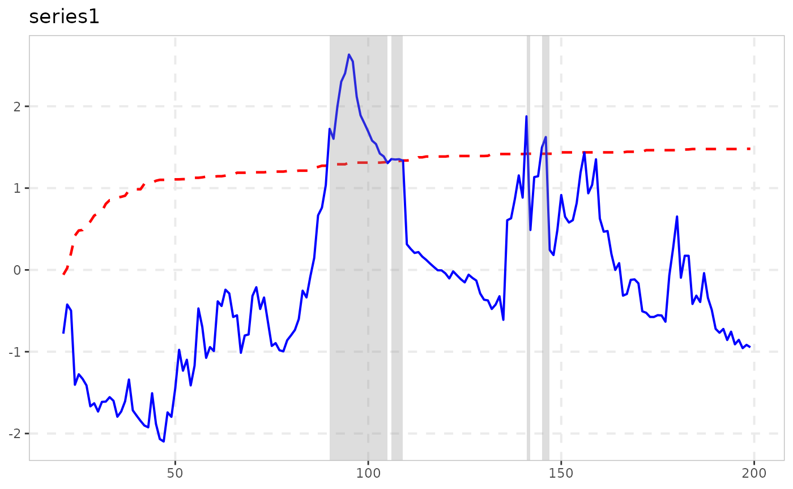
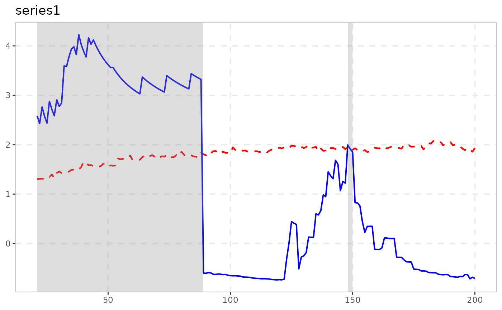
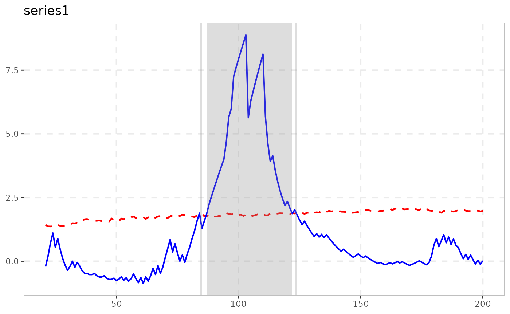
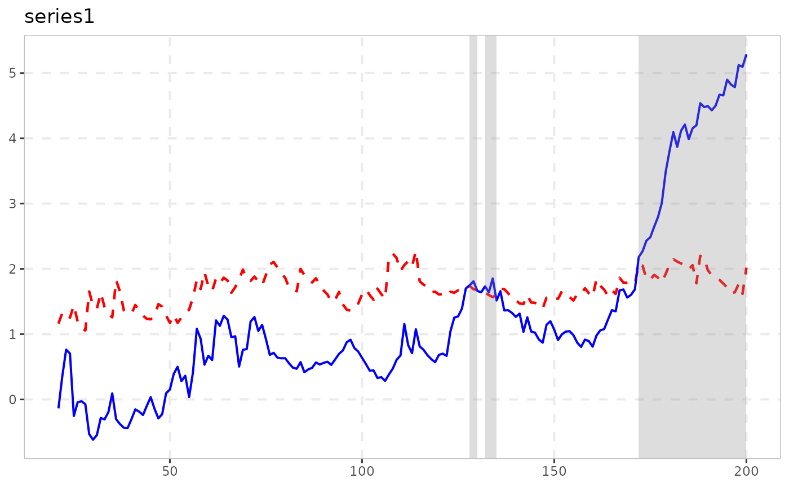
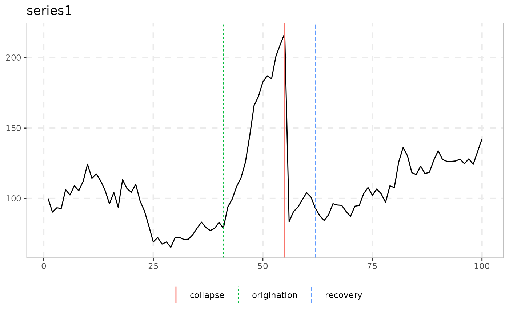

# Naming Conventions and the Analysis/Tidying/Plotting Pipeline

``` r

library(exuber)
```

## Why this exists

`exuber` started as a single test,
[`radf()`](https://kvasilopoulos.github.io/exuber/reference/radf.md),
the recursive ADF/SADF/GSADF/BSADF statistic of Phillips, Shi & Yu
(2015). Through a long research programme it grew to roughly 25
functions that cover a dozen papers: alternative tests, dating
procedures, monitoring schemes and root inference. Every one of them
used to be named `radf_<something>()`. That was accurate for some and
misleading for others, because a `radf_` prefix suggests a recursive ADF
statistic and several of these functions are not one. This vignette
documents the naming scheme that replaced the old one. It also explains
which functions plug into the
[`summary()`](https://rdrr.io/r/base/summary.html),
[`datestamp()`](https://kvasilopoulos.github.io/exuber/reference/datestamp.md),
[`tidy()`](https://generics.r-lib.org/reference/tidy.html) and
[`autoplot()`](https://ggplot2.tidyverse.org/reference/autoplot.html)
pipeline built for
[`radf()`](https://kvasilopoulos.github.io/exuber/reference/radf.md),
and which have differently shaped output of their own.

## The naming scheme

| Pattern | Means | Examples |
|----|----|----|
| `radf_` prefix | Built on the recursive ADF core: calls [`radf()`](https://kvasilopoulos.github.io/exuber/reference/radf.md) directly or reuses its `badf`/`bsadf` recursion | [`radf()`](https://kvasilopoulos.github.io/exuber/reference/radf.md), [`radf_tt()`](https://kvasilopoulos.github.io/exuber/reference/radf_tt.md), [`radf_sign()`](https://kvasilopoulos.github.io/exuber/reference/radf_sign.md), [`radf_common()`](https://kvasilopoulos.github.io/exuber/reference/radf_common.md), [`radf_kp()`](https://kvasilopoulos.github.io/exuber/reference/radf_kp.md), [`radf_recovery()`](https://kvasilopoulos.github.io/exuber/reference/radf_recovery.md), and the `_cv`/`_mc`/`_sb`/`_wb` critical-value engines |
| `_test` suffix | A standalone hypothesis test with its own null distribution, not built on the recursive ADF core | [`lbi_test()`](https://kvasilopoulos.github.io/exuber/reference/lbi_test.md), [`ssu_test()`](https://kvasilopoulos.github.io/exuber/reference/ssu_test.md), [`quantile_test()`](https://kvasilopoulos.github.io/exuber/reference/quantile_test.md), [`cobubble_test()`](https://kvasilopoulos.github.io/exuber/reference/cobubble_test.md) |
| `dating_` prefix | Dating by point estimation and model selection, with no formal hypothesis test | [`dating_hls()`](https://kvasilopoulos.github.io/exuber/reference/dating_hls.md), [`dating_hlw()`](https://kvasilopoulos.github.io/exuber/reference/dating_hlw.md), [`dating_knp()`](https://kvasilopoulos.github.io/exuber/reference/dating_knp.md), [`dating_pdc()`](https://kvasilopoulos.github.io/exuber/reference/dating_pdc.md) |
| `monitor`/`monitor_` prefix | Real-time (sequential) detection, grouped by what the function does and not by its internal mechanism. [`monitor()`](https://kvasilopoulos.github.io/exuber/reference/monitor.md) is the flagship of this family, as [`radf()`](https://kvasilopoulos.github.io/exuber/reference/radf.md) is for the `radf_` family. It reuses `badf` and `bsadf` directly but carries no `radf` or `sadf` token, so that it reads as the real-time monitor and not as a `radf_` variant (see below) | [`monitor()`](https://kvasilopoulos.github.io/exuber/reference/monitor.md), [`monitor_cusum()`](https://kvasilopoulos.github.io/exuber/reference/monitor_cusum.md), [`monitor_lbi()`](https://kvasilopoulos.github.io/exuber/reference/monitor_lbi.md), [`monitor_quantile()`](https://kvasilopoulos.github.io/exuber/reference/monitor_quantile.md) |
| `root` family | Confidence-interval inference on the magnitude of the explosive root, not a test for its presence (`exuber_functions(family = "root")`; there is no shared prefix) | [`rootstamp()`](https://kvasilopoulos.github.io/exuber/reference/rootstamp.md), which has two S3 methods: the default for a single sub-sample and the `radf_obj` method, which runs every [`datestamp()`](https://kvasilopoulos.github.io/exuber/reference/datestamp.md) episode at once |
| stands alone | A point-estimation tool, not a test | [`contagion_reg()`](https://kvasilopoulos.github.io/exuber/reference/contagion_reg.md) |

The prefixes are a convention and not a contract. They are easy to
misremember and they sometimes pull against each other.
[`monitor()`](https://kvasilopoulos.github.io/exuber/reference/monitor.md)
is grouped with the other monitors under a name that deliberately does
not advertise its ADF-family internals, so that nobody mistakes it for a
`radf_*()` variant. For programmatic use, do not parse function names.
Call
[`exuber_functions()`](https://kvasilopoulos.github.io/exuber/reference/exuber_functions.md),
which returns the same categorization as queryable data.

``` r

exuber_functions(family = "monitor")
#> # A tibble: 4 × 3
#>   name             family      description                                      
#>   <chr>            <chr>       <chr>                                            
#> 1 monitor          adf,monitor Real-time monitoring (Family A); reuses radf()'s…
#> 2 monitor_cusum    monitor     CUSUM/CUSUMV real-time monitoring, closed-form b…
#> 3 monitor_lbi      monitor     Sequential extension of lbi_test(), constant-bou…
#> 4 monitor_quantile monitor     QPWY/QPSY recursive quantile-regression monitori…
```

Two names look related but are not. The `dating_*()` functions above are
standalone SSR/BIC procedures that run directly on raw data and take no
critical value.
[`datestamp()`](https://kvasilopoulos.github.io/exuber/reference/datestamp.md)
(see below) is a different thing: it is the generic that applies the
threshold-crossing rule of Phillips, Shi and Yu to any `radf_obj` and
`radf_cv` pair.

[`datestamp()`](https://kvasilopoulos.github.io/exuber/reference/datestamp.md)
normally needs a `radf_cv`, with one exception.
`datestamp(object, option = "svadf")` runs the asymmetric-threshold
dating of Sarkar & Wells (2026) directly on `object$badf` and needs no
critical value (see
[`vignette("experimental-methods")`](https://kvasilopoulos.github.io/exuber/articles/experimental-methods.md)).

## What actually plugs into `summary()`/`datestamp()`/`tidy()`/`autoplot()`

These four generics are built around one shape: a `radf_obj` (from
[`radf()`](https://kvasilopoulos.github.io/exuber/reference/radf.md))
paired with a `radf_cv` that carries a time-varying boundary (`badf_cv`
and `bsadf_cv`, one critical value per recursion point) as well as the
three scalar sup-statistic critical values (`adf_cv`, `sadf_cv` and
`gsadf_cv`). Only functions whose result has the `radf_obj` class, and
whose paired `_cv()` function computes that time-varying boundary, get
the full pipeline. In practice there are three tiers.

### Full support: `radf_common()`, `radf_kp()`, `radf_tt()`, `radf_sign()`, `radf_sign_dm()`, `radf_sbz()`

[`radf_kp()`](https://kvasilopoulos.github.io/exuber/reference/radf_kp.md)
and
[`radf_common()`](https://kvasilopoulos.github.io/exuber/reference/radf_common.md)
return the output of
[`radf()`](https://kvasilopoulos.github.io/exuber/reference/radf.md)
itself, computed on a series purged of volatility or on a PCA factor
respectively, so every generic works exactly as it does for plain
[`radf()`](https://kvasilopoulos.github.io/exuber/reference/radf.md).
The running example for this section is the series these tests were
designed for: the
[`sim_psy1()`](https://kvasilopoulos.github.io/exuber/reference/sim_psy1.md)
bubble with a permanent volatility break
([`sim_vol_break()`](https://kvasilopoulos.github.io/exuber/reference/sim_vol_break.md),
where the innovation standard deviation triples half-way through the
sample). See
[`vignette("volatility-robust-radf")`](https://kvasilopoulos.github.io/exuber/articles/volatility-robust-radf.md).

``` r

y <- sim_psy1(n = 200, seed = 1, e = sim_vol_break(199))
```

``` r

res <- radf_kp(y, minw = 20)
cv <- radf_mc_cv(n = attr(res, "n"), minw = 20)

summary(res, cv = cv)
#> 
#> ── Summary (minw = 20, lag = 0) ────────────────── Monte Carlo (nboot = 1000) ──
#> 
#> series1 :
#> # A tibble: 3 × 5
#>   stat  tstat   `90`    `95`  `99`
#>   <fct> <dbl>  <dbl>   <dbl> <dbl>
#> 1 adf   -1.72 -0.328 0.00172 0.572
#> 2 sadf   1.50  1.19  1.48    1.97 
#> 3 gsadf  2.63  1.99  2.27    2.87
datestamp(res, cv = cv)
#> 
#> ── Datestamp (min_duration = 0) ───────────────────────────────── Monte Carlo ──
#> 
#> series1 :
#>   Start Peak End Duration   Signal Ongoing
#> 1    90   95 105       15 positive   FALSE
#> 2   106  106 109        3 positive   FALSE
#> 3   141  141 142        1 positive   FALSE
#> 4   145  146 147        2 negative   FALSE
tidy(res, cv = cv)
#> # A tibble: 1 × 4
#>   id        adf  sadf gsadf
#>   <fct>   <dbl> <dbl> <dbl>
#> 1 series1 -1.72  1.50  2.63
autoplot(res, cv = cv)
```



The other three are different. They carry the `radf_obj` class but build
their statistic on `gls_dfstat_grid()` and do not call
[`radf()`](https://kvasilopoulos.github.io/exuber/reference/radf.md)
directly. This function is a no-intercept, GLS-demeaned recursive
Dickey-Fuller grid. It is fed the raw series for
[`radf_tt()`](https://kvasilopoulos.github.io/exuber/reference/radf_tt.md),
the cumulated sign of the series for
[`radf_sign()`](https://kvasilopoulos.github.io/exuber/reference/radf_sign.md),
and a recursively demeaned cumulated sign for
[`radf_sign_dm()`](https://kvasilopoulos.github.io/exuber/reference/radf_sign_dm.md).

Until 2026-08-18 the `_cv()` functions of all three had a gap. They
computed only the three scalar critical values that
[`summary()`](https://rdrr.io/r/base/summary.html) and
[`tidy()`](https://generics.r-lib.org/reference/tidy.html) need and
discarded the `badf` and `bsadf` paths that `gls_dfstat_grid()` already
produces for each replicate. As a result
[`datestamp()`](https://kvasilopoulos.github.io/exuber/reference/datestamp.md)
and
[`autoplot()`](https://ggplot2.tidyverse.org/reference/autoplot.html),
which need a time-varying boundary, always failed. We fixed all three in
the same way. We first established the fix in
[`radf_tt_cv()`](https://kvasilopoulos.github.io/exuber/reference/radf_tt_cv.md)
and then checked that it holds for the other two. The `bsadf` that
`gls_dfstat_grid()` returns is already the sup over all window starts at
each point. This differs from the `bsadf_cv` of
[`radf_mc_cv()`](https://kvasilopoulos.github.io/exuber/reference/radf_mc_cv.md),
which uses a [`cummax()`](https://rdrr.io/r/base/cumsum.html) across
replicates because of the output shape of the base C++ engine. No
shortcut was needed here, and the boundary is the per-time-point
quantile across replicates, the same construction
[`radf_mc_cv()`](https://kvasilopoulos.github.io/exuber/reference/radf_mc_cv.md)
uses for its own `bsadf_cv`.

We validated each function in three ways.

- The last row of `badf_cv` is bit-identical to `adf_cv`, because `adf`
  is the last point of `badf` in every replicate. This is an exact
  identity, and it holds whichever series feeds `gls_dfstat_grid()`.
- The empirical false-alarm rate under `H0` is at or below the nominal
  5% (`radf_tt` 3.3%, `radf_sign` 5.5%, `radf_sign_dm` 3.5%, with n =
  100 and minw = 20).
- The detection power on an identical synthetic bubble is in the same
  range as the 16% of the established
  [`radf()`](https://kvasilopoulos.github.io/exuber/reference/radf.md)
  and
  [`radf_mc_cv()`](https://kvasilopoulos.github.io/exuber/reference/radf_mc_cv.md)
  baseline, and it is neither suspiciously higher nor lower (`radf_tt`
  18%, `radf_sign` 20%, `radf_sign_dm` 8%). The sign-based tests give up
  power in exchange for invariance to heteroskedasticity, which is a
  documented finding of the source paper and not a validation problem.

``` r

res <- radf_tt(y, minw = 20)
cv <- radf_tt_cv(n = 200, minw = 20)

summary(res, cv = cv)
#> 
#> ── Summary (minw = 20, lag = 0) ────────── Time-Transformed MC (nboot = 2000) ──
#> 
#> series1 :
#> # A tibble: 3 × 5
#>   stat   tstat  `90`  `95`  `99`
#>   <fct>  <dbl> <dbl> <dbl> <dbl>
#> 1 adf   -0.997 0.832  1.26  2.04
#> 2 sadf   3.27  2.32   2.66  3.32
#> 3 gsadf  4.23  3.26   3.65  4.38
datestamp(res, cv = cv)
#> 
#> ── Datestamp (min_duration = 0) ───────────────────────── Time-Transformed MC ──
#> 
#> series1 :
#>   Start Peak End Duration   Signal Ongoing
#> 1    21   38  89       68 negative   FALSE
#> 2   148  148 150        2 positive   FALSE
tidy(res, cv = cv)
#> # A tibble: 1 × 4
#>   id         adf  sadf gsadf
#>   <fct>    <dbl> <dbl> <dbl>
#> 1 series1 -0.997  3.27  4.23
autoplot(res, cv = cv)
```



``` r

res <- radf_sign(y, minw = 20)
cv <- radf_sign_cv(n = 200, minw = 20)

summary(res, cv = cv)
#> 
#> ── Summary (minw = 20, lag = 0) ──────────────── Sign-Based MC (nboot = 2000) ──
#> 
#> series1 :
#> # A tibble: 3 × 5
#>   stat   tstat  `90`  `95`  `99`
#>   <fct>  <dbl> <dbl> <dbl> <dbl>
#> 1 adf   -0.293 0.932  1.35  2.14
#> 2 sadf   4.47  2.43   2.78  3.26
#> 3 gsadf  8.88  3.46   3.88  4.98
datestamp(res, cv = cv)
#> 
#> ── Datestamp (min_duration = 0) ─────────────────────────────── Sign-Based MC ──
#> 
#> series1 :
#>   Start Peak End Duration   Signal Ongoing
#> 1    84   84  85        1 positive   FALSE
#> 2    87  103 122       35 positive   FALSE
#> 3   123  123 124        1 positive   FALSE
tidy(res, cv = cv)
#> # A tibble: 1 × 4
#>   id         adf  sadf gsadf
#>   <fct>    <dbl> <dbl> <dbl>
#> 1 series1 -0.293  4.47  8.88
autoplot(res, cv = cv)
```



[`radf_sbz()`](https://kvasilopoulos.github.io/exuber/reference/radf_sbz.md)
is a fourth, separate case. It builds its statistic (`supBZ`) on
`wls_dfstat_grid()`, a no-intercept recursive Dickey-Fuller grid
weighted by WLS and kernel volatility, and not on `gls_dfstat_grid()`.
The same fix applies for the same reason, since `wls_dfstat_grid()`
already returns the full `badf` and `bsadf` path for each replicate. The
wild bootstrap in
[`radf_sbz_cv()`](https://kvasilopoulos.github.io/exuber/reference/radf_sbz_cv.md)
is therefore built as the Monte Carlo simulation in
[`radf_tt_cv()`](https://kvasilopoulos.github.io/exuber/reference/radf_tt_cv.md)
and
[`radf_sign_cv()`](https://kvasilopoulos.github.io/exuber/reference/radf_sign_cv.md)
is, with a per-time-point quantile across replicates and no
[`cummax()`](https://rdrr.io/r/base/cumsum.html) shortcut. We validated
it in the same way. The last row of `badf_cv` is bit-identical to
`adf_cv`, and the empirical false-alarm rate under `H0` is 5.0% at a
nominal 5% (n = 100, minw = 20, 200 replications). The test also rejects
on a sufficiently strong deterministic explosive path. Its
kernel-volatility weighting costs enough power, however, that it does
not reject the series above at nboot = 100 to 200, where the bubble is
the milder default of
[`sim_psy1()`](https://kvasilopoulos.github.io/exuber/reference/sim_psy1.md).
The same trade between power and robustness is documented for the
`supBZ` leg of
[`radf_sbz_union()`](https://kvasilopoulos.github.io/exuber/reference/radf_sbz_union.md)
below, so it is not new to this split.

``` r

res <- radf_sbz(y, minw = 20)
cv <- radf_sbz_cv(y, minw = 20, nboot = 200, seed = 1)

summary(res, cv = cv)
#> 
#> ── Summary (minw = 20, lag = 0) ────────── Wild Bootstrap (SBZ) (nboot = 200) ──
#> 
#> series1 :
#> # A tibble: 3 × 5
#>   stat  tstat  `90`  `95`  `99`
#>   <fct> <dbl> <dbl> <dbl> <dbl>
#> 1 adf   -1.39 0.825  1.13  1.61
#> 2 sadf   1.67 1.58   2.11  3.36
#> 3 gsadf  1.91 3.37   5.06  6.21
tidy(res, cv = cv)
#> # A tibble: 1 × 4
#>   id        adf  sadf gsadf
#>   <fct>   <dbl> <dbl> <dbl>
#> 1 series1 -1.39  1.67  1.91
```

[`datestamp()`](https://kvasilopoulos.github.io/exuber/reference/datestamp.md)
and
[`autoplot()`](https://ggplot2.tidyverse.org/reference/autoplot.html)
need at least one rejection to have anything to show, and they raise an
error otherwise, as for any other `radf_obj` and `radf_cv` pair. The
series above does not clear the `supBZ` threshold, so we repeat the
volatility break with a stronger explosive regime that does not collapse
(`rho = 1.03` from `t = 120` to the end of the sample):

``` r

y_strong <- sim_psy1(n = 200, te = 120, tf = 200, c = 0.03, alpha = 0, seed = 1,
                     e = sim_vol_break(199))

res2 <- radf_sbz(y_strong, minw = 20)
cv2 <- radf_sbz_cv(y_strong, minw = 20, nboot = 100, seed = 1)
datestamp(res2, cv = cv2)
#> 
#> ── Datestamp (min_duration = 0) ──────────────────────── Wild Bootstrap (SBZ) ──
#> 
#> series1 :
#>   Start Peak End Duration   Signal Ongoing
#> 1   128  129 130        2 positive   FALSE
#> 2   132  134 135        3 positive   FALSE
#> 3   172  200 200       29 positive    TRUE
autoplot(res2, cv = cv2)
```



### Own `print()` and `autoplot()`: everything else

The remaining 15 or so functions return their own class, with their own
[`print()`](https://rdrr.io/r/base/print.html) and
[`autoplot()`](https://ggplot2.tidyverse.org/reference/autoplot.html)
methods. They are
[`lbi_test()`](https://kvasilopoulos.github.io/exuber/reference/lbi_test.md),
[`ssu_test()`](https://kvasilopoulos.github.io/exuber/reference/ssu_test.md),
[`quantile_test()`](https://kvasilopoulos.github.io/exuber/reference/quantile_test.md),
[`cobubble_test()`](https://kvasilopoulos.github.io/exuber/reference/cobubble_test.md),
the `dating_*()` family, the
[`monitor()`](https://kvasilopoulos.github.io/exuber/reference/monitor.md)
and `monitor_*()` family (including
[`monitor()`](https://kvasilopoulos.github.io/exuber/reference/monitor.md)
itself, despite its ADF-family internals),
[`contagion_reg()`](https://kvasilopoulos.github.io/exuber/reference/contagion_reg.md),
[`radf_recovery()`](https://kvasilopoulos.github.io/exuber/reference/radf_recovery.md),
[`rootstamp()`](https://kvasilopoulos.github.io/exuber/reference/rootstamp.md)
and
[`radf_sbz_union()`](https://kvasilopoulos.github.io/exuber/reference/radf_sbz_union.md).
Their output does not fit the `radf_obj` shape: a dating table is not a
per-series sup-statistic, and a monitoring alarm is not a critical value
grid. Forcing them through
[`summary()`](https://rdrr.io/r/base/summary.html),
[`datestamp()`](https://kvasilopoulos.github.io/exuber/reference/datestamp.md)
and [`tidy()`](https://generics.r-lib.org/reference/tidy.html) would not
close a documentation gap, so each is presented by its own methods,
shown below.

[`rootstamp()`](https://kvasilopoulos.github.io/exuber/reference/rootstamp.md)
needs one remark. The [reference
index](https://kvasilopoulos.github.io/exuber/reference/index.md) and
the workflow list in the README place it under Analysis, right after
[`datestamp()`](https://kvasilopoulos.github.io/exuber/reference/datestamp.md),
because that is its position in the sequence of steps (detect, date,
measure the growth rate). That is a position in the workflow and not an
S3-support tier. It has its own class with its own
[`print()`](https://rdrr.io/r/base/print.html) and
[`autoplot()`](https://ggplot2.tidyverse.org/reference/autoplot.html)
methods, like everything else in this section. See
[`vignette("root-inference")`](https://kvasilopoulos.github.io/exuber/articles/root-inference.md).

``` r

dating_hls(sim_data$psy1, trim = 0.05)
#> 
#> ── dating_hls (n = 100, trim = 0.05) ───────────────────────────────────────────
#> 
#>    series  model  origination  collapse  recovery
#>   series1      4           41        55        62

ssu_test(sim_data$psy1, sig_lvl = 95)
#> 
#> ── ssu_test (SSU, n = 100, minw = 19, sig_lvl = 95%, crit = 3.3) ───────────────
#> 
#>    series   sadf  detected
#>   series1  4.356      TRUE
autoplot(dating_hls(sim_data$psy1, trim = 0.05))
```



## Summary

| Tier | Functions | [`summary()`](https://rdrr.io/r/base/summary.html) | [`datestamp()`](https://kvasilopoulos.github.io/exuber/reference/datestamp.md) | [`tidy()`](https://generics.r-lib.org/reference/tidy.html) | [`autoplot()`](https://ggplot2.tidyverse.org/reference/autoplot.html) |
|----|----|----|----|----|----|
| Full | [`radf()`](https://kvasilopoulos.github.io/exuber/reference/radf.md), [`radf_common()`](https://kvasilopoulos.github.io/exuber/reference/radf_common.md), [`radf_kp()`](https://kvasilopoulos.github.io/exuber/reference/radf_kp.md), [`radf_tt()`](https://kvasilopoulos.github.io/exuber/reference/radf_tt.md), [`radf_sign()`](https://kvasilopoulos.github.io/exuber/reference/radf_sign.md), [`radf_sign_dm()`](https://kvasilopoulos.github.io/exuber/reference/radf_sign_dm.md), [`radf_sbz()`](https://kvasilopoulos.github.io/exuber/reference/radf_sbz.md) | yes | yes | yes | yes |
| Standalone | everything else | own [`print()`](https://rdrr.io/r/base/print.html) | – | – | own method |
