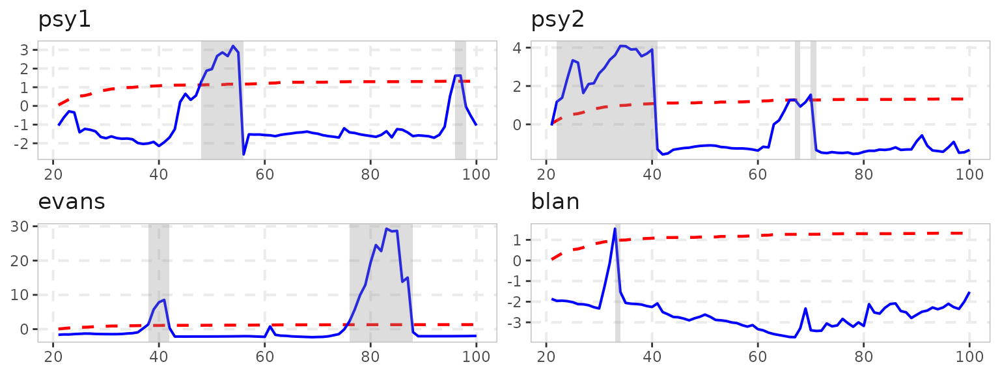
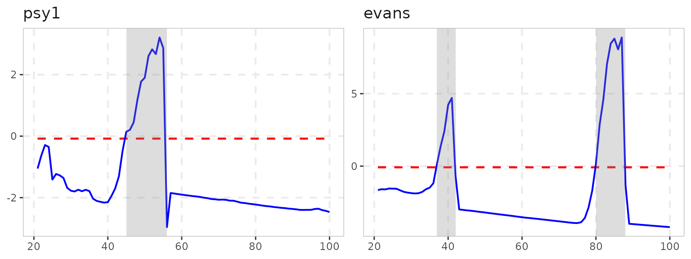
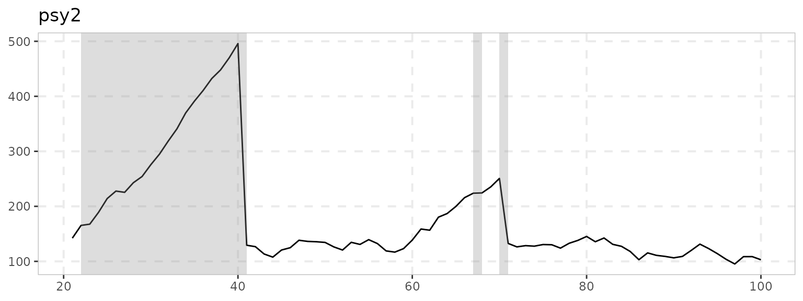
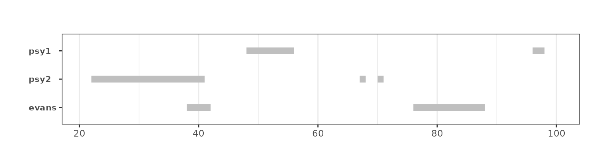
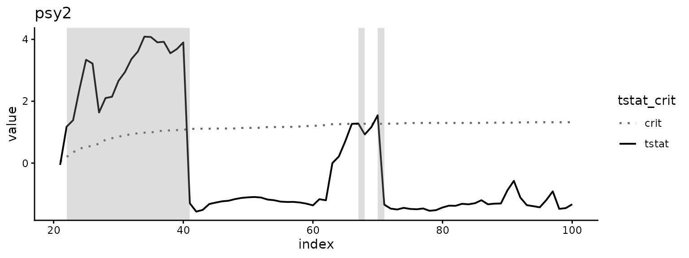
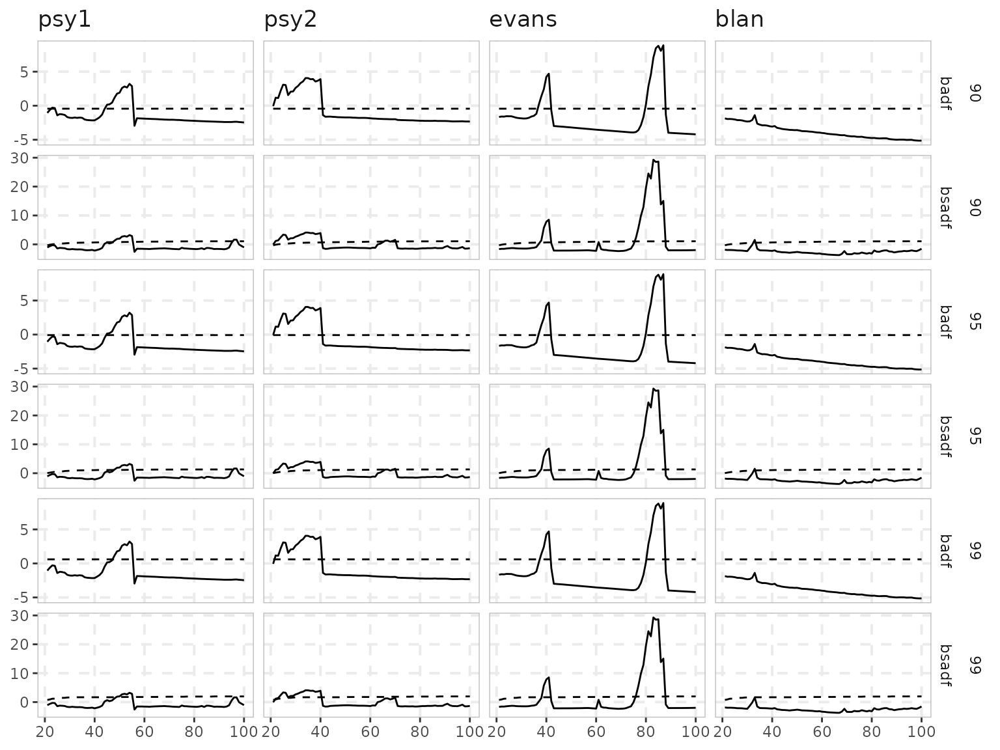
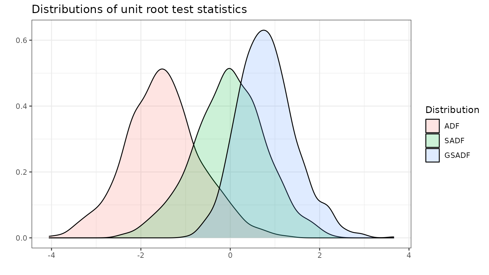

# Plotting with exuber

``` r

library(exuber)
library(ggplot2)
```

## One `autoplot()` per object

Every result object in the package has an
[`autoplot()`](https://ggplot2.tidyverse.org/reference/autoplot.html)
method, so the plotting call is the same whatever you ran –
`autoplot(x)` – and what it draws depends on what `x` is. All of them
return a plain `ggplot` object, so anything ggplot2 can do (themes,
scales, extra layers, `facet_*()` arguments) applies on top.

| What you have | What [`autoplot()`](https://ggplot2.tidyverse.org/reference/autoplot.html) draws |
|----|----|
| [`radf()`](https://kvasilopoulos.github.io/exuber/reference/radf.md) result (`radf_obj`) | Test statistic vs. critical-value sequence, one facet per series that rejects the null, with the explosive episodes shaded |
| [`datestamp()`](https://kvasilopoulos.github.io/exuber/reference/datestamp.md) result (`ds_radf`) | Just the episodes, one horizontal segment per series – the view for many series at once |
| `radf_*_distr()` result (`radf_distr`) | The simulated null distribution of the ADF/SADF/GSADF statistics |
| Any `sim_*()` series | The series itself |
| [`monitor()`](https://kvasilopoulos.github.io/exuber/reference/monitor.md), `monitor_*()` | Monitored statistic vs. its boundary, with training-end and alarm markers |
| `dating_*()`, [`radf_recovery()`](https://kvasilopoulos.github.io/exuber/reference/radf_recovery.md) | The series with vertical markers at the estimated break dates |
| [`rootstamp()`](https://kvasilopoulos.github.io/exuber/reference/rootstamp.md) | Estimated root and its confidence interval per episode |
| [`lbi_test()`](https://kvasilopoulos.github.io/exuber/reference/lbi_test.md), [`quantile_test()`](https://kvasilopoulos.github.io/exuber/reference/quantile_test.md), [`radf_sbz_union()`](https://kvasilopoulos.github.io/exuber/reference/radf_sbz_union.md) | Statistic vs. critical value per series |

The rest of this vignette is about the first three – the
[`radf()`](https://kvasilopoulos.github.io/exuber/reference/radf.md)
workflow – and about building your own plot from the tidied tables when
the defaults don’t fit. The other methods take no options beyond the
object and are shown in their own vignettes
([`vignette("monitoring")`](https://kvasilopoulos.github.io/exuber/articles/monitoring.md),
[`vignette("dating-methods")`](https://kvasilopoulos.github.io/exuber/articles/dating-methods.md),
[`vignette("root-inference")`](https://kvasilopoulos.github.io/exuber/articles/root-inference.md)).

## The `radf()` plot

Four simulated series, one from each of the package’s classic bubble
DGPs (see
[`vignette("simulation")`](https://kvasilopoulos.github.io/exuber/articles/simulation.md)),
estimated with one lag. With a lag the critical values depend on
`(n, lag)`, so we simulate them once and pass them to every call – the
same pattern as
[`vignette("exuber")`](https://kvasilopoulos.github.io/exuber/articles/exuber.md):

``` r

sims <- data.frame(
  psy1 = sim_psy1(100, seed = 1),
  psy2 = sim_psy2(100, seed = 2),
  evans = sim_evans(100, seed = 3),
  blan = sim_blan(100, seed = 4)
)
est <- radf(sims, lag = 1)
cv <- radf_mc_cv(100, lag = 1, seed = 1)
```

``` r

autoplot(est, cv)
```


Only series that reject the null at 5% are drawn. The options that
change *what* is plotted are arguments of
[`autoplot()`](https://ggplot2.tidyverse.org/reference/autoplot.html)
itself:

``` r

# Every series, whether or not it rejects
autoplot(est, cv, nonrejected = TRUE)
```



``` r


# A subset, by name or position; the SADF sequence instead of the BSADF one
autoplot(est, cv, select_series = c("psy1", "evans"), option = "sadf")
```



The shading of the explosive episodes is a
[`geom_rect()`](https://ggplot2.tidyverse.org/reference/geom_tile.html)
layer controlled through `shade_opt` and the
[`shade()`](https://kvasilopoulos.github.io/exuber/reference/autoplot.radf_obj.md)
helper; `shade_opt = NULL` removes it:

``` r

autoplot(est, cv, select_series = "psy2",
         shade_opt = shade(fill = "pink", opacity = 0.3))
```


[`autoplot2()`](https://kvasilopoulos.github.io/exuber/reference/autoplot2.md)
draws the *series* instead of the statistic, with the same shading,
which is often the more readable view for a non-technical audience;
[`datestamp()`](https://kvasilopoulos.github.io/exuber/reference/datestamp.md)’s
own method reduces each series to its episodes:

``` r

autoplot2(est, cv, select_series = "psy2")
```



``` r

datestamp(est, cv) %>%
  autoplot()
```



### Changing the appearance

Everything else – colors, line types, theme – is ggplot2 territory.
[`autoplot()`](https://ggplot2.tidyverse.org/reference/autoplot.html)
maps the statistic and the critical value to `color`, `size` and
`linetype`, so the ggplot2 `scale_*_manual()` functions override them;
[`scale_exuber_manual()`](https://kvasilopoulos.github.io/exuber/reference/scale_exuber_manual.md)
sets all three at once, and
[`theme_exuber()`](https://kvasilopoulos.github.io/exuber/reference/scale_exuber_manual.md)
is the package’s default theme, exported so you can apply it to your own
plots too:

``` r

autoplot(est, cv, select_series = "psy2") +
  scale_exuber_manual(color_values = c("grey40", "black"),
                      linetype_values = c(3, 1)) +
  theme_classic()
```



Arguments
[`autoplot()`](https://ggplot2.tidyverse.org/reference/autoplot.html)
doesn’t recognize are forwarded to
[`ggplot2::facet_wrap()`](https://ggplot2.tidyverse.org/reference/facet_wrap.html),
so `scales = "free_y"`, `ncol`, `labeller`, etc. work directly – see
[`?autoplot.radf_obj`](https://kvasilopoulos.github.io/exuber/reference/autoplot.radf_obj.md)
for a labeller example that renames the facets.

## Building your own plot

When the default layout isn’t what you need, skip
[`autoplot()`](https://ggplot2.tidyverse.org/reference/autoplot.html)
and start from the same table it is built on.
[`augment_join()`](https://kvasilopoulos.github.io/exuber/reference/augment_join.md)
joins the full statistic sequences of a `radf_obj` with the
critical-value sequences of a `radf_cv`, one row per observation,
series, statistic and significance level – ggplot2-ready as is:

``` r

joined <- augment_join(est, cv)
joined
#> # A tibble: 1,920 × 8
#>      key index id     data stat   tstat sig    crit
#>    <int> <dbl> <fct> <dbl> <fct>  <dbl> <fct> <dbl>
#>  1    21    21 psy1   126. badf  -1.05  90    -0.44
#>  2    22    22 psy1   132. badf  -0.630 90    -0.44
#>  3    23    23 psy1   137. badf  -0.289 90    -0.44
#>  4    24    24 psy1   138. badf  -0.350 90    -0.44
#>  5    25    25 psy1   124. badf  -1.41  90    -0.44
#>  6    26    26 psy1   129. badf  -1.23  90    -0.44
#>  7    27    27 psy1   128. badf  -1.28  90    -0.44
#>  8    28    28 psy1   127. badf  -1.36  90    -0.44
#>  9    29    29 psy1   117. badf  -1.68  90    -0.44
#> 10    30    30 psy1   114. badf  -1.77  90    -0.44
#> # ℹ 1,910 more rows
```

``` r

joined %>%
  ggplot(aes(x = index)) +
  geom_line(aes(y = tstat)) +
  geom_line(aes(y = crit), linetype = 2) +
  facet_grid(sig + stat ~ id, scales = "free_y") +
  theme_exuber()
```



[`tidy_join()`](https://kvasilopoulos.github.io/exuber/reference/tidy_join.md)
is the scalar counterpart (one row per series and statistic, the table
[`summary()`](https://rdrr.io/r/base/summary.html) prints), and
[`tidy()`](https://generics.r-lib.org/reference/tidy.html)/[`augment()`](https://generics.r-lib.org/reference/augment.html)
on either object alone give the un-joined halves – see
[`vignette("naming-and-analysis")`](https://kvasilopoulos.github.io/exuber/articles/naming-and-analysis.md)
for the full pipeline.

## Distributions

The `radf_*_distr()` twins of the critical-value functions return the
whole simulated null distribution rather than its quantiles, and have
their own
[`autoplot()`](https://ggplot2.tidyverse.org/reference/autoplot.html):

``` r

distr <- radf_mc_distr(n = 100, nrep = 1000, seed = 1)
autoplot(distr)
```



As with everything else,
[`tidy()`](https://generics.r-lib.org/reference/tidy.html) gives the
underlying table, so an empirical CDF or any other summary is a few
ggplot2 lines away:

``` r

distr %>%
  tidy() %>%
  tidyr::pivot_longer(everything(), names_to = "statistic") %>%
  ggplot(aes(value, color = statistic)) +
  stat_ecdf() +
  geom_hline(yintercept = 0.95, linetype = 2) +
  labs(title = "Empirical CDF of the null distributions", y = NULL) +
  theme_exuber()
```


## Which to reach for

- A quick look at which series are explosive and when:
  `autoplot(est, cv)`; add `nonrejected = TRUE` to see the ones that
  aren’t.
- The series itself with the episodes shaded, for a non-technical
  reader: `autoplot2(est, cv)`.
- Many series, only the episodes: `autoplot(datestamp(est, cv))`.
- Cosmetic changes: keep
  [`autoplot()`](https://ggplot2.tidyverse.org/reference/autoplot.html)
  and add ggplot2 layers, scales or a theme;
  [`scale_exuber_manual()`](https://kvasilopoulos.github.io/exuber/reference/scale_exuber_manual.md)
  for the statistic/critical-value styling.
- A different layout altogether: `augment_join(est, cv)` and build it
  yourself.
