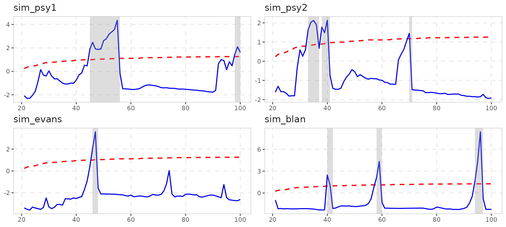
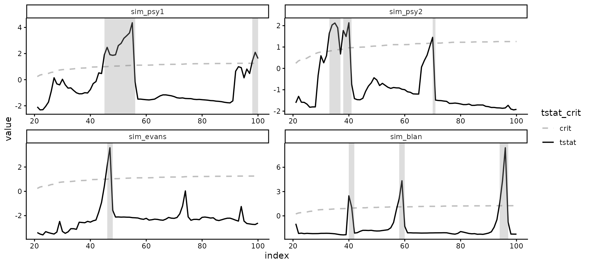
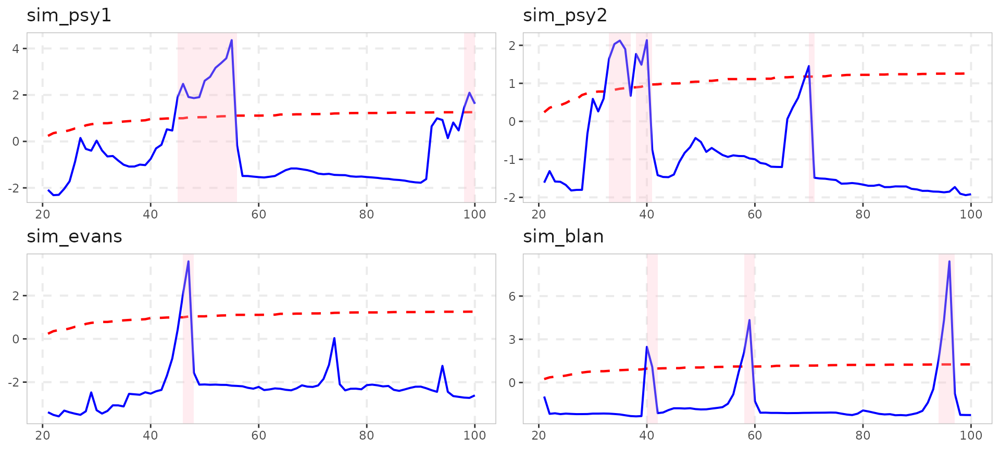
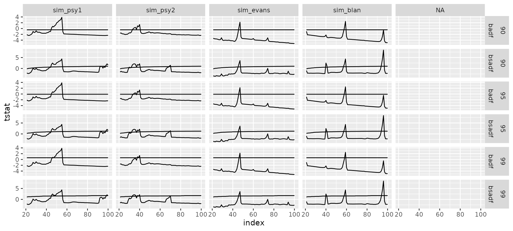
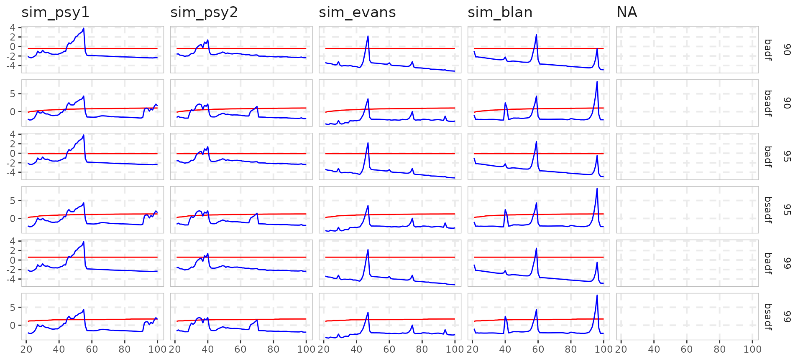
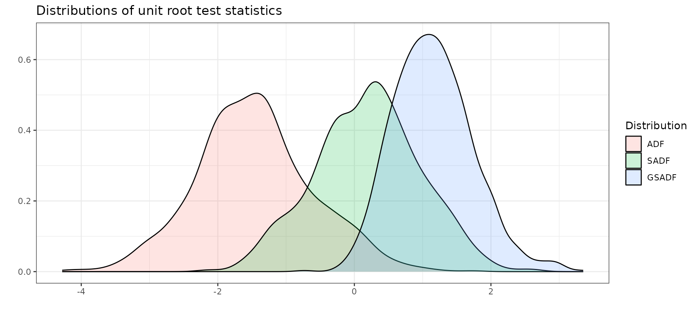
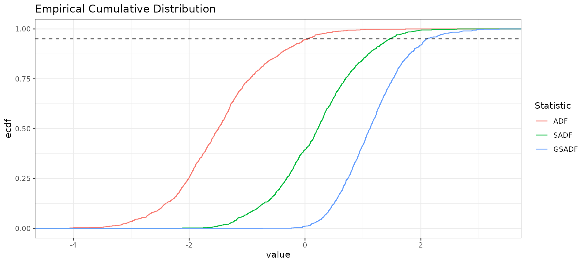
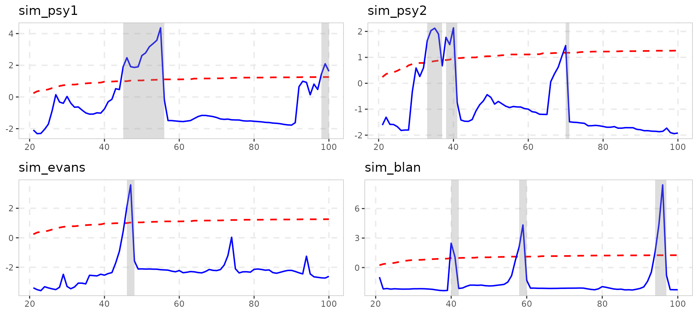

# Plotting with exuber

### The plotting API has changed in exuber 0.4.0

The new design offers full flexibility and customization to produce
publication-ready plots. `exuber` used to plot graph individually in a
list, and then you could modify each plot and arrange them into a single
grob with
[`ggarrange()`](https://kvasilopoulos.github.io/exuber/reference/exuber-defunct.md)(which
now is defunct). However, newer versions of exuber focus on providing a
faceted plot as it easier to change the aesthetics and themes.

Let’s start by simulating some data.

``` r

set.seed(123)
sims <- tibble(
  sim_psy1 = sim_psy1(100),
  sim_psy2 = sim_psy2(100),
  sim_evans = sim_blan(100),
  sim_blan = sim_evans(100),
) 

# Esimation
estimation <- radf(sims, lag = 1)
  
# Critical Values
crit_values <- radf_mc_cv(nrow(sims))
```

## Same Appearance with New Features

The visual output of autoplot in `v0.4.0` is exactly the same as before.

``` r

autoplot(estimation, crit_values)
#> Warning: Using `size` aesthetic for lines was deprecated in ggplot2 3.4.0.
#> ℹ Please use `linewidth` instead.
#> ℹ The deprecated feature was likely used in the exuber package.
#>   Please report the issue at <https://github.com/kvasilopoulos/exuber/issues>.
#> This warning is displayed once per session.
#> Call `lifecycle::last_lifecycle_warnings()` to see where this warning was
#> generated.
```

 However, almost all
aspects of the plot can be easily changed.

### Change color and theme

The custom color for autoplot are “blue and”red”, however the user can
easily override this option with
[`ggplot2::scale_color_manual`](https://ggplot2.tidyverse.org/reference/scale_manual.html).

``` r

autoplot(estimation, crit_values) +
  scale_color_manual(values = c("grey","black")) + 
  theme_classic()
```



### Changed the shaded region with shade_opt

`shade_opt` allows the user to manipulate the
[`geom_rect()`](https://ggplot2.tidyverse.org/reference/geom_tile.html)
layer of the ggplot, using the `shade` function. Alternatively, it can
be omitted if it set to `NULL`.

``` r

autoplot(estimation, crit_values, shade_opt = shade(fill = "pink", opacity = 0.3))
```



## Custom plotting

Custom plotting is also very easy with the
[`augment_join()`](https://kvasilopoulos.github.io/exuber/reference/tidy_join.md),
that merge the output of the estimation and and critical values in a
ggplot2-friendly way.

``` r

joined <- augment_join(estimation, crit_values)
joined
#> # A tibble: 1,926 × 8
#>      key index id        data stat   tstat sig    crit
#>    <int> <dbl> <fct>    <dbl> <fct>  <dbl> <fct> <dbl>
#>  1    21    21 sim_psy1 119.  badf  -2.08  90    -0.44
#>  2    22    22 sim_psy1 112.  badf  -2.31  90    -0.44
#>  3    23    23 sim_psy1 111.  badf  -2.39  90    -0.44
#>  4    24    24 sim_psy1 104.  badf  -2.26  90    -0.44
#>  5    25    25 sim_psy1  98.6 badf  -2.08  90    -0.44
#>  6    26    26 sim_psy1  94.3 badf  -1.79  90    -0.44
#>  7    27    27 sim_psy1  82.9 badf  -1.00  90    -0.44
#>  8    28    28 sim_psy1  88.6 badf  -1.34  90    -0.44
#>  9    29    29 sim_psy1  89.6 badf  -1.28  90    -0.44
#> 10    30    30 sim_psy1  81.9 badf  -0.800 90    -0.44
#> # ℹ 1,916 more rows
```

The output of `augment_join` returns data in tidy format and offers full
flexibility to the user. After this point plotting becomes extremely
trivial.

``` r

joined %>% 
  ggplot(aes(x = index)) +
  geom_line(aes(y = tstat)) +
  geom_line(aes(y = crit)) +
  facet_grid(sig + stat ~  id  , scales = "free_y")
#> Warning: Removed 6 rows containing missing values or values outside the scale range
#> (`geom_line()`).
#> Removed 6 rows containing missing values or values outside the scale range
#> (`geom_line()`).
```



We also offer two functions `scale_exuber_manual` and `theme_exuber`
that offer some extra functionality.

``` r

joined %>%
  pivot_longer(cols = c("tstat", "crit"), names_to = "nms") %>% 
  ggplot(aes(x = index, y = value, col = nms)) +
  geom_line() +
  facet_grid(sig + stat ~  id  , scales = "free_y") +
  scale_exuber_manual() +
  theme_exuber()
```



## Distribution

In addition to critical values, we can also calculate the empirical
distribution by utilizing the family of \*\_distr functions. For example
if we can simulate the distribution of the supADF tests with Monte Carlo
method.

``` r

distr <- radf_mc_distr(n = 300)
autoplot(distr)
```



### Empirical distribution

This part is made just for fun.

``` r

library(tidyr)
distr %>%
  tidy() %>%
  rename_all(~ stringr::str_to_upper(.)) %>%
  gather(Statistic, value, factor_key = TRUE) %>%
  ggplot(aes(value, color = Statistic)) +
  stat_ecdf() +
  ggtitle("Empirical Cumulative Distribution") +
  geom_hline(yintercept = 0.95, linetype = "dashed") + theme_bw()
```



## Old Functionality

To return to the old functionality there are several ways.

``` r

library(gridExtra)

# To choose only positive series (i.e. statistically significant for 5%)
positive_series <- diagnostics(estimation, crit_values)$positive 

# Through a loop on positive series 
plot_list1 <- list()
for (as in positive_series) {
  plot_list1[[as]] <- autoplot(estimation, crit_values, select_series = as)
}

# Alternatively  with lapply
plot_list2 <- lapply(positive_series, function(x) autoplot(estimation, crit_values, select_series = x))
names(plot_list2) <- positive_series

do.call(gridExtra::grid.arrange, plot_list1)
```



With the old functionality you had to make changes one at a time

``` r

plot_list1[[1]] <- plot_list1[[1]] + theme_classic()
```

and then reconstruct the plot with `grid.arrange` or some other function
that arranges all plots into a single grob.

Enjoy Plotting with `exuber` !!!
