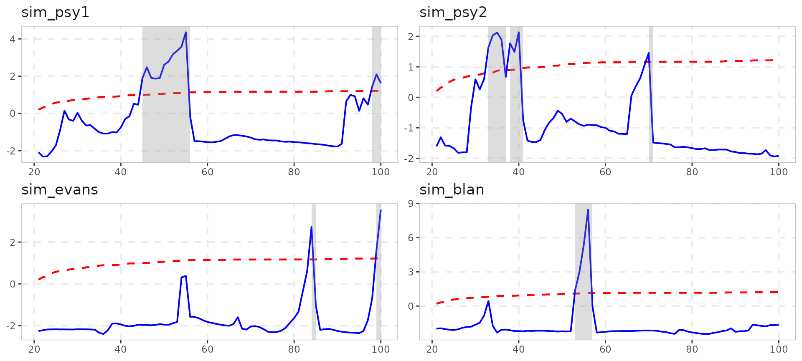
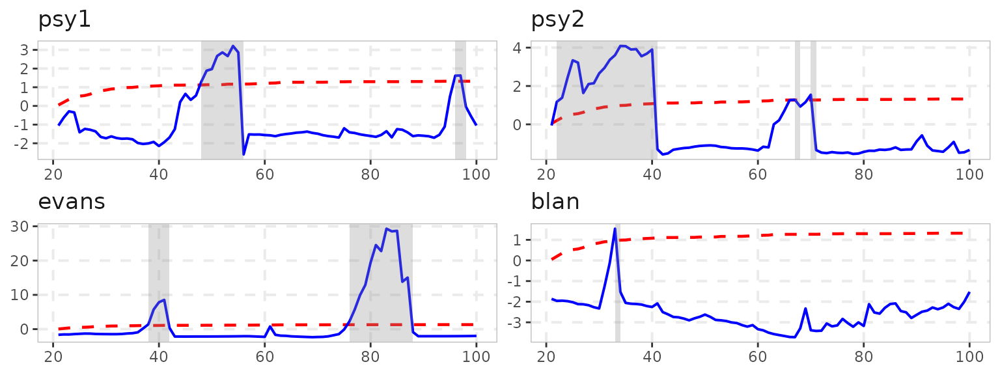
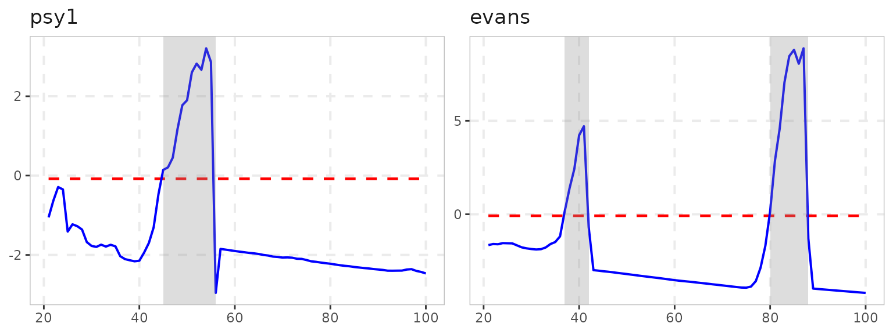
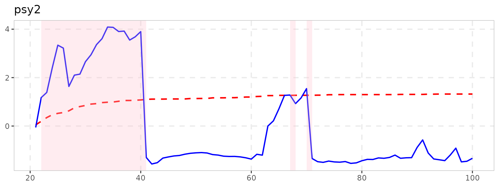
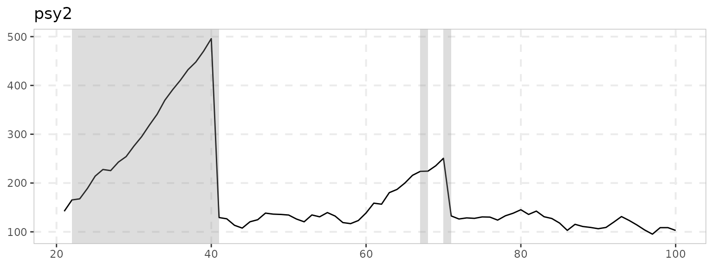
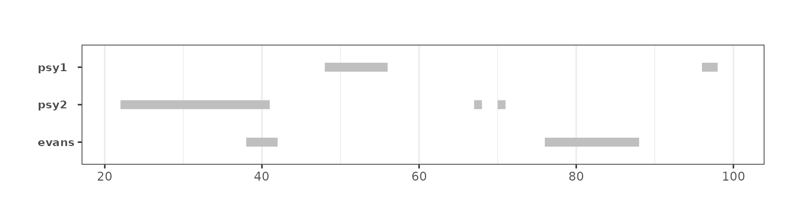
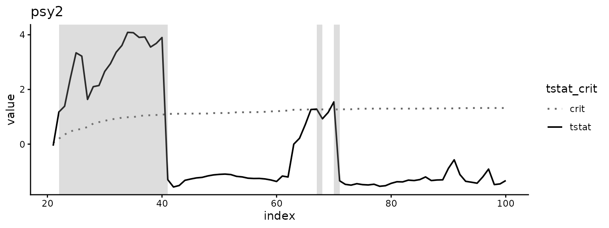
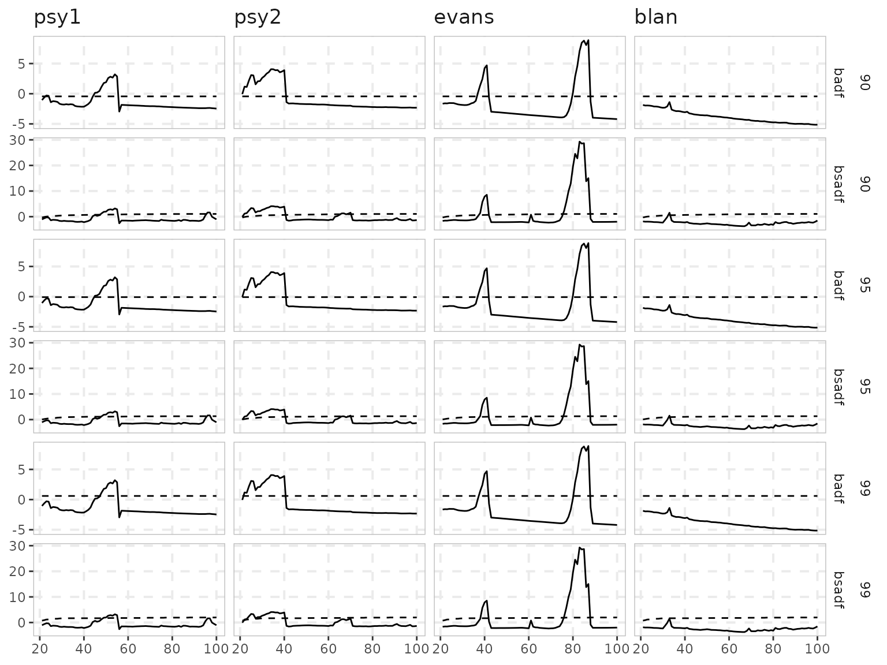
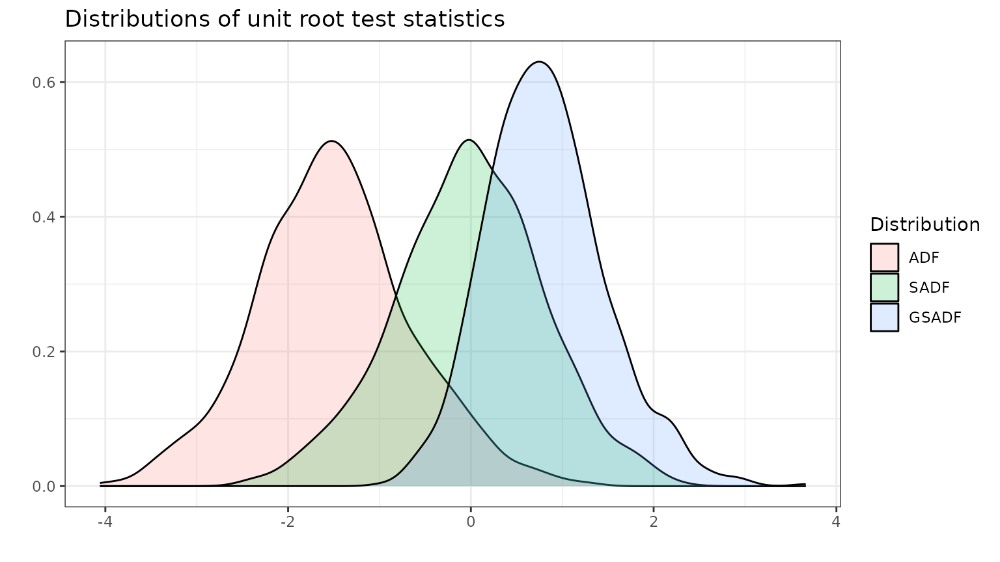
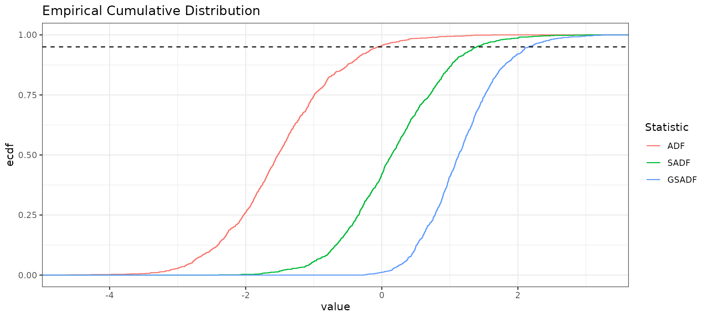

# Plotting with exuber

``` r

library(exuber)
library(ggplot2)
```

## One `autoplot()` per object

Every result object in the package has an
[`autoplot()`](https://ggplot2.tidyverse.org/reference/autoplot.html)
method. The call is always `autoplot(x)`, and what it draws depends on
the class of `x`. Each method returns an ordinary `ggplot` object, so
anything ggplot2 offers, such as themes, scales, extra layers and
`facet_*()` arguments, can be added on top.

| What you have | What [`autoplot()`](https://ggplot2.tidyverse.org/reference/autoplot.html) draws |
|----|----|
| [`radf()`](https://kvasilopoulos.github.io/exuber/reference/radf.md) result (`radf_obj`) | Test statistic against the critical-value sequence, with one facet per series that rejects the null and the explosive episodes shaded |
| [`datestamp()`](https://kvasilopoulos.github.io/exuber/reference/datestamp.md) result (`ds_radf`) | Only the episodes, as one horizontal segment per series. This is the view for many series at once |
| `radf_*_distr()` result (`radf_distr`) | The simulated null distribution of the ADF/SADF/GSADF statistics |
| Any `sim_*()` series | The series itself |
| [`monitor()`](https://kvasilopoulos.github.io/exuber/reference/monitor.md), `monitor_*()` | Monitored statistic against its boundary, with markers for the end of training and for the alarm |
| `dating_*()`, [`radf_recovery()`](https://kvasilopoulos.github.io/exuber/reference/radf_recovery.md) | The series with vertical markers at the estimated break dates |
| [`rootstamp()`](https://kvasilopoulos.github.io/exuber/reference/rootstamp.md) | Estimated root and its confidence interval per episode |
| [`lbi_test()`](https://kvasilopoulos.github.io/exuber/reference/lbi_test.md), [`quantile_test()`](https://kvasilopoulos.github.io/exuber/reference/quantile_test.md), [`radf_sbz_union()`](https://kvasilopoulos.github.io/exuber/reference/radf_sbz_union.md) | Statistic against critical value for each series |

The rest of this page covers the first three rows, which belong to the
[`radf()`](https://kvasilopoulos.github.io/exuber/reference/radf.md)
workflow, and shows how to build your own plot from the tidied tables
when the defaults do not fit. The other methods take no options beyond
the object. They are described with their own methods:
[`vignette("monitoring")`](https://kvasilopoulos.github.io/exuber/articles/monitoring.md)
for the monitors and
[`vignette("dating-methods")`](https://kvasilopoulos.github.io/exuber/articles/dating-methods.md)
and
[`vignette("root-inference")`](https://kvasilopoulos.github.io/exuber/articles/root-inference.md)
for dating and root inference.

## The `radf()` plot

We simulate four series, one from each of the classic bubble data
generating processes in the package (see
[`vignette("simulation")`](https://kvasilopoulos.github.io/exuber/articles/simulation.md)),
and estimate them with one lag. The critical values depend on
`(n, lag)`, so we simulate them once and pass them to every call, as in
[`vignette("exuber")`](https://kvasilopoulos.github.io/exuber/articles/exuber.md):

``` r

sims <- data.frame(
  psy1 = sim_psy1(100, seed = 1),
  psy2 = sim_psy2(100, seed = 2),
  evans = sim_evans(100, seed = 3),
  blan = sim_blan(100, seed = 4)
)
est <- radf(sims, lag = 1)
cv <- radf_mc_cv(100, lag = 1, seed = 1)
```

``` r

autoplot(est, cv)
```



Only series that reject the null at the 5% level are drawn. The
arguments of
[`autoplot()`](https://ggplot2.tidyverse.org/reference/autoplot.html)
itself control what is plotted:

``` r

# Every series, whether or not it rejects
autoplot(est, cv, nonrejected = TRUE)
```



``` r


# A subset, by name or position; the SADF sequence instead of the BSADF one
autoplot(est, cv, select_series = c("psy1", "evans"), option = "sadf")
```



The shading of the explosive episodes is a
[`geom_rect()`](https://ggplot2.tidyverse.org/reference/geom_tile.html)
layer. The `shade_opt` argument and the
[`shade()`](https://kvasilopoulos.github.io/exuber/reference/autoplot.radf_obj.md)
helper control it, and `shade_opt = NULL` removes it:

``` r

autoplot(est, cv, select_series = "psy2",
         shade_opt = shade(fill = "pink", opacity = 0.3))
```



[`autoplot2()`](https://kvasilopoulos.github.io/exuber/reference/autoplot2.md)
draws the series itself instead of the statistic, with the same shading.
This is often easier to read for a non-technical audience. The method
for
[`datestamp()`](https://kvasilopoulos.github.io/exuber/reference/datestamp.md)
objects reduces each series to its episodes:

``` r

autoplot2(est, cv, select_series = "psy2")
```



``` r

datestamp(est, cv) %>%
  autoplot()
```



### Changing the appearance

Colors, line types and themes are handled by ggplot2.
[`autoplot()`](https://ggplot2.tidyverse.org/reference/autoplot.html)
maps the statistic and the critical value to `color`, `size` and
`linetype`, so the ggplot2 `scale_*_manual()` functions can override
them.
[`scale_exuber_manual()`](https://kvasilopoulos.github.io/exuber/reference/scale_exuber_manual.md)
sets all three at once.
[`theme_exuber()`](https://kvasilopoulos.github.io/exuber/reference/scale_exuber_manual.md)
is the default theme of the package, and it is exported so that you can
apply it to your own plots too:

``` r

autoplot(est, cv, select_series = "psy2") +
  scale_exuber_manual(color_values = c("grey40", "black"),
                      linetype_values = c(3, 1)) +
  theme_classic()
```



Arguments that
[`autoplot()`](https://ggplot2.tidyverse.org/reference/autoplot.html)
does not recognize are passed on to
[`ggplot2::facet_wrap()`](https://ggplot2.tidyverse.org/reference/facet_wrap.html),
so `scales = "free_y"`, `ncol` and `labeller` work directly.
[`?autoplot.radf_obj`](https://kvasilopoulos.github.io/exuber/reference/autoplot.radf_obj.md)
has a labeller example that renames the facets.

## Building your own plot

When the default layout does not suit you, skip
[`autoplot()`](https://ggplot2.tidyverse.org/reference/autoplot.html)
and start from the table it is built on.
[`augment_join()`](https://kvasilopoulos.github.io/exuber/reference/augment_join.md)
joins the full statistic sequences of a `radf_obj` with the
critical-value sequences of a `radf_cv`. It returns one row per
observation, series, statistic and significance level, which ggplot2 can
use as it is:

``` r

joined <- augment_join(est, cv)
joined
#> # A tibble: 1,920 × 8
#>      key index id     data stat   tstat sig    crit
#>    <int> <dbl> <fct> <dbl> <fct>  <dbl> <fct> <dbl>
#>  1    21    21 psy1   126. badf  -1.05  90    -0.44
#>  2    22    22 psy1   132. badf  -0.630 90    -0.44
#>  3    23    23 psy1   137. badf  -0.289 90    -0.44
#>  4    24    24 psy1   138. badf  -0.350 90    -0.44
#>  5    25    25 psy1   124. badf  -1.41  90    -0.44
#>  6    26    26 psy1   129. badf  -1.23  90    -0.44
#>  7    27    27 psy1   128. badf  -1.28  90    -0.44
#>  8    28    28 psy1   127. badf  -1.36  90    -0.44
#>  9    29    29 psy1   117. badf  -1.68  90    -0.44
#> 10    30    30 psy1   114. badf  -1.77  90    -0.44
#> # ℹ 1,910 more rows
```

``` r

joined %>%
  ggplot(aes(x = index)) +
  geom_line(aes(y = tstat)) +
  geom_line(aes(y = crit), linetype = 2) +
  facet_grid(sig + stat ~ id, scales = "free_y") +
  theme_exuber()
```



[`tidy_join()`](https://kvasilopoulos.github.io/exuber/reference/tidy_join.md)
is the scalar counterpart, with one row per series and statistic, which
is the table that [`summary()`](https://rdrr.io/r/base/summary.html)
prints. Calling
[`tidy()`](https://generics.r-lib.org/reference/tidy.html) or
[`augment()`](https://generics.r-lib.org/reference/augment.html) on
either object alone returns the two halves before they are joined. The
first part of this page describes the full pipeline.

## Distributions

The `radf_*_distr()` functions are the counterparts of the
critical-value functions. They return the whole simulated null
distribution instead of its quantiles, and they have their own
[`autoplot()`](https://ggplot2.tidyverse.org/reference/autoplot.html)
method:

``` r

distr <- radf_mc_distr(n = 100, nrep = 1000, seed = 1)
autoplot(distr)
```



As elsewhere, [`tidy()`](https://generics.r-lib.org/reference/tidy.html)
returns the underlying table, so an empirical CDF or any other summary
takes only a few lines of ggplot2:

``` r

distr %>%
  tidy() %>%
  tidyr::pivot_longer(everything(), names_to = "statistic") %>%
  ggplot(aes(value, color = statistic)) +
  stat_ecdf() +
  geom_hline(yintercept = 0.95, linetype = 2) +
  labs(title = "Empirical CDF of the null distributions", y = NULL) +
  theme_exuber()
```



## Which to reach for

- For a quick look at which series are explosive and when, use
  `autoplot(est, cv)`. Add `nonrejected = TRUE` to include the series
  that do not reject.
- To show the series itself with the episodes shaded, for a
  non-technical reader, use `autoplot2(est, cv)`.
- To show only the episodes of many series, use
  `autoplot(datestamp(est, cv))`.
- For cosmetic changes, keep
  [`autoplot()`](https://ggplot2.tidyverse.org/reference/autoplot.html)
  and add ggplot2 layers, scales or a theme. Use
  [`scale_exuber_manual()`](https://kvasilopoulos.github.io/exuber/reference/scale_exuber_manual.md)
  to style the statistic and the critical value.
- For a different layout altogether, build your own plot from
  `augment_join(est, cv)`.
