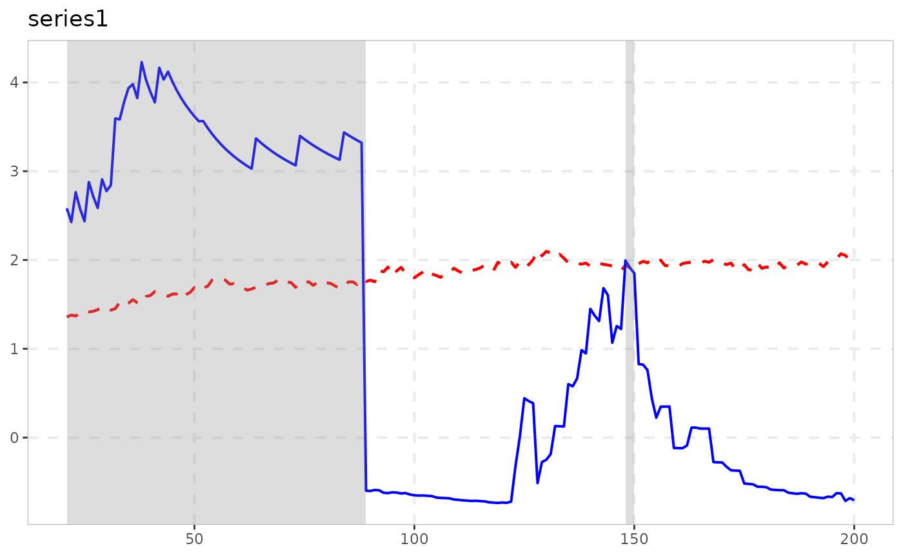

# Time-Transformed Test (STADF/GSTADF)

``` r

library(exuber)
```

## Why another test

[`radf()`](https://kvasilopoulos.github.io/exuber/reference/radf.md)
(the classic PSY GSADF test) assumes the innovation variance is
constant. Real financial series usually don’t have constant volatility,
and Harvey, Leybourne, Sollis & Taylor (2016) show that when volatility
is time-varying,
[`radf()`](https://kvasilopoulos.github.io/exuber/reference/radf.md)’s
standard critical values no longer control size –
[`radf_wb_cv()`](https://kvasilopoulos.github.io/exuber/reference/radf_wb_cv.md)
already addresses this in exuber via a wild bootstrap.

[`radf_tt()`](https://kvasilopoulos.github.io/exuber/reference/radf_tt.md)
implements a different, bootstrap-free fix from Kurozumi, Skrobotov &
Tsarev (2024, *Journal of Financial Econometrics*): instead of
resampling, it *time-deforms* the series using a nonparametric estimate
of its variance profile, so that the deformed series behaves like a
constant-volatility random walk under the null. The resulting
statistic’s null distribution is then the same (pivotal) distribution as
under homoskedasticity, so ordinary asymptotic critical values apply –
no bootstrap, and no per-dataset resimulation needed.

## Basic usage

[`radf_tt()`](https://kvasilopoulos.github.io/exuber/reference/radf_tt.md)
targets *non-stationary* volatility – a permanent shift or trend in the
unconditional innovation variance, the setting of Kurozumi, Skrobotov &
Tsarev’s own simulations. (Stationary conditional heteroskedasticity
such as GARCH is not the target: its variance profile is asymptotically
flat, so the time-deformation is close to the identity and plain
[`radf()`](https://kvasilopoulos.github.io/exuber/reference/radf.md) is
already size-correct there.)
[`sim_vol_break()`](https://kvasilopoulos.github.io/exuber/reference/sim_vol_break.md)
generates exactly such innovations, and
[`sim_psy1()`](https://kvasilopoulos.github.io/exuber/reference/sim_psy1.md)’s
`e` argument injects them into the PSY bubble DGP – here the innovation
standard deviation triples half-way through the sample:

``` r

y <- sim_psy1(n = 200, seed = 1, e = sim_vol_break(199))
res <- radf_tt(y)
res
#> 
#> ── radf_tt (minw = 27, kernel = uniform) ───────────────────────────────────────
#> 
#>    series      adf   sadf  gsadf
#>   series1  -0.9972  3.275  4.165
```

[`radf_tt_cv()`](https://kvasilopoulos.github.io/exuber/reference/radf_tt_cv.md)
gives the matching (pivotal) asymptotic critical values; because the
null distribution doesn’t depend on the volatility path, one call with a
large `n` approximates the whole family, unlike
[`radf_wb_cv()`](https://kvasilopoulos.github.io/exuber/reference/radf_wb_cv.md)’s
per-dataset bootstrap:

``` r

cv <- radf_tt_cv(n = 300, minw = 30, nrep = 1000, seed = 1)
cv$gsadf_cv
#>      90%      95%      99% 
#> 3.248911 3.584415 4.246916
```

## What’s actually estimated

Under the hood,
[`radf_tt()`](https://kvasilopoulos.github.io/exuber/reference/radf_tt.md):

1.  estimates the time-varying AR(1) coefficient with a local kernel
    regression, and from its (truncated) residuals builds a monotone
    *variance profile* `eta_hat(s)`, `s` in `[0, 1]`;
2.  inverts it and uses the inverse to resample/time-deform the series;
3.  runs a (GLS-demeaned, no-intercept) recursive sup-ADF statistic on
    the deformed series – the same statistic family as
    [`radf()`](https://kvasilopoulos.github.io/exuber/reference/radf.md),
    but built to need no fitted intercept, matching the paper’s
    derivation.

`kernel` (`"uniform"`, the paper’s own choice, or `"gaussian"`) and `h`
(bandwidth; default a fixed plug-in, not the paper’s full
cross-validation search – see the package’s enhancement notes for the
cost/benefit reasoning) can both be adjusted.

## Verifying against the paper

Kurozumi, Skrobotov & Tsarev’s footnote 4 gives an exact published
asymptotic critical value triple for `minw/n = 0.1`:
`(2.319, 2.626, 3.223)` at the (10%, 5%, 1%) levels – for the **STADF**
statistic (the single-sup, `r1 = 0` case). exuber’s test suite
(`tests/testthat/test-tt.R`) reproduces this via
[`radf_tt_cv()`](https://kvasilopoulos.github.io/exuber/reference/radf_tt_cv.md)’s
own Monte Carlo and checks it lands within Monte Carlo/finite-sample
tolerance of the published numbers.

## Dating and plotting a detected bubble

[`radf_tt()`](https://kvasilopoulos.github.io/exuber/reference/radf_tt.md)
keeps the same `radf_obj` class
[`radf()`](https://kvasilopoulos.github.io/exuber/reference/radf.md)
itself uses, and (as of 2026-08-18)
[`radf_tt_cv()`](https://kvasilopoulos.github.io/exuber/reference/radf_tt_cv.md)
computes the full time-varying boundary needed to date and plot
episodes, not just the summary-level critical values – so the usual
pipeline works unchanged:

``` r

res <- radf_tt(y, minw = 20)
cv <- radf_tt_cv(n = 200, minw = 20)

datestamp(res, cv = cv)
#> 
#> ── Datestamp (min_duration = 0) ───────────────────────── Time-Transformed MC ──
#> 
#> series1 :
#>   Start Peak End Duration   Signal Ongoing
#> 1    21   38  89       68 negative   FALSE
#> 2   148  148 150        2 positive   FALSE
autoplot(res, cv = cv)
```



See
[`vignette("naming-and-analysis")`](https://kvasilopoulos.github.io/exuber/articles/naming-and-analysis.md)
for which other exuber functions do and don’t plug into this pipeline,
and why.
