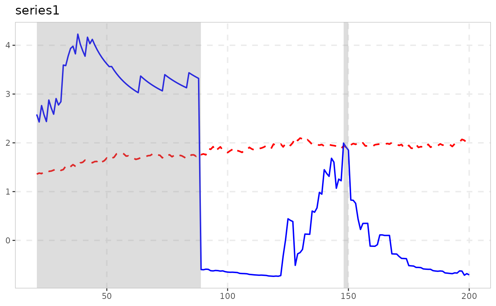

# Time-Transformed Test (STADF/GSTADF)

``` r

library(exuber)
```

## Why another test

[`radf()`](https://kvasilopoulos.github.io/exuber/reference/radf.md),
the classic PSY GSADF test, assumes that the innovation variance is
constant. Real financial series usually do not have constant volatility.
Harvey, Leybourne, Sollis & Taylor (2016) show that when volatility
changes over time, the standard critical values of
[`radf()`](https://kvasilopoulos.github.io/exuber/reference/radf.md) no
longer control the size of the test.
[`radf_wb_cv()`](https://kvasilopoulos.github.io/exuber/reference/radf_wb_cv.md)
addresses this in exuber with a wild bootstrap.

[`radf_tt()`](https://kvasilopoulos.github.io/exuber/reference/radf_tt.md)
implements a different fix that needs no bootstrap, from Kurozumi,
Skrobotov & Tsarev (2024, *Journal of Financial Econometrics*). Instead
of resampling, it time-deforms the series using a nonparametric estimate
of its variance profile, so that under the null the deformed series
behaves like a random walk with constant volatility. The null
distribution of the resulting statistic is then the same pivotal
distribution as under homoskedasticity. Ordinary asymptotic critical
values therefore apply, with no bootstrap and no resimulation for each
dataset.

## Basic usage

[`radf_tt()`](https://kvasilopoulos.github.io/exuber/reference/radf_tt.md)
targets non-stationary volatility, meaning a permanent shift or trend in
the unconditional innovation variance, which is the setting of the
simulations in Kurozumi, Skrobotov & Tsarev. It does not target
stationary conditional heteroskedasticity such as GARCH. In that case
the variance profile is asymptotically flat, the time deformation is
close to the identity, and plain
[`radf()`](https://kvasilopoulos.github.io/exuber/reference/radf.md)
already has the correct size.
[`sim_vol_break()`](https://kvasilopoulos.github.io/exuber/reference/sim_vol_break.md)
generates innovations with a permanent volatility shift, and the `e`
argument of
[`sim_psy1()`](https://kvasilopoulos.github.io/exuber/reference/sim_psy1.md)
passes them into the PSY bubble process. Here the innovation standard
deviation triples half-way through the sample:

``` r

y <- sim_psy1(n = 200, seed = 1, e = sim_vol_break(199))
res <- radf_tt(y)
res
#> 
#> ── radf_tt (minw = 27, kernel = uniform) ───────────────────────────────────────
#> 
#>    series      adf   sadf  gsadf
#>   series1  -0.9972  3.275  4.165
```

[`radf_tt_cv()`](https://kvasilopoulos.github.io/exuber/reference/radf_tt_cv.md)
returns the matching pivotal asymptotic critical values. The null
distribution does not depend on the volatility path, so one call with a
large `n` approximates the whole family of cases.
[`radf_wb_cv()`](https://kvasilopoulos.github.io/exuber/reference/radf_wb_cv.md),
in contrast, runs a separate bootstrap for each dataset:

``` r

cv <- radf_tt_cv(n = 300, minw = 30, nrep = 1000, seed = 1)
cv$gsadf_cv
#>      90%      95%      99% 
#> 3.248911 3.584415 4.246916
```

## What is estimated

[`radf_tt()`](https://kvasilopoulos.github.io/exuber/reference/radf_tt.md)
works in three steps.

1.  It estimates the time-varying AR(1) coefficient with a local kernel
    regression. From the truncated residuals it builds a monotone
    variance profile `eta_hat(s)`, with `s` in `[0, 1]`.
2.  It inverts the profile and uses the inverse to resample and
    time-deform the series.
3.  It computes a recursive sup-ADF statistic (GLS-demeaned, with no
    intercept) on the deformed series. This belongs to the same family
    of statistics as
    [`radf()`](https://kvasilopoulos.github.io/exuber/reference/radf.md),
    but it needs no fitted intercept, which matches the derivation in
    the paper.

You can adjust `kernel` (`"uniform"`, the choice of the paper, or
`"gaussian"`) and `h`, the bandwidth. The default for `h` is a fixed
plug-in value and not the full cross-validation search of the paper. The
package’s enhancement notes explain why we weighed cost against benefit
this way.

## Verifying against the paper

Footnote 4 of Kurozumi, Skrobotov & Tsarev gives published asymptotic
critical values for `minw/n = 0.1`: `(2.319, 2.626, 3.223)` at the 10%,
5% and 1% levels. They apply to the STADF statistic, the single-sup case
with `r1 = 0`. The test suite of exuber (`tests/testthat/test-tt.R`)
reproduces them with the Monte Carlo in
[`radf_tt_cv()`](https://kvasilopoulos.github.io/exuber/reference/radf_tt_cv.md)
and checks that they fall within the Monte Carlo and finite-sample
tolerance of the published numbers.

## Dating and plotting a detected bubble

[`radf_tt()`](https://kvasilopoulos.github.io/exuber/reference/radf_tt.md)
returns the same `radf_obj` class as
[`radf()`](https://kvasilopoulos.github.io/exuber/reference/radf.md).
Since 2026-08-18,
[`radf_tt_cv()`](https://kvasilopoulos.github.io/exuber/reference/radf_tt_cv.md)
also computes the full time-varying boundary that dating and plotting
need, and not only the summary-level critical values. The usual pipeline
therefore works unchanged:

``` r

res <- radf_tt(y, minw = 20)
cv <- radf_tt_cv(n = 200, minw = 20)

datestamp(res, cv = cv)
#> 
#> ── Datestamp (min_duration = 0) ───────────────────────── Time-Transformed MC ──
#> 
#> series1 :
#>   Start Peak End Duration   Signal Ongoing
#> 1    21   38  89       68 negative   FALSE
#> 2   148  148 150        2 positive   FALSE
autoplot(res, cv = cv)
```



[`vignette("naming-and-analysis")`](https://kvasilopoulos.github.io/exuber/articles/naming-and-analysis.md)
explains which other exuber functions work with this pipeline and which
do not.
