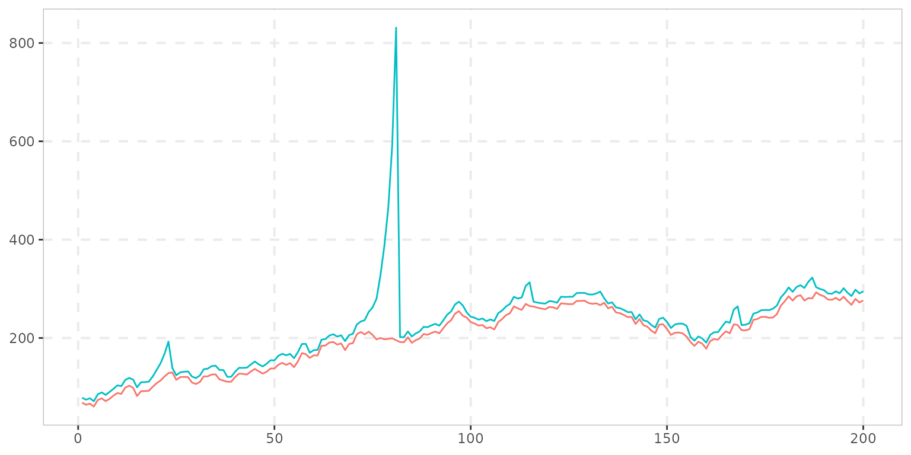
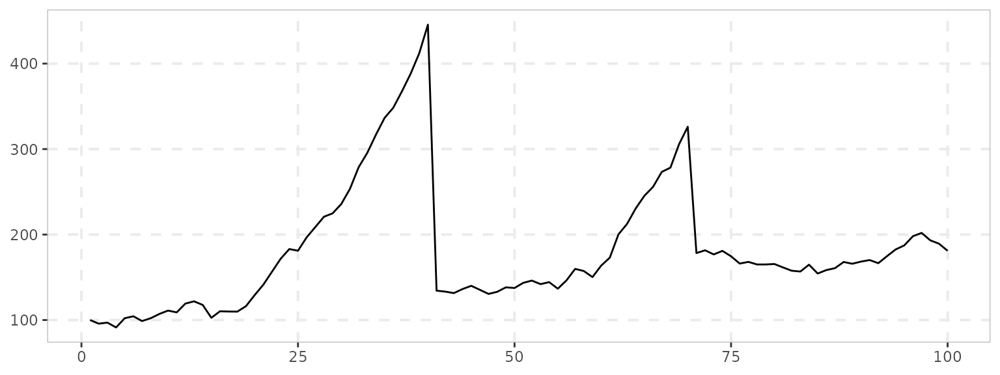
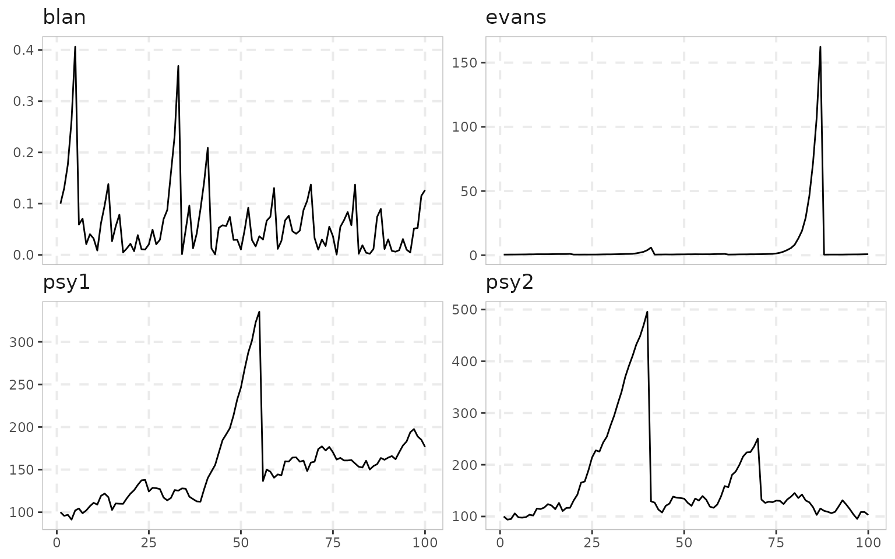
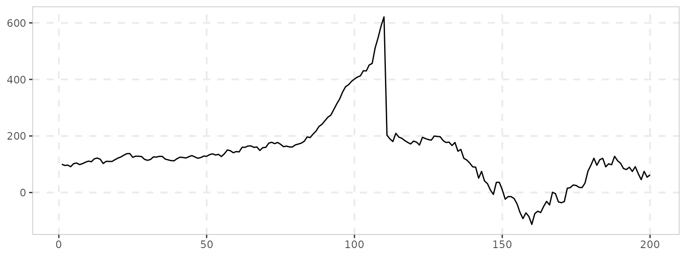

# Simulation

``` r

library(exuber)
library(ggplot2)
```

## What the `sim_*()` family is for

Every test in the package is calibrated and validated on simulated data,
and the same data-generating processes are exported so you can do the
same: check size under a null you choose, check power against a bubble
you choose, or just see what a given test does to a series whose true
break dates you know. There are three kinds:

| Kind | Functions | Returns |
|----|----|----|
| Bubble processes | [`sim_psy1()`](https://kvasilopoulos.github.io/exuber/reference/sim_psy1.md), [`sim_psy2()`](https://kvasilopoulos.github.io/exuber/reference/sim_psy2.md), [`sim_ps1()`](https://kvasilopoulos.github.io/exuber/reference/sim_ps1.md), [`sim_blan()`](https://kvasilopoulos.github.io/exuber/reference/sim_blan.md), [`sim_evans()`](https://kvasilopoulos.github.io/exuber/reference/sim_evans.md), [`sim_div()`](https://kvasilopoulos.github.io/exuber/reference/sim_div.md), [`sim_tree()`](https://kvasilopoulos.github.io/exuber/reference/sim_tree.md), [`sim_mar()`](https://kvasilopoulos.github.io/exuber/reference/sim_mar.md), [`sim_msbubble()`](https://kvasilopoulos.github.io/exuber/reference/sim_msbubble.md), [`sim_falsebubble()`](https://kvasilopoulos.github.io/exuber/reference/sim_falsebubble.md) | One series (`class "sim"`, plots with [`autoplot()`](https://ggplot2.tidyverse.org/reference/autoplot.html)) |
| Innovation generators | [`sim_innov()`](https://kvasilopoulos.github.io/exuber/reference/sim_innov.md), [`sim_vol_garch()`](https://kvasilopoulos.github.io/exuber/reference/sim_vol_garch.md), [`sim_vol_break()`](https://kvasilopoulos.github.io/exuber/reference/sim_vol_break.md), [`sim_vol_cir()`](https://kvasilopoulos.github.io/exuber/reference/sim_vol_cir.md), [`sim_vol_sv()`](https://kvasilopoulos.github.io/exuber/reference/sim_vol_sv.md), [`sim_fi()`](https://kvasilopoulos.github.io/exuber/reference/sim_fi.md) | One series of shocks, to feed into a bubble process through its `e` argument |
| Multi-series processes | [`sim_common()`](https://kvasilopoulos.github.io/exuber/reference/sim_common.md), [`sim_coexplosive()`](https://kvasilopoulos.github.io/exuber/reference/sim_coexplosive.md) | A `data.frame`, one column per series |

Plus `sim_data`/`sim_data_wdate`, a bundled `data.frame` of five of the
classic series (with and without a date column) used throughout the
examples.

Every function takes a `seed` argument, so a series is reproducible
without a surrounding
[`set.seed()`](https://rdrr.io/r/base/Random.html), and the bubble
processes take the break dates (`te`, `tf`, …) as arguments, so the
truth you are testing against is explicit.

The bubble processes split into two families.
[`sim_psy1()`](https://kvasilopoulos.github.io/exuber/reference/sim_psy1.md)/[`sim_psy2()`](https://kvasilopoulos.github.io/exuber/reference/sim_psy2.md)/
[`sim_ps1()`](https://kvasilopoulos.github.io/exuber/reference/sim_ps1.md)
are the *regime* DGPs of Phillips, Shi & Yu (2015) and Phillips & Shi
(2018): a unit root, then an explosive AR(1) between fixed dates, then a
collapse and a return to a unit root – the design every paper in this
literature uses for size and power.
[`sim_blan()`](https://kvasilopoulos.github.io/exuber/reference/sim_blan.md),
[`sim_evans()`](https://kvasilopoulos.github.io/exuber/reference/sim_evans.md),
[`sim_tree()`](https://kvasilopoulos.github.io/exuber/reference/sim_tree.md),
[`sim_mar()`](https://kvasilopoulos.github.io/exuber/reference/sim_mar.md)
and
[`sim_msbubble()`](https://kvasilopoulos.github.io/exuber/reference/sim_msbubble.md)
are *rational bubble* models: the explosive behaviour and its collapse
are stochastic, driven by a probability of bursting each period rather
than by fixed dates.
[`sim_evans()`](https://kvasilopoulos.github.io/exuber/reference/sim_evans.md)’s
periodically collapsing bubble is the one PSY’s GSADF test was designed
to catch, and the one the earlier tests it replaced could not.

## The PSY experiment

PSY validate the GSADF test on a price built from Lucas-model
fundamentals plus an Evans (1991) bubble.
[`sim_div()`](https://kvasilopoulos.github.io/exuber/reference/sim_div.md)
gives the fundamental price from a random walk with drift in dividends
(West 1988’s S&P 500 parameterisation by default),
[`sim_evans()`](https://kvasilopoulos.github.io/exuber/reference/sim_evans.md)
gives the bubble term, and a scaling factor `kappa` sets how much of the
price the bubble accounts for:

``` r

n <- 200
pf <- sim_div(n, seed = 1)          # fundamental price
pb <- sim_evans(n, seed = 3)        # periodically collapsing bubble
p <- pf + 20 * pb                   # kappa = 20
```

``` r

data.frame(index = seq_len(n), fundamental = pf, price = p) %>%
  tidyr::pivot_longer(-index) %>%
  ggplot(aes(index, value, color = name)) +
  geom_line() +
  labs(y = NULL, x = NULL, color = NULL) +
  theme_exuber()
```



The point of the exercise is that
[`radf()`](https://kvasilopoulos.github.io/exuber/reference/radf.md)
finds the episodes:

``` r

cv <- radf_mc_cv(n, seed = 1)
datestamp(radf(p), cv)
#> 
#> ── Datestamp (min_duration = 0) ───────────────────────────────── Monte Carlo ──
#> 
#> series1 :
#>   Start Peak End Duration   Signal Ongoing
#> 1    75   81  82        7 positive   FALSE
```

## Plotting a simulated series

Each series has an
[`autoplot()`](https://ggplot2.tidyverse.org/reference/autoplot.html)
method:

``` r

sim_psy2(100, seed = 1) %>%
  autoplot()
```



Several at once go into a `data.frame` – which is also exactly what
[`radf()`](https://kvasilopoulos.github.io/exuber/reference/radf.md)
takes, so the same object serves both:

``` r

sims <- data.frame(
  psy1 = sim_psy1(100, seed = 1),
  psy2 = sim_psy2(100, seed = 2),
  evans = sim_evans(100, seed = 3),
  blan = sim_blan(100, seed = 4)
)
```

``` r

sims %>%
  dplyr::mutate(dplyr::across(dplyr::everything(), as.numeric), index = dplyr::row_number()) %>%
  tidyr::pivot_longer(-index, names_to = "id") %>%
  ggplot(aes(index, value)) +
  geom_line() +
  facet_wrap(~id, scales = "free_y") +
  theme_exuber()
```



## Swapping the innovations

By default the regime DGPs are driven by i.i.d. Gaussian shocks. Every
bubble process accepts a vector of innovations through `e` instead, and
the innovation generators exist to fill it: heavy-tailed or skewed
marginals
([`sim_innov()`](https://kvasilopoulos.github.io/exuber/reference/sim_innov.md)),
conditional heteroskedasticity
([`sim_vol_garch()`](https://kvasilopoulos.github.io/exuber/reference/sim_vol_garch.md)),
a one-off variance break
([`sim_vol_break()`](https://kvasilopoulos.github.io/exuber/reference/sim_vol_break.md)),
stochastic volatility
([`sim_vol_cir()`](https://kvasilopoulos.github.io/exuber/reference/sim_vol_cir.md),
[`sim_vol_sv()`](https://kvasilopoulos.github.io/exuber/reference/sim_vol_sv.md))
or long memory
([`sim_fi()`](https://kvasilopoulos.github.io/exuber/reference/sim_fi.md)).
The bubble dates stay where you put them; only the noise changes – which
is how the volatility-robust tests in
[`vignette("volatility-robust-radf")`](https://kvasilopoulos.github.io/exuber/articles/volatility-robust-radf.md)
are compared against plain
[`radf()`](https://kvasilopoulos.github.io/exuber/reference/radf.md) on
an equal footing:

``` r

# Same bubble, same seed, volatility tripling half-way through the sample
sim_psy1(n = 200, seed = 1, e = sim_vol_break(199, seed = 1)) %>%
  autoplot()
```



The innovation vector is one shorter than `n` because the first
observation is the starting value, not a shock.

## Multi-series processes

[`sim_common()`](https://kvasilopoulos.github.io/exuber/reference/sim_common.md)
draws `n_series` series that share one latent bubble plus idiosyncratic
noise, the design behind the panel test
[`radf_common()`](https://kvasilopoulos.github.io/exuber/reference/radf_common.md);
[`sim_coexplosive()`](https://kvasilopoulos.github.io/exuber/reference/sim_coexplosive.md)
draws a pair where `y` is a linear function of a (possibly lagged)
explosive `x`, the design behind
[`cobubble_test()`](https://kvasilopoulos.github.io/exuber/reference/cobubble_test.md)
and
[`contagion_reg()`](https://kvasilopoulos.github.io/exuber/reference/contagion_reg.md)
(see
[`vignette("co-explosivity")`](https://kvasilopoulos.github.io/exuber/articles/co-explosivity.md)):

``` r

head(sim_common(n_series = 3, n = 100, seed = 1))
#>   series_1 series_2 series_3
#> 1 63.51506 156.4806 53.64832
#> 2 60.82614 150.0373 51.29328
#> 3 61.68536 151.9221 52.08866
#> 4 57.95947 143.0566 48.83047
#> 5 65.01851 160.0944 54.52820
#> 6 66.25556 163.4051 55.81010
head(sim_coexplosive(n = 100, lag = 2, seed = 1))
#>           x         y
#> 1 100.00000        NA
#> 2  95.74638        NA
#> 3  96.99332 100.28597
#> 4  91.31940  89.56122
#> 5 102.15136  98.06633
#> 6 104.38871  86.87477
```

## Which to reach for

- Size or power of a test against a bubble with **known dates**:
  [`sim_psy1()`](https://kvasilopoulos.github.io/exuber/reference/sim_psy1.md)
  (one episode),
  [`sim_psy2()`](https://kvasilopoulos.github.io/exuber/reference/sim_psy2.md)
  (two),
  [`sim_ps1()`](https://kvasilopoulos.github.io/exuber/reference/sim_ps1.md)
  (one, with a distinct collapse regime – the design the `dating_*()`
  estimators assume).
- A **rational**, stochastically collapsing bubble:
  [`sim_evans()`](https://kvasilopoulos.github.io/exuber/reference/sim_evans.md)
  on its own or on top of
  [`sim_div()`](https://kvasilopoulos.github.io/exuber/reference/sim_div.md)
  fundamentals, as in PSY;
  [`sim_blan()`](https://kvasilopoulos.github.io/exuber/reference/sim_blan.md)
  for the Blanchard version;
  [`sim_tree()`](https://kvasilopoulos.github.io/exuber/reference/sim_tree.md),
  [`sim_mar()`](https://kvasilopoulos.github.io/exuber/reference/sim_mar.md),
  [`sim_msbubble()`](https://kvasilopoulos.github.io/exuber/reference/sim_msbubble.md)
  for the newer ones.
- A **null that looks like a bubble** but isn’t:
  [`sim_falsebubble()`](https://kvasilopoulos.github.io/exuber/reference/sim_falsebubble.md).
- Non-Gaussian or **heteroskedastic** shocks under any of the above:
  build the shocks with an innovation generator and pass them as `e`.
- **Several series**:
  [`sim_common()`](https://kvasilopoulos.github.io/exuber/reference/sim_common.md)
  for a shared bubble,
  [`sim_coexplosive()`](https://kvasilopoulos.github.io/exuber/reference/sim_coexplosive.md)
  for a linked pair, or a `data.frame` of independent draws.
