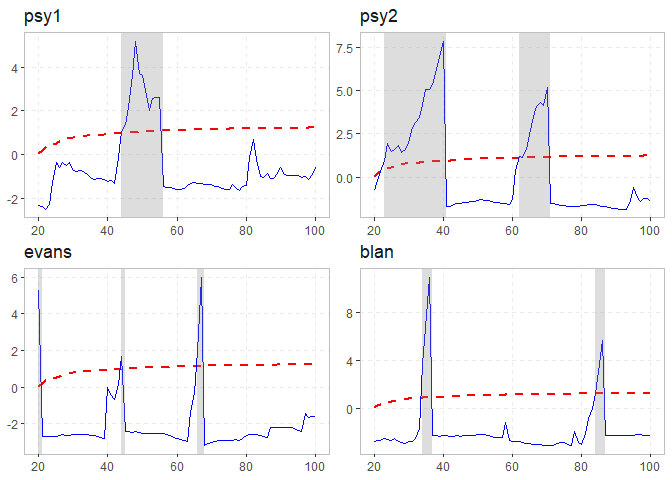
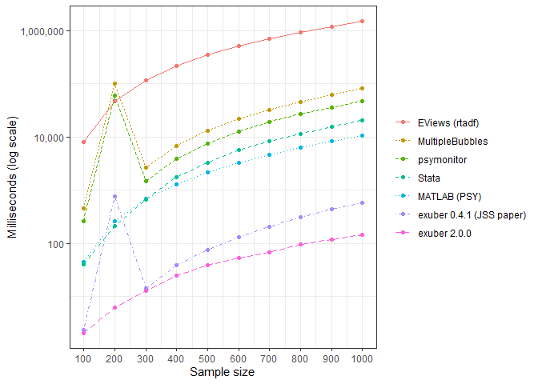

# exuber

Testing for and dating periods of explosive dynamics (exuberance) in
time series using the univariate and panel recursive unit root tests
proposed by [Phillips et al. (2015)](https://doi.org/10.1111/iere.12132)
and [Pavlidis et al. (2016)](https://doi.org/10.1007/s11146-015-9531-2).
The recursive least-squares algorithm uses the matrix inversion lemma,
so no matrix has to be inverted at each step, which makes the tests much
faster to compute. The package also simulates a variety of periodically
collapsing bubble processes.

### Overview

Testing for explosive dynamics has two parts:

- Estimation of the test statistics
- Critical values to compare them with

Conventional tests take their critical values and p-values from a
standard distribution, so the user never has to supply them. The test
statistics used for explosive dynamics follow non-standard
distributions, so the critical values have to be obtained by simulating
the empirical distribution.

#### Estimation

The central function of the package is:

- [`radf()`](https://kvasilopoulos.github.io/exuber/reference/radf.md):
  the recursive augmented Dickey-Fuller test.

It accepts a single series or several, and it can estimate each series
individually or as a panel. It reads data from several classes and uses
dates as the index when they are available.

#### Critical Values

There are several ways to generate critical values:

- [`radf_mc_cv()`](https://kvasilopoulos.github.io/exuber/reference/radf_mc_cv.md):
  Monte Carlo
- [`radf_wb_cv()`](https://kvasilopoulos.github.io/exuber/reference/radf_wb_cv.md),
  [`radf_wb_ps_cv()`](https://kvasilopoulos.github.io/exuber/reference/radf_wb_ps_cv.md):
  wild bootstrap (Harvey et al. 2016; Phillips & Shi 2020)
- [`radf_sb_cv()`](https://kvasilopoulos.github.io/exuber/reference/radf_sb_cv.md):
  sieve bootstrap (panel)

When `cv` is omitted, `exuber` uses precomputed Monte Carlo critical
values. They come from a shared store that covers `lag = 0` to `4` and
every sample size up to 4000. Each `(n, lag)` combination is fetched
once and cached on disk.
[`radf_mc_cv()`](https://kvasilopoulos.github.io/exuber/reference/radf_mc_cv.md)
and the bootstrap functions work offline, and they are the only option
for other lags or larger samples.

### Analysis

The analysis needs both the output of the estimation (`object`) and the
critical values (`cv`). The following methods break it into small steps:

- [`summary()`](https://rdrr.io/r/base/summary.html) summarizes the
  model.
- [`diagnostics()`](https://kvasilopoulos.github.io/exuber/reference/diagnostics.md)
  shows which series reject the null hypothesis.
- [`datestamp()`](https://kvasilopoulos.github.io/exuber/reference/datestamp.md)
  computes the origination, termination and duration of episodes, if
  there are any.
- [`rootstamp()`](https://kvasilopoulos.github.io/exuber/reference/rootstamp.md)
  estimates how fast a detected episode is growing (the explosive root
  and its doubling time) and runs over every
  [`datestamp()`](https://kvasilopoulos.github.io/exuber/reference/datestamp.md)
  episode at once.

Together they give a full account of the exuberant behavior of the
model. See
[`vignette("exuber")`](https://kvasilopoulos.github.io/exuber/articles/exuber.md)
for this workflow from start to finish and
[`vignette("plotting")`](https://kvasilopoulos.github.io/exuber/articles/plotting.md)
for the matching
[`autoplot()`](https://ggplot2.tidyverse.org/reference/autoplot.html)
methods.

### Beyond `radf()`

The recursive ADF test is the core of the package, but not all of it.
Each family below has its own vignette and its own section of the
reference index:

- Volatility-robust tests
  ([`radf_tt()`](https://kvasilopoulos.github.io/exuber/reference/radf_tt.md),
  [`radf_sign()`](https://kvasilopoulos.github.io/exuber/reference/radf_sign.md),
  [`radf_kp()`](https://kvasilopoulos.github.io/exuber/reference/radf_kp.md),
  [`radf_sbz()`](https://kvasilopoulos.github.io/exuber/reference/radf_sbz.md))
  ask the same question as
  [`radf()`](https://kvasilopoulos.github.io/exuber/reference/radf.md)
  when the innovation variance changes over time. See
  [`vignette("radf-tt")`](https://kvasilopoulos.github.io/exuber/articles/radf-tt.md)
  and
  [`vignette("volatility-robust-radf")`](https://kvasilopoulos.github.io/exuber/articles/volatility-robust-radf.md).
- Dating procedures
  ([`dating_hls()`](https://kvasilopoulos.github.io/exuber/reference/dating_hls.md),
  [`dating_knp()`](https://kvasilopoulos.github.io/exuber/reference/dating_knp.md),
  [`dating_pdc()`](https://kvasilopoulos.github.io/exuber/reference/dating_pdc.md),
  [`dating_hlw()`](https://kvasilopoulos.github.io/exuber/reference/dating_hlw.md),
  [`radf_recovery()`](https://kvasilopoulos.github.io/exuber/reference/radf_recovery.md))
  use regime models to estimate when a bubble that you already believe
  in starts and ends. They need no critical value. See
  [`vignette("dating-methods")`](https://kvasilopoulos.github.io/exuber/articles/dating-methods.md).
- Real-time monitoring
  ([`monitor()`](https://kvasilopoulos.github.io/exuber/reference/monitor.md),
  [`monitor_cusum()`](https://kvasilopoulos.github.io/exuber/reference/monitor_cusum.md),
  [`monitor_lbi()`](https://kvasilopoulos.github.io/exuber/reference/monitor_lbi.md),
  [`monitor_quantile()`](https://kvasilopoulos.github.io/exuber/reference/monitor_quantile.md))
  is calibrated on a training window and raises an alarm as new
  observations arrive. See
  [`vignette("monitoring")`](https://kvasilopoulos.github.io/exuber/articles/monitoring.md).
- Root inference
  ([`rootstamp()`](https://kvasilopoulos.github.io/exuber/reference/rootstamp.md))
  measures how fast a detected episode is growing. See
  [`vignette("root-inference")`](https://kvasilopoulos.github.io/exuber/articles/root-inference.md).
- Multivariate tools
  ([`radf_common()`](https://kvasilopoulos.github.io/exuber/reference/radf_common.md),
  [`cobubble_test()`](https://kvasilopoulos.github.io/exuber/reference/cobubble_test.md),
  [`contagion_reg()`](https://kvasilopoulos.github.io/exuber/reference/contagion_reg.md))
  look for shared and transmitted bubbles across series. See
  [`vignette("co-explosivity")`](https://kvasilopoulos.github.io/exuber/articles/co-explosivity.md).
- Simulation (`sim_*()`) provides the bubble processes and innovation
  generators on which every test above is validated. See
  [`vignette("simulation")`](https://kvasilopoulos.github.io/exuber/articles/simulation.md).

[`vignette("naming-and-analysis")`](https://kvasilopoulos.github.io/exuber/articles/naming-and-analysis.md)
explains the naming scheme (`radf_`, `_test`, `dating_`, `monitor_`) and
which results work with
[`summary()`](https://rdrr.io/r/base/summary.html),
[`datestamp()`](https://kvasilopoulos.github.io/exuber/reference/datestamp.md),
[`tidy()`](https://generics.r-lib.org/reference/tidy.html) and
[`autoplot()`](https://ggplot2.tidyverse.org/reference/autoplot.html).

### Installation

``` r

# Install release version from CRAN
install.packages("exuber")
```

You can install the development version of exuber from GitHub.

``` r

# install.packages("devtools")
devtools::install_github("kvasilopoulos/exuber")
```

If you encounter a clear bug, please file a reproducible example on
[GitHub](https://github.com/kvasilopoulos/exuber/issues).

### Development

Development uses [rig](https://github.com/r-lib/rig) for R versions,
[rv](https://github.com/A2-ai/rv) for packages,
[air](https://posit-dev.github.io/air/) for formatting and
[jarl](https://jarl.etiennebacher.com/) for linting. After cloning, run
`rv sync` and `pre-commit install`. The commands are listed in
`CLAUDE.md`.

### Usage

``` r


library(exuber)

rsim_data <- radf(sim_data)

summary(rsim_data)
#> Using precomputed critical values for `cv`.
#> 
#> ── Summary (minw = 19, lag = 0) ────────────────── Monte Carlo (nboot = 2000) ──
#> 
#> psy1 :
#> # A tibble: 3 × 5
#>   stat  tstat   `90`    `95`  `99`
#>   <fct> <dbl>  <dbl>   <dbl> <dbl>
#> 1 adf   -2.46 -0.412 -0.0178 0.644
#> 2 sadf   1.95  0.965  1.25   1.77 
#> 3 gsadf  5.19  1.65   1.93   2.60 
#> 
#> psy2 :
#> # A tibble: 3 × 5
#>   stat  tstat   `90`    `95`  `99`
#>   <fct> <dbl>  <dbl>   <dbl> <dbl>
#> 1 adf   -2.86 -0.412 -0.0178 0.644
#> 2 sadf   7.88  0.965  1.25   1.77 
#> 3 gsadf  7.88  1.65   1.93   2.60 
#> 
#> evans :
#> # A tibble: 3 × 5
#>   stat  tstat   `90`    `95`  `99`
#>   <fct> <dbl>  <dbl>   <dbl> <dbl>
#> 1 adf   -5.83 -0.412 -0.0178 0.644
#> 2 sadf   5.28  0.965  1.25   1.77 
#> 3 gsadf  5.99  1.65   1.93   2.60 
#> 
#> div :
#> # A tibble: 3 × 5
#>   stat  tstat   `90`    `95`  `99`
#>   <fct> <dbl>  <dbl>   <dbl> <dbl>
#> 1 adf   -1.95 -0.412 -0.0178 0.644
#> 2 sadf   1.11  0.965  1.25   1.77 
#> 3 gsadf  1.34  1.65   1.93   2.60 
#> 
#> blan :
#> # A tibble: 3 × 5
#>   stat  tstat   `90`    `95`  `99`
#>   <fct> <dbl>  <dbl>   <dbl> <dbl>
#> 1 adf   -5.15 -0.412 -0.0178 0.644
#> 2 sadf   3.93  0.965  1.25   1.77 
#> 3 gsadf 11.0   1.65   1.93   2.60

diagnostics(rsim_data)
#> Using precomputed critical values for `cv`.
#> 
#> ── Diagnostics (option = gsadf) ───────────────────────────────── Monte Carlo ──
#> 
#> psy1:     Rejects H0 at the 1% significance level
#> psy2:     Rejects H0 at the 1% significance level
#> evans:    Rejects H0 at the 1% significance level
#> div:      Cannot reject H0 
#> blan:     Rejects H0 at the 1% significance level

datestamp(rsim_data)
#> Using precomputed critical values for `cv`.
#> 
#> ── Datestamp (min_duration = 0) ───────────────────────────────── Monte Carlo ──
#> 
#> psy1 :
#>   Start Peak End Duration   Signal Ongoing
#> 1    44   48  56       12 positive   FALSE
#> 
#> psy2 :
#>   Start Peak End Duration   Signal Ongoing
#> 1    23   40  41       18 positive   FALSE
#> 2    62   70  71        9 positive   FALSE
#> 
#> evans :
#>   Start Peak End Duration   Signal Ongoing
#> 1    20   20  21        1 positive   FALSE
#> 2    44   44  45        1 positive   FALSE
#> 3    66   67  68        2 positive   FALSE
#> 
#> blan :
#>   Start Peak End Duration   Signal Ongoing
#> 1    34   36  37        3 positive   FALSE
#> 2    84   86  87        3 positive   FALSE

autoplot(rsim_data)
#> Using precomputed critical values for `cv`.
```



### Performance

The speed of `exuber` comes from the recursive least-squares algorithm
in [`radf()`](https://kvasilopoulos.github.io/exuber/reference/radf.md),
which uses the matrix inversion lemma and never inverts a matrix for
each window. The chart below reproduces the full software comparison
from Section 4 of the [JSS
paper](https://doi.org/10.18637/jss.v103.i10). It covers R’s
[`MultipleBubbles`](https://cran.r-project.org/package=MultipleBubbles)
and
[`psymonitor::PSY()`](https://cran.r-project.org/package=psymonitor),
EViews’ `rtadf`, MATLAB’s `PSY.m` and Stata, together with `exuber` as
it was benchmarked when the paper appeared and the current version. The
setup is the same throughout: `minw = 30`, `lag`/`adflag = 1`, and the
median elapsed time over repeated runs on a random walk of length `n`.



All series except `exuber 2.0.0` are the archived benchmark data from
the paper, not a new run. `MultipleBubbles` and `psymonitor` are
`O(T^2)` loops written in pure R that already take minutes per run at
`n = 1000`, and the archived numbers do not depend on the current
`exuber` implementation. `exuber 2.0.0` is faster than `0.4.1` at every
sample size shown.

### Citation

`exuber` is the product of ongoing research. If it is useful in your own
work, please cite the accompanying paper in the *Journal of Statistical
Software*:

> Vasilopoulos, K., Pavlidis, E., & Martínez-García, E. (2022). exuber:
> Recursive Right-Tailed Unit Root Testing with R. *Journal of
> Statistical Software*, 103(10), 1-26.
> [doi:10.18637/jss.v103.i10](https://doi.org/10.18637/jss.v103.i10)

``` r

citation("exuber")
#> To cite exuber in publications use:
#> 
#>   Vasilopoulos K, Pavlidis E, Martínez-García E (2022). "exuber:
#>   Recursive Right-Tailed Unit Root Testing with R." _Journal of
#>   Statistical Software_, *103*(10), 1-26. doi:10.18637/jss.v103.i10
#>   <https://doi.org/10.18637/jss.v103.i10>.
#> 
#> A BibTeX entry for LaTeX users is
#> 
#>   @Article{,
#>     title = {{exuber}: Recursive Right-Tailed Unit Root Testing with {R}},
#>     author = {Kostas Vasilopoulos and Efthymios Pavlidis and Enrique Mart{\'i}nez-Garc{\'i}a},
#>     journal = {Journal of Statistical Software},
#>     year = {2022},
#>     volume = {103},
#>     number = {10},
#>     pages = {1--26},
#>     doi = {10.18637/jss.v103.i10},
#>   }
```

------------------------------------------------------------------------

Please note that the ‘exuber’ project is released with a [Contributor
Code of
Conduct](https://kvasilopoulos.github.io/exuber/CODE_OF_CONDUCT). By
contributing to this project, you agree to abide by its terms.
